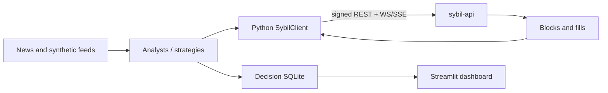

# Sybil arena

The Python client, simulation framework, and live agent system that trade
through the same public API as any other Sybil participant. The arena is a
consumer of the exchange, not part of the matching or validity boundary.

## Two ways to use it

| Mode | Entry point | Purpose |
|---|---|---|
| Deterministic competition/simulation | `examples/`, `sim/` | Develop bots and replay controlled scenarios |
| Live arena | `python -m live.runner` | Run analyst/sizer agents, synthetic flow, metrics, and decision logging against an API |



## Quick start

Start a development API from the repository root:

```bash
cargo run --release -p sybil-api -- --dev-mode --port 3001
```

Then install and run a local competition:

```bash
cd arena
uv sync
uv run python examples/full_competition.py
```

For the live LLM arena, provide secrets through the environment and inspect all
options with `--help`:

```bash
OPENROUTER_API_KEY=... uv run python -m live.runner --help
```

Do not put provider keys in source, command examples committed with real
values, or process arguments on a deployed host. The deployment path reads the
key from `/opt/sybil/arena.env`.

## Layout

| Path | Responsibility |
|---|---|
| `sybil_client/` | Hand-written async SDK over a generated OpenAPI substrate |
| `bots/` | Generic competition agents |
| `sim/` | Clock, LLM trader, replay runner, and results |
| `live/` | Production-style analysts, sizing, market selection, metrics, and decision DB |
| `markets/` | Market-specific personas, sources, configuration, and local datasets |
| `feeds/` | Test/synthetic feeds |
| `scripts/` | Calibration, outcome recording, and orchestration utilities |
| `viz/` | Streamlit analysis views |
| `tests/` | Python tests |

## Checks and generated code

```bash
just arena-check       # ruff + pytest, from repo root
just arena-sdk-regen   # regenerate sybil_client/_generated from live OpenAPI
```

Never hand-edit `sybil_client/_generated/`; see
[`sybil_client/README.md`](sybil_client/README.md). Architecture and invariants
are summarized in [`docs/architecture/06-agents/`](../docs/architecture/06-agents/).
