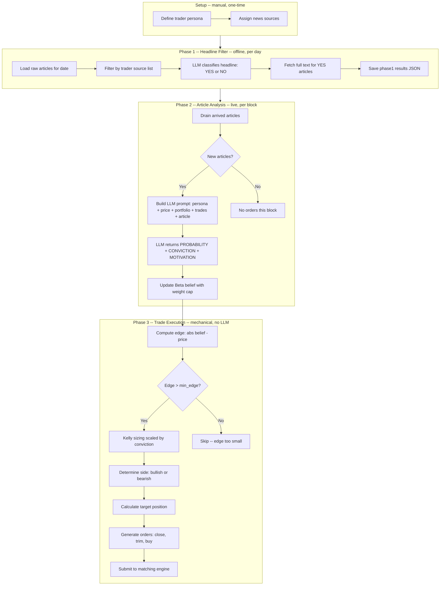

# LLM Trader Decision Flow

How an article becomes a trade in the Iran strike market simulation.

## Pipeline Overview

## Stage Details

### Setup: Source Assignment

Each trader persona is defined in `BOT_PERSONAS` with:
- **Identity & style** — LLM system prompt shaping analytical bias (e.g. hawkish believer vs cold skeptic)
- **Source list** — which news outlets this trader reads (e.g. American Believer reads US/UK mainstream; Anti-US Trader reads Iranian/Russian/Chinese media)
- **Strategy params** — `belief_weight_cap` (reactivity), `kelly_scale` (sizing aggressiveness), `min_edge`, `confirm_boost`

Traders sharing sources (e.g. American Believer + American Skeptic) share phase1 results via `phase1_bot` aliasing.

### Phase 1: Headline Filter (`sim/headline_filter.py`, offline)

Runs once per bot per date before simulation:

1. Load all articles from `iran_news_raw.json` matching the trader's source list and target date
2. LLM classifies each headline as YES (relevant to US-Iran dynamics) or NO (unrelated)
3. Fetch full article text for YES headlines via HTTP + trafilatura extraction
4. Save results to `markets/iran/phase1/{bot}_{YYYYMMDD}_phase1_results.json`

Prompt is permissive ("when in doubt, say YES") — cheap to filter later, expensive to miss relevant news.

### Phase 2: Article Analysis (`sim/news_trader.py:_phase2_analyze`, live)

Runs during simulation, triggered each block:

1. **Drain arrived articles** — articles whose real-world timestamp has passed in simulated time
2. **Build prompt** containing:
   - Trader persona (identity + analytical style)
   - Current market YES price
   - Last 5 trades with fill results
   - Current portfolio (USDC, YES shares, NO shares)
   - Article source, title, and full text (truncated to 4k chars)
3. **LLM analyzes** using chain-of-thought, returns structured output:
   - `PROBABILITY` — trader's estimate of event likelihood (0.00-1.00)
   - `CONVICTION` — signal strength (LOW / MEDIUM / HIGH)
   - `MOTIVATION` — 1-2 sentence thesis
4. **Update running belief** (Beta distribution):
   - If total weight (alpha + beta) exceeds `belief_weight_cap`, rescale down proportionally
   - Add weighted evidence: `alpha += strength * probability`, `beta += strength * (1 - probability)`
   - Low cap = reactive trader (recent articles dominate), high cap = anchored trader (history matters)

If multiple articles arrive in one block, all are analyzed sequentially, each updating belief. Trading happens once after all analyses.

### Phase 3: Trade Execution (`sim/news_trader.py:_phase3_execute`, mechanical)

Pure math, no LLM:

1. **Edge check** — `|belief - market_price|`. Skip if below `min_edge`
2. **Kelly criterion** — `edge / (1 - price)` for bullish, `edge / price` for bearish
3. **Scale by conviction** — LOW=0.15x, MEDIUM=0.30x, HIGH=0.50x (configurable)
4. **Confirming signal boost** — each past same-direction MEDIUM/HIGH trade adds `confirm_boost` to scale
5. **Target position** — `risk_budget / belief` for YES, `risk_budget / (1 - belief)` for NO
6. **Order generation**:
   - Close any wrong-side positions (bullish but holding NO → sell NO)
   - Trim right-side if above target
   - Buy toward target, capped by available cash
7. **Submit** to Sybil's Frequent Batch Auction engine

### Cross-Day Persistence (multi-day simulation)

Between simulation days:
- **Persists**: Beta belief state (alpha, beta), trade log, price history, account balances/positions (server-side)
- **Resets**: Clock, articles (new day's phase1 file), noise bots, block logs

## Trader Personality Spectrum

| Trader | Cap | Responsiveness | Bias |
|--------|-----|----------------|------|
| American Believer | 5 | Impulsive | Hawkish, trusts govt rhetoric |
| Iran/Russia/China Media | 8 | Impulsive | Skeptical of US threats |
| Global Media Mix | 8 | Impulsive | Balanced cross-source |
| Israeli Security Press | 10 | Responsive | Security-focused, weights military intel |
| Financial Press | 20 | Moderate | Risk/reward driven |
| Arab Regional Press | 30 | Deliberate | Diplomatic shifts, ground-level |
| American Skeptic | 40 | Cold | Demands concrete evidence |
| Random Sampler | 1 | Fully reactive | No memory, each article overwrites |
