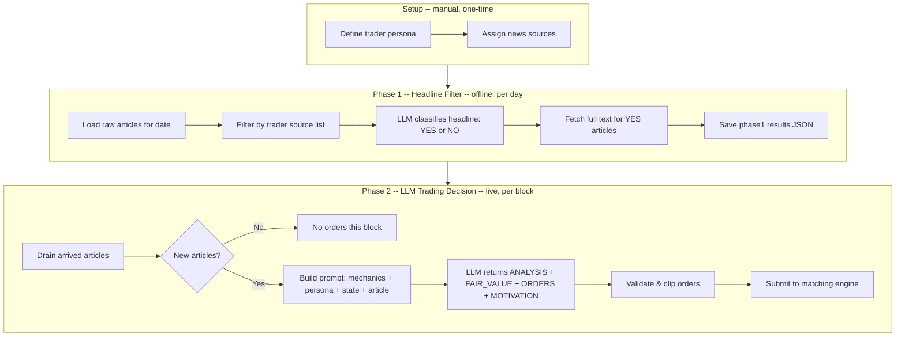

# LLM Trader Decision Flow

How an article becomes a trade in the Iran strike market simulation.

## Pipeline Overview

## Stage Details

### Setup: Source Assignment

Each trader persona is defined in `BOT_PERSONAS` with:
- **Identity** — who the trader is
- **Read style** — how they interpret signals (1-2 bullets)
- **Trade style** — how they trade: sizing, patience, risk tolerance (2-3 bullets)
- **Source list** — which news outlets this trader reads

Traders sharing sources (e.g. American Believer + American Skeptic) share phase1 results via `phase1_bot` aliasing.

### Phase 1: Headline Filter (`sim/headline_filter.py`, offline)

Runs once per bot per date before simulation:

1. Load all articles from `iran_news_raw.json` matching the trader's source list and target date
2. LLM classifies each headline as YES (relevant to US-Iran dynamics) or NO (unrelated)
3. Fetch full article text for YES headlines via HTTP + trafilatura extraction
4. Save results to `markets/iran/phase1/{bot}_{YYYYMMDD}_phase1_results.json`

Prompt is permissive ("when in doubt, say YES") — cheap to filter later, expensive to miss relevant news.

### Phase 2: LLM Trading Decision (`sim/llm_trader.py`, live)

The LLM makes the full trading decision — no mechanical Kelly/Beta system. Runs during simulation, triggered each block:

1. **Drain arrived articles** — articles whose real-world timestamp has passed in simulated time
2. **Process articles sequentially** (each trade changes portfolio state for the next):
   a. **Build prompt** containing:
      - FBA mechanics (batches, minting, TTL=3, competition)
      - Trading principles (sizing by conviction, sell when thesis weakens, don't overtrade)
      - Trader persona (identity + read style + trade style)
      - Market question + context
      - Current YES price + last 5 price trend
      - Portfolio state (cash, YES/NO shares, estimated value)
      - Recent trades with motivations and fill results
      - Article source, title, and full text (truncated to 3000 chars)
   b. **LLM decides** — outputs structured response:
      - `ANALYSIS` — 2-4 sentence interpretation of the article
      - `FAIR_VALUE` — probability estimate (0.01-0.99)
      - `ORDERS` — specific orders (`BUY_YES 50 @ 0.35`, `SELL_NO 100 @ 0.60`, or `HOLD`)
      - `MOTIVATION` — 1-2 sentence thesis
   c. **Validate orders** — clip sells to held positions, buys to affordable, clamp prices to 0.01-0.99
   d. **Update shadow portfolio** — track pending orders for next article's prompt
3. **Submit all orders** to Sybil's Frequent Batch Auction engine

### Cross-Day Persistence (multi-day simulation)

Between simulation days:
- **Persists**: Trade log, price history, account balances/positions (server-side)
- **Resets**: Clock, articles (new day's phase1 file), noise bots, block logs

## Trader Personality Spectrum

| Trader | Read Style | Trade Style |
|--------|-----------|-------------|
| American Believer | Trusts govt rhetoric | Impulsive, FOMO, slow to sell |
| American Skeptic | Demands concrete evidence | Patient, small positions, quick to cut |
| Israeli Security Press | Security/military intel focused | Decisive, holds through volatility |
| Arab Regional Press | Diplomatic shifts, reading between lines | Incremental, active rebalancer |
| Iran/Russia/China Media | Skeptical of US threats | Contrarian, aggressive YES seller on bluster |
| Financial Press | Price movements as leading indicators | Disciplined, strict edge, cuts losses fast |
| Global Media Mix | Cross-regional corroboration | Cautious, small positions, waits for confirmation |
| Random Sampler | No prior, pure reaction | Maximally reactive, no memory |
