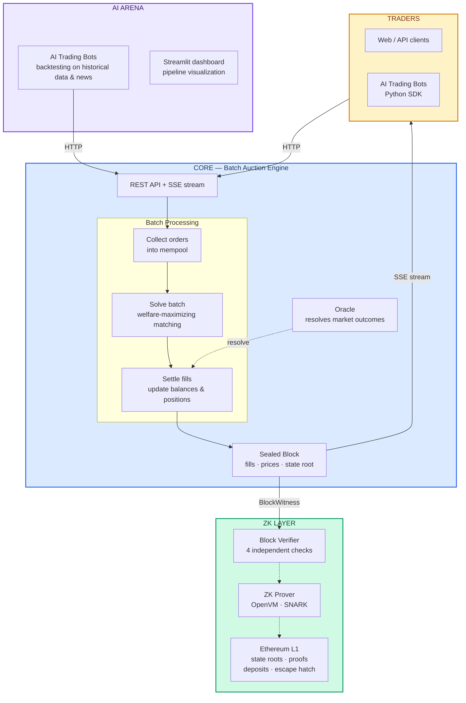
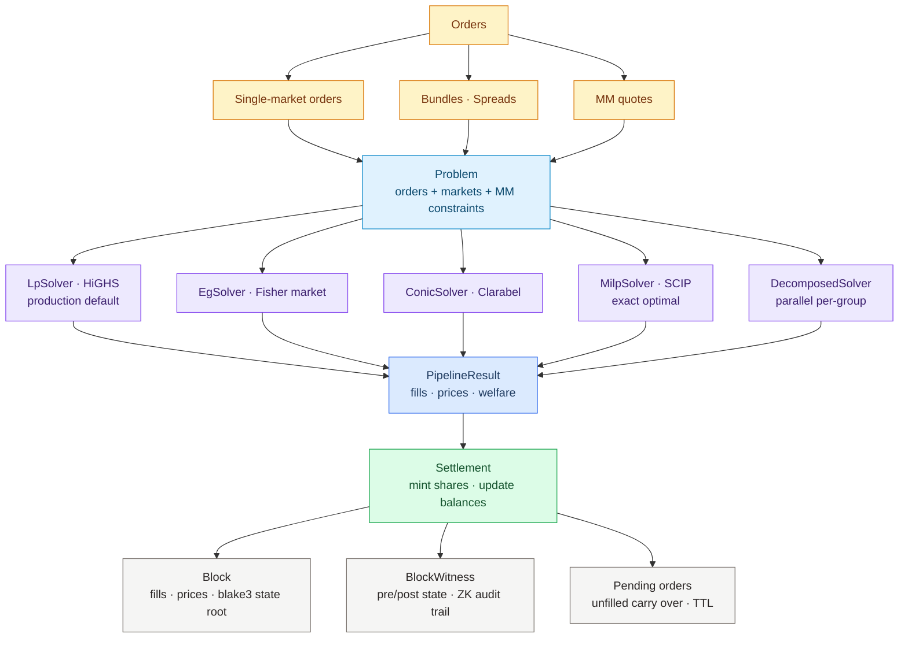
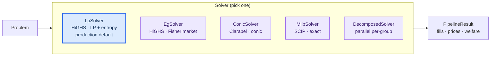
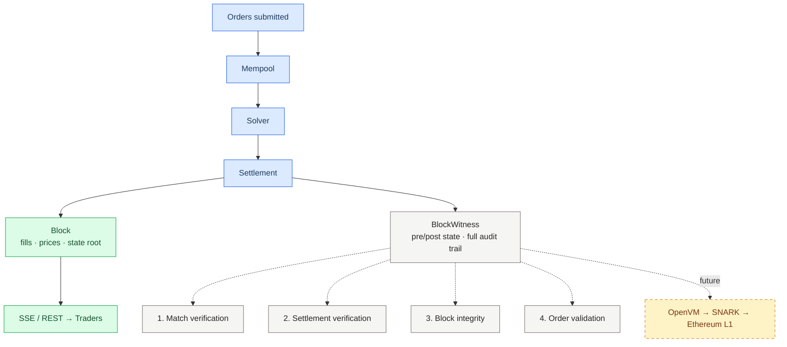
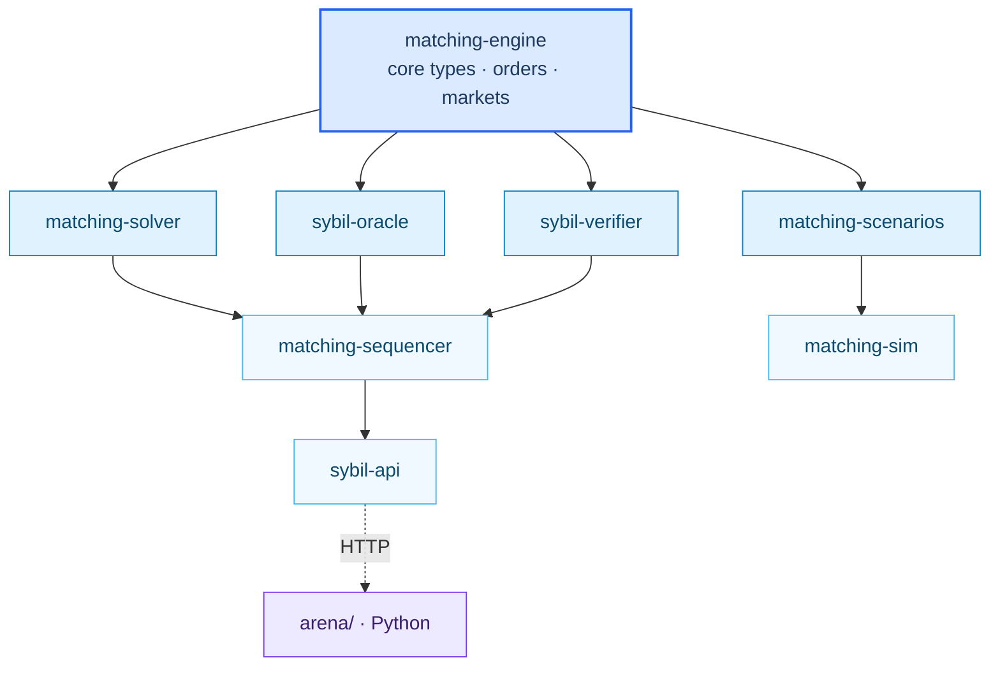

> **Superseded.** Diagrams now live inline in the relevant vault notes at `docs/architecture/`. This file is kept for historical reference.

# Architecture Diagrams

---

## 1. System Overview — Three Layers

Sybil is a **prediction market exchange** using Frequent Batch Auctions. Traders place orders on binary-outcome markets (e.g. "Will X happen? YES/NO"). Every few seconds, all pending orders are batched and matched by a welfare-maximizing solver. Fills are settled, a block is produced, and (future) a ZK proof is posted to Ethereum.

**Core** is the exchange. Orders flow in → batched → solved → settled → block sealed. This is the `matching-sequencer` crate, which internally uses `matching-engine` (domain types) and `matching-solver` (optimization). The oracle resolves markets when outcomes are known.

**AI Arena** is the external simulation layer. AI bots (informed traders, market makers, noise traders) backtest strategies against historical data and news via a Python SDK. The Streamlit dashboard visualizes pipeline convergence and performance.

**ZK Layer** provides trust. The block verifier validates correctness across 4 layers (match validity, settlement, block integrity, order validation). Today it runs offline in tests. Future: the same verification logic compiles into a SNARK circuit via OpenVM, posting proofs to Ethereum L1 in a Validium architecture — off-chain data, on-chain proofs.

---

## 1b. Core Internals — Engineering Deep-Dive

Zooms into the Core layer showing technical details: order representation, solver options, settlement mechanics, and state commitments.

**Key technical properties:**
- **Payoff vectors**: Every order is a vector over atomic market states — unifies simple orders, bundles, spreads, and conditionals into one representation. Max 5 markets, 32 states per order (stack-allocated).
- **Integer arithmetic**: All prices and quantities in nanos (1 dollar = 10^9). No floating point anywhere. Overflow-safe via i128 intermediates in settlement.
- **Welfare objective**: `Σ (limit_price - clearing_price) × fill_qty`. The solver maximizes total trader surplus, not volume.
- **Uniform clearing price**: One price per outcome per market. All fills at the same price within a batch.
- **Minting**: When a BuyYes and BuyNo fill match, $1 creates a YES+NO position pair. No counterparty needed — the protocol mints shares.
- **State commitment**: blake3 hash of all account state. Parent hash chains blocks. Designed for ZK proof integration via `BlockWitness`.
- **Pending orders**: Unfilled orders persist across batches with TTL expiry (default 3 batches). MM quotes are one-shot — consumed each batch.

---

## 2. Solvers

All solvers are self-contained: they take a `Problem` and return a `PipelineResult`. The **LpSolver** is the production default — fastest and highest welfare. The sequencer calls whichever solver is configured; there is no multi-phase pipeline.

---

## 3. Block Lifecycle — Production, Verification, Settlement

The sequencer produces two outputs: a **Block** (served to traders via SSE/REST) and a **BlockWitness** (complete audit trail). Today the witness is only used by `matching-sim` for offline 4-layer verification. Future: the witness feeds into a ZK prover for on-chain proof posting.

---

## 4. Crate Dependencies

*Note: `matching-sim` also depends on `matching-solver` and `sybil-verifier` — omitted from the diagram to keep arrows clean. It's a dev tool that pulls from multiple crates for benchmarking.*
