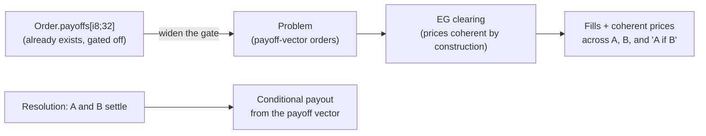

# Conditional & combinatorial markets

Expands brainstorm idea #1 ([[possibility-space-2026-07]]) into a concrete
design. This is the **headline capability of a Fisher-market exchange** — and the
one competitors on a CLOB or AMM structurally cannot match, because it falls out
of the joint clearing rather than being bolted on.

## The intuition

A normal exchange prices each market in its own order book. If you list "Will the
Fed cut in March?" and "Will CPI be under 3%?" and "Will the Fed cut in March *if*
CPI is under 3%?", nothing forces those three prices to be mutually consistent —
an arbitrage can sit open between them. Sybil clears **all orders in one convex
program** whose dual variables are the prices ([ADR-0001](../docs/adr/0001-eg-fisher-market-matching.md)),
so **coherence is not enforced, it's emergent**: the equilibrium prices of related
outcomes cannot contradict each other, because they're duals of one optimization.

That means Sybil can offer instruments an order book can't price honestly:
- **Conditional** — "A given B" (pays only in worlds where B holds).
- **Combinatorial / bundle** — one instrument over a basket of outcomes.
- **Spreads / baskets / indices** — weighted combinations.

## The machinery already exists (latent)

The single most important fact: **`Order` is already a general payoff-vector
instrument.** `matching-engine/src/order.rs` carries `payoffs: [i8; 32]` over up
to 5 markets plus an optional `PriceCondition`. It is *deliberately disabled* —
`validate_binary_one_hot()` is enforced at four layers (API ingress, sequencer,
the validity-critical verifier, and solver ingress) so only simple binary orders pass
today ([[Payoff Vectors]]; the KEEP-DEFERRED entry in
`docs/review/simplification-plan.md`; math in canonical
`~/github/prediction-markets-are-fisher-markets/decomposition.typ`,
`bundle-clearing.typ` — see `design/math-papers.md`).

So this feature is not "invent a new instrument." It is **"safely widen the
one-hot gate to the payoff-vector generality the type already models, and teach
the solver, verifier, and resolution to honor it."**

## What it takes — four honest pieces of work

### 1. Solver support (the real algorithmic work)
The LP core prices independent binaries in milliseconds. Payoff-vector orders
couple markets, and the MM budget constraints add bilinear coupling
([[MM Budget Constraint]]) — the sole source of NP-hardness. The existing
research solvers (`decomposed.rs` implements canonical `decomposition.typ` in
`~/github/prediction-markets-are-fisher-markets/`) are the
head-start: decompose per market-group, solve the coupled sub-blocks, reconcile.
This is where the genuine effort is, and why it's deferred, not deleted. Scope it
to a bounded generality first (small `k`-market conditionals), not the full
32-dimensional space.

Follow the **corrected** plan in the revised `bundle-clearing.typ`
(July 2026, canonical repo — see `design/math-papers.md`): factor the clearing
**exactly** across the connected components of the coupling graph, and within a
component run a **junction tree** whose cost is exponential in the component's
**treewidth** — so chains and stars of conditionals stay cheap while dense
coupling is where the blow-up lives. Where even that is too expensive, fall back
to a **price-taking injection** of the bundle against fixed prices, which carries
a proven welfare bound. (The Feb draft's claim of cost "polynomial in the number
of bundles regardless of coupling" was wrong: per-bundle minting-cost
corrections do not simply add.)

### 2. Resolution semantics (new, must be exact)
A conditional "A if B" must settle correctly across the *joint* outcome of A and
B — including the "B didn't happen" world where the conditional voids and stakes
return. This is new [[Market Resolution]] logic: resolution must consume the
payoff vector, not assume one-hot binary payout. The void-and-refund path is the
subtle case (mirrors the scalar-market and Voided-status roadmap).

### 3. Validity impact (bounded but real)
`Order`, `Fill`, and settlement are in the guest commitment
([ADR-0006](../docs/adr/0006-witness-v3-full-snapshot.md)) — so widening the gate
and teaching settlement to honor payoff vectors **moves the commitment**. But the
*struct already serializes the full vector* (that's why `OrderDirection::to_byte`
has a stability test), so this is enabling latent bytes, not reshaping the wire
format. Rides a fresh-genesis window
([ADR-0009](../docs/adr/0009-fresh-genesis-for-consensus-changes.md)); the encoders
belong in [`sybil-commitments`](sybil-commitments-consolidation.md), defined once.
The verifier's `validate_binary_one_hot` becomes `validate_payoff_vector` with an
explicit, tested admissible set — **the one-hot check is load-bearing safety;
loosen it deliberately, not by accident.**

### 4. UX / product surface
Conditional and bundle markets are only useful if users can express and
understand them. The API/order-type layer ([[Order Types]]) and the frontend need
a way to construct a payoff vector without hand-writing `[i8; 32]`. Start with a
small palette (binary, simple conditional, two-outcome bundle), not the raw
vector.

## Sequencing & risk

- **Not near-term.** This sits behind the current queue (god-split → keys_digest →
  redeploy → shakedown) and behind the escape/trust-minimization work — a market
  isn't compelling if the exit isn't real yet ([[Threat Model]]).
- **Bounded-generality first.** Enable `k=2` conditionals and two-outcome bundles
  with an explicit admissible-payoff set and full solver↔verifier conformance
  before widening. The four-layer one-hot enforcement is a *safety asset* — each
  loosening is a validity change gated by golden vectors and the differential
  harness ([testing strategy](testing-strategy-2026-07.md)).
- **The payoff is the moat.** Coherent conditional pricing is the clearest reason
  the Fisher-market architecture was chosen over a CLOB. When the trust story is
  solid, this is the feature that makes Sybil *interesting*, not just *safe*.

## Why it's uniquely Sybil's

Everything else — the joint EG clearing, the payoff-vector `Order`, the
decomposition solver, the coherence proof — is already in the codebase or the
math. A CLOB would need to invent cross-market coherence and would still price
each book independently; an AMM can't express multi-outcome coupling at all.
Sybil's clearing gives coherent conditional prices *for free*; the work is
letting them through the gate safely.
