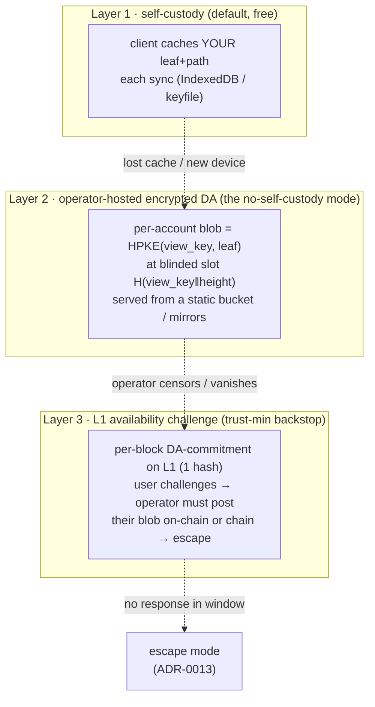

# Data availability for a private validium — the concrete scheme

> **Superseded in part by
> [ADR-0016](../docs/adr/0016-public-market-tape-and-recovery-da-boundaries.md).**
> The privacy classification remains useful, but the passkey-PRF “stable
> per-account view key” construction below is not implementable as written:
> PRF is optional and credential-specific, WebAuthn signing keys cannot do
> ECDH, and add/revoke semantics were unspecified. User-private recovery bundles
> and full operator-replacement snapshots are now explicitly separate future
> protocols. Do not implement the key construction below without a new reviewed
> recipient-registration design and physical authenticator tests.

Resolves the open fork in [ADR-0012 §Decision-4](../docs/adr/0012-privacy-and-data-availability.md)
(self-custody vs encrypted-DA) with a specific construction, its cost, and — the
part that actually matters for UX — a mode where **users never have to
self-custody anything**. Founder ask (2026-07-07): *"what specific DA solution,
what cost, and can something clever spare users from self-custody?"*

## The requirement, stated narrowly (this is the whole trick)

A rollup must publish **all** transaction data so **anyone** can rebuild **global**
state. A validium doesn't. Sybil's exit ([ADR-0013](../docs/adr/0013-exit-and-escape-model.md))
needs exactly one thing per user:

> **their own latest account leaf** (cash, positions, `keys_digest`,
> `events_digest`) **+ the Merkle path to a committed root.**

That's ~150–300 bytes. Not the batch, not other users' data, not the witness. So
Sybil's DA is **per-account, not global** — and per-account data *encrypted to its
owner* leaks nothing even if published in the clear. That single observation is
why "private" and "always-exitable" stop fighting each other.

Keep three things distinct — they are constantly conflated:

| Object | Who needs it | Where it lives | Public? |
|---|---|---|---|
| **State root + validity proof** | L1, everyone | on-chain | yes (opaque) |
| **Full block witness** (all orders/fills/leaves) | the prover only | operator, private | **no** — private prover input, *not* DA ([ADR-0006](../docs/adr/0006-witness-v3-full-snapshot.md) reframed) |
| **Your own leaf + path** | you, to exit | the DA scheme below | encrypted to you |

## The scheme — three layers, ship the first two now

### Layer 1 — self-custody by default (happy path, zero infra)
On every sync the client stores the user's *own* encrypted leaf + path for the
latest root (browser storage + an exportable keyfile). Cost nothing, leaks
nothing. Sufficient for a user who keeps their session — but fragile (stale after
inactivity, gone with the device). This is a **robustness cache, not a
requirement** — which is the UX inversion Valery asked for.

### Layer 2 — operator-hosted encrypted per-account DA (the clever bit)
The operator keeps each account's **latest** leaf as a blob
`HPKE(view_key, leaf‖path)` and serves it from cheap, replicable storage. Because
it's sealed to a key only the owner derives, hosting it *publicly* leaks nothing —
so it can sit behind a CDN or be mirrored by anyone. A user on a fresh device
**re-fetches their blob and decrypts** — no backup, no seed phrase, no
self-custody burden. Three sub-pieces make it private and usable:

- **The view key — how a passkey user decrypts without an extractable key.**
  A WebAuthn passkey ([ADR-0014](../docs/adr/0014-webauthn-first-auth.md)) only
  *signs*; it can't do ECDH. So we don't decrypt *with* the passkey — we derive a
  **view key** from the passkey's **PRF/`hmac-secret` extension** (a stable 32-byte
  secret per credential): `view_key = HKDF(prf_secret, "sybil/da/view/v1")`. The
  passkey never leaves the authenticator; the view key is reconstructed on demand,
  used for HPKE-decrypt, and discarded. This is the Zcash incoming-viewing-key
  pattern. Agent keys (raw P-256) can ECDH directly or derive a view key the same
  way from a stored secret.
- **Blinded addressing — no public account→identity map.** The blob's storage slot
  is `slot = HMAC(view_key, root_height)` (or a static per-account tag
  `H(view_key‖"da-slot")`). The owner re-derives their slot; a public mirror sees
  only opaque tags → blobs. The operator knows the map when it *writes*, but the
  mirror/challenger surface exposes only the owner's own tag.
- **HPKE** (RFC 9180: P-256 + HKDF-SHA256 + AES-256-GCM) — a boring, standard,
  misuse-resistant sealed-box. Reuses the curve OpenVM already accelerates.

### Layer 3 — L1 availability challenge (Phase 2, trust-minimization)
The operator commits per block to a **DA-commitment** `D_root`: a vector
commitment over the account blobs for that state root — **one extra 32-byte word
folded into the existing block-commit tx.** If a user can't get their blob, they
post an on-chain **availability challenge** for their slot; the operator must
publish that blob + its proof against `D_root` within a window, or the vault flips
to **escape mode** ([ADR-0013](../docs/adr/0013-exit-and-escape-model.md)). In the
happy path *nothing* touches L1; a challenge reveals only the *challenger's own*
(encrypted) blob — never the batch. This closes the last trust gap: availability
stops being "trust the operator" and becomes "challenge or exit."

## Privacy details that are easy to get wrong

- **Don't leak the update count.** A variable-size on-chain commitment reveals how
  many accounts moved that block (an activity signal). Commit over a **fixed-size**
  account space (Merkle/KZG of fixed dimension, unchanged blobs re-committed or
  padded) so `D_root`'s shape is constant.
- **Access-pattern privacy.** Serving blobs by blinded slot over a mirror hides
  *who* fetches *what* from third parties; the operator still sees fetches (it
  already sees everything pre-encryption — operator-blindness is the separate
  [sealed-bid](sealed-bid-batch-auctions.md) step, explicitly out of scope here).
- **Key rotation.** Tie `view_key` to a **stable per-account secret**, not to one
  credential, so rotating a passkey (`keys_digest` change) doesn't strand old
  blobs. Simplest: a per-account `da_seed` set at creation, wrapped to each active
  key; `view_key = HKDF(da_seed, …)`. Rotating keys re-wraps the seed, never
  re-encrypts blobs.

## Cost — concretely, it's negligible

| Item | Cost |
|---|---|
| On-chain / block | +1 32-byte `D_root` word, folded into the existing block-commit tx — ~one SSTORE. Negligible. |
| Off-chain storage | O(#accounts) *latest* blobs (overwrite, not append), ~150–300 B each → **~300 MB at 1 M accounts.** A static bucket. |
| Bandwidth / block | changed accounts' new blobs only — a few small writes per block. |
| Challenge (rare) | one on-chain post of a single ~300 B blob + ~log N proof, per disputing user. Bounded. |

No external DA layer, no new token, no committee. The on-chain footprint is one
hash per block; everything else is a static encrypted bucket.

## Why not the alternatives

- **Everything on-chain (blobs/calldata).** That's a rollup: expensive, and even
  encrypted it leaks per-account **access patterns** (who updated when). Rejected.
- **External DA (Celestia/EigenDA/Avail).** Extra dependency + liveness trust +
  token cost, and still needs the encryption + blinding anyway. More moving parts
  for no privacy gain over a mirrored bucket + L1 challenge. Rejected for now
  (revisit only if operator-hosting proves insufficient).
- **Pure self-custody.** The simple fallback in ADR-0012, but it's the UX Valery
  flagged: lose the cache + operator gone = stuck, and non-technical users won't
  keep backups. Kept as Layer 1 *robustness*, demoted from *requirement*.

## Phasing

- **Phase 1 (now — also fixes the live leak):** auth-gate every per-account read
  (SYB-60); replace the plaintext public witness endpoint with **HPKE per-account
  blobs + view-key derivation + blinded slots** (SYB-120), self-custody cache as
  Layer 1. Availability is still operator-trusted, but data is **private** and the
  no-self-custody UX works. This alone closes the headline privacy bug.
- **Phase 2 (with the escape/soundness cluster):** add the per-block `D_root`
  commitment + the L1 challenge game (Layer 3) → availability becomes
  trust-minimized.

## The one-line answer

**Encrypt each account's own leaf to a view key derived from its passkey's PRF,
store the blobs at blinded slots in a plain mirrorable bucket, commit one hash per
block on L1, and let any unserved user challenge on-chain or escape.** Users keep
nothing; privacy is structural; the on-chain cost is a single word per block.
