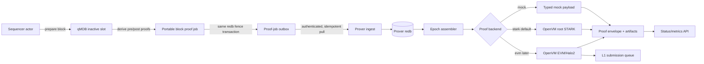

# Resilient epoch prover service — design and implementation plan

> **Decision summary:** prove a configurable number of consecutive blocks in
> one OpenVM execution. Run real root STARK proving now, retain an explicit EVM
> wrapping switch for later, and use a typed mock backend for fast end-to-end
> tests. Capture every block's portable proof job transactionally, then let a
> separate durable prover service assemble, prove, and publish epochs. Land
> ordinary order/cancel authorization and replay nonces in the same guest repin.

This plan implements [ADR-0019](../docs/adr/0019-epoch-stark-prover-service.md).
It replaces the runtime recommendations in the dated
[`settlement-aggregation-swirl.md`](settlement-aggregation-swirl.md); that note
remains useful research evidence for why monolithic epochs were selected.

## 1. Goals and completion boundary

The first production-capable milestone is complete when:

1. every locally produced committed sequencer block transactionally leaves a portable,
   independently validating proof job;
2. a standalone `sybil-prover` daemon ingests jobs without gaps, assembles
   deterministic contiguous epochs, produces and verifies OpenVM STARK proofs,
   and survives kill/restart at every state transition;
3. the epoch guest proves all existing block validity rules plus ordinary
   Raw-P256/WebAuthn order and cancel authorization and monotonic cross-block
   replay nonces;
4. mock and real STARK runs emit the same typed envelope and status API, while
   L1 calldata construction rejects both;
5. switching configuration to `evm` runs the same input through OpenVM's EVM
   wrapper and is the only mode eligible for state-root submission; and
6. a local/Compose soak proves multiple epochs with injected crashes and no
   missing, duplicated, reordered, or silently skipped blocks.

Sepolia deployment and 24-hour proving are the next rollout gate, not a reason
to weaken this service's local durability model.

## 2. Non-goals

- Recursive aggregation of independently generated block proofs.
- Parallel multi-machine proving in the first implementation.
- Selecting the final production DA provider or encrypted recovery scheme.
- Automatically enabling EVM wrapping or submitting L1 transactions.
- Preserving the current devnet genesis or witness/state formats.
- Proving read-only API keys, profile metadata, or other actions that cannot
  move value or alter open orders in the first authorization migration.

## 3. Current-state findings that constrain the design

### 3.1 Proof material expires even when witnesses remain

`Store` persists the block witness in redb but holds authenticated state in two
qMDB A/B slots. `collect_state_transition_proof_job` can build a job only while
the block's post-state and predecessor still occupy those slots. A polling
worker that misses more than one rotation cannot reconstruct the old qMDB leaf
proofs. Therefore proof-job capture is part of block commit, not a downstream
best-effort task.

### 3.2 The worker is a preparer, not a prover scheduler

The current filesystem worker validates one block, writes guest input and DA
files, creates free-form string status, and stops at
`proof_status: "not_started"`. It has no typed transition graph, attempt lease,
retry clock, atomic artifact protocol, epoch assembly, or proof subprocess.

### 3.3 Ordinary authorization is deliberately outside the guest

Raw P256 orders/cancels are verified by the sequencer. WebAuthn is verified by
the API and passed inward as an `Authenticated*` value, discarding the
authenticator and client-data envelope. `Account.last_nonce` is durable
operational state but is absent from `AccountSnapshot` and `state_root`.

Adding these actions to the witness also changes WAL reasoning. The current
separate admit, pending-bundle, and control-plane logs replay in a fixed
cross-table order. Once acknowledgement order determines a proven nonce/key
transition, that ordering becomes validity-sensitive. This fires the
single-WAL contingency described by [[Acknowledged-Write WAL Replay]].

## 4. Architecture



The sequencer owns committed state and the source proof-job outbox. The prover
owns ingestion checkpoints, epoch policy, attempts, proof artifacts, and
submission state. Neither service mutates the other's database.

## 5. Crate and process boundaries

### 5.1 `sybil-zk`: pure validity statement

Keep guest-safe types and deterministic verification here:

- `StateTransitionGuestInput` and per-block verification;
- `EpochTransitionHeader`, `EpochTransitionPublicInputs`, and the streaming
  epoch fold;
- epoch public-input hashing and block/DA commitments; and
- no filesystem, process, network, clock, or scheduler code.

### 5.2 New `sybil-proof-protocol`: portable host handoff

Extract the current proof-job types from `sybil-prover` into a dependency-light
crate:

- versioned `BlockProofJob` and content-derived `BlockProofJobId`;
- `EpochId`, `ProofKind`, `ProofEnvelope`, and artifact digests;
- MessagePack transport and validation helpers; and
- no sequencer store or OpenVM SDK dependency.

`matching-sequencer` and `sybil-prover` may both depend on this crate without a
cycle. Guest code does not.

### 5.3 `sybil-prover`: one standalone daemon

The host crate owns:

- authenticated job ingestion;
- a redb-backed scheduler and lease/retry state machine;
- deterministic epoch assembly;
- artifact filesystem transactions;
- mock, OpenVM STARK, and OpenVM EVM backend adapters;
- status, metrics, readiness, and administrative retry/seal endpoints; and
- optional development witgen commands behind `sequencer-store`.

`sybil-prover daemon` runs scheduler and HTTP API in one supervised process.
The existing `worker` and `serve` commands remain migration/debug tools until
the daemon replaces them. OpenVM is invoked as a pinned external executable;
the ordinary service binary does not link the proving SDK or compile guests.

### 5.4 Sequencer/API boundary

The sequencer store builds and commits proof jobs. The API exposes a
service-authenticated MessagePack pull/ack surface; it does not interpret or
modify jobs. The prover may later move to a different host without sharing the
sequencer volume.

## 6. Validity formats

### 6.1 Block proof job

`BlockProofJobV3` contains the current witness plus ordered pre/post qMDB leaf
proofs. Its ID is derived, never assigned:

```text
block_job_id = BLAKE3(
    "sybil/proof-job/v3"
 || genesis_hash
 || height:u64le
 || block_hash
 || state_root
 || witness_root
)
```

The persisted outbox key is `(height, block_hash)`. Re-inserting identical
bytes is a no-op. A different block hash at an existing committed height is a
fail-closed chain conflict.

### 6.2 Streaming epoch input

OpenVM stdin is an ordered stream, so the guest does not deserialize one giant
`Vec<StateTransitionGuestInput>`:

1. stream item 0: `EpochTransitionHeader`;
2. stream items `1..=block_count`: one encoded `StateTransitionGuestInput` each.

The guest reads, verifies, folds, and drops one block at a time. Host-side input
JSON contains one hex item per stream item. Bounds are checked before allocation:

- `block_count > 0`;
- deployment-configured `block_count <= MAX_EPOCH_BLOCKS`;
- each encoded block and the aggregate encoded input remain below explicit
  byte caps; and
- epoch start/end metadata must match the first/last verified block.

The initial deployment default is 360 blocks (approximately one hour at the
current ten-second cadence). Tests use 1–4. The value is configuration, not a
guest constant; the guest enforces only the protocol maximum.

### 6.3 Epoch public inputs

Do not overload the old singular `block_hash/events_root/witness_root` fields.
Use an explicit v2 epoch statement:

```text
EpochTransitionPublicInputs {
    start_height: u64,          // previous accepted height
    end_height: u64,            // final block height
    start_state_root: bytes32,
    end_state_root: bytes32,
    block_count: u64,
    blocks_commitment: bytes32, // ordered per-block public-input hashes
    epoch_da_commitment: bytes32,
    deposit_root: bytes32,
    deposit_count: u64,
}
```

```text
blocks_commitment_0 = BLAKE3("sybil/epoch/blocks/v1")
blocks_commitment_i = BLAKE3(
    "sybil/epoch/blocks/fold/v1"
 || blocks_commitment_(i-1)
 || per_block_public_input_hash_i
)

epoch_da_commitment_0 = BLAKE3("sybil/epoch/da/v1")
epoch_da_commitment_i = BLAKE3(
    "sybil/epoch/da/fold/v1"
 || epoch_da_commitment_(i-1)
 || block_da_commitment_i
)
```

The revealed 32 bytes are:

```text
keccak256(abi.encode(
    "sybil/openvm/epoch-transition/v1",
    start_height,
    end_height,
    start_state_root,
    end_state_root,
    block_count,
    blocks_commitment,
    epoch_da_commitment,
    deposit_root,
    deposit_count
))
```

The L1 adapter/settlement migration uses this struct directly. Early
development does not preserve the single-block ABI for aesthetic compatibility.

### 6.4 Epoch verification rules

For each streamed block, the guest runs the existing full
`verify_state_transition_input`. In addition it requires:

- identical `genesis_hash` across the epoch;
- strictly consecutive heights;
- exact previous-header equality with the prior verified header, not only equal
  state roots;
- prior `new_state_root == next.previous_state_root`;
- the first previous height/root and last height/root match epoch public inputs;
- final deposit root/count match the epoch statement; and
- the two ordered commitments recompute exactly.

An invalid block poisons its epoch. Later epochs must not skip over it.

## 7. Ordinary action authorization and replay nonce

### 7.1 Committed nonce

Add `last_nonce: u64` to the canonical account snapshot/state leaf and all three
witness account phases. This is a validity migration: witness v10, new state
roots, new goldens, a new guest commitment, an adapter repin, and fresh genesis.

### 7.2 Retained authorization

Promote the existing Raw-P256/WebAuthn envelope shape to a general
`P256Authorization` used by key operations and ordinary actions. The API may
still perform WebAuthn policy checks for good errors, but it must pass the exact
`authenticator_data`, `client_data_json`, signer key, and raw signature inward.
The sequencer and guest re-run the shared verifier; an `Authenticated*` marker
without an envelope is no longer sufficient.

### 7.3 Ordered authorization stream

Witness v10 contains one actor-order-preserving `authorized_actions` section:

```text
AuthorizedActionWitness {
    account_id: u64,
    nonce_before: u64,
    nonce_after: u64,
    action: Order { assigned_order_id, signed_order }
          | Cancel { order_id }
          | KeyRegister { ... }
          | KeyRevoke { ... },
    authorization: P256Authorization,
}
```

For ordinary actions `nonce_after` is the signed nonce and must be strictly
greater than `nonce_before`; the next action for that account must open the
prior `nonce_after`. State-bound key operations retain their digest binding and
participate in the same active-key ordering even if they do not consume the
ordinary nonce.

The verifier reconstructs block-start active keys from the authenticated
post-state opening, then replays key mutations and ordinary actions in exact
acknowledgement order. It verifies:

- scheme-matching active-key membership at that point in the stream;
- Raw-P256/WebAuthn cryptography over shared canonical bytes;
- genesis, action fields, and nonce binding;
- each authorized order maps exactly to a newly introduced witnessed order
  with the server-assigned ID excluded only from signing bytes;
- each authorized cancel maps exactly to its cancellation event and the
  pre-state resting order; and
- final nonce/key digests match authenticated post-system/post-state leaves.

Carried resting orders are not re-authorized every block: the previous accepted
state root proves their prior admission. New unsigned value-bearing actions may
not masquerade as user actions. Production service routes must either use an
explicit operator action class with a documented trust boundary or sign with a
registered agent key.

### 7.4 Unified acknowledged-write log

Before authorization becomes validity-sensitive, replace the separate replay
tables with the single typed log anticipated by the existing WAL analysis:

```text
AckWrite {
    DirectAdmit { order, authorization },
    DeferredBundle { submission, authorizations },
    Cancel { request, authorization },
    KeyOperation { operation, authorization },
    ControlPlane(...),
    L1Deposit(...),
    BridgeWithdrawal(...),
    BridgeL1Input(...),
}
```

One monotonically increasing sequence is allocated in the same redb append
transaction. Replay scans once and reproduces acknowledgement order. Rows are
cleared in the block fence transaction exactly as today. A layout migration
re-emits legacy tables in today's documented replay order; mixed populated old
and new layouts fail closed.

## 8. Transactional proof-job outbox

During `save_block_inner`:

1. persist the new state into the inactive qMDB slot;
2. verify its root against the prepared header;
3. while both required qMDB slots still exist, build and natively validate the
   portable block proof job;
4. serialize the job and include it in the same redb transaction that writes
   witness/history and flips the qMDB fence; and
5. only then commit the prepared sequencer clone live.

Failure to construct or persist the job fails the block commit. This is
intentional: a committed but permanently unprovable block is worse than a
temporarily stalled sequencer.

The disaster-recovery witness-import path is the sole explicit exception. An
imported non-genesis head is a new trusted checkpoint and the fresh store does
not possess its prior qMDB slot, so it cannot fabricate a job for the incoming
historical transition. The checkpoint itself has no outbox row; mandatory
capture resumes with its first locally produced child. Prover epoch policy must
start after that checkpoint, just as a fresh-genesis deployment starts after
its configured trust anchor.

Outbox reads are idempotent and ordered by height. The prover acknowledges only
after the exact bytes and digest are durable in its own database. Source jobs
remain until acknowledgement plus a configured safety-retention window; never
prune an unacknowledged gap. Queue bytes, oldest unacknowledged height, and
capture latency are monitored.

Proof-job construction adds critical-path work. Before the production default
is enabled, benchmark leaf-proof generation and serialized size at realistic
account/order counts. If it threatens the block interval, optimize qMDB
multiproof generation; do not move capture behind a lossy watcher.

## 9. Prover persistence and crash recovery

### 9.1 Durable authority

Use a dedicated redb database; status JSON is a projection, not authority.
Large jobs and proof payloads may live as content-addressed files, but their
digest, length, ownership, and state transition live in redb.

Tables conceptually contain:

- block jobs by content ID and height;
- the contiguous ingested frontier;
- epoch records and their ordered block-job IDs;
- proof attempts with lease owner, lease expiry, retry count, and last error;
- artifact manifests/digests;
- the proven and submitted frontiers; and
- the persisted epoch policy (`next_start`, target block count, limits).

### 9.2 Typed state machine

```text
Collecting -> Ready -> Preparing -> Proving -> Verifying -> Proven
                                                |            |
                                                v            v
                                           RetryWait     ReadyToSubmit (EVM only)
                                                |            |
                                                +------> Submitting -> Submitted
```

`Mock`, `OpenVmStark`, and `OpenVmEvm` are typed proof kinds, not status strings
or booleans. `Proven(Mock)` and `Proven(Stark)` cannot transition to
`ReadyToSubmit`.

### 9.3 Artifact transaction

For every stage:

1. write into an attempt-specific temporary directory;
2. fsync files and directory;
3. hash and validate the outputs, including the revealed public-input hash;
4. atomically rename to the content-addressed final path; and
5. commit the redb transition referencing that immutable path.

On startup, temporary directories are quarantined or removed. A final artifact
without the matching DB transition is revalidated and adopted only when its
epoch ID, kind, digests, and public output match exactly; otherwise it is
quarantined. A DB record whose artifact is absent/corrupt returns to retry.

### 9.4 Leases and retries

An attempt has a durable owner UUID and lease deadline. The daemon renews the
lease while the OpenVM subprocess is alive. On restart, an expired lease makes
the epoch retryable. Retries use bounded exponential backoff with jitter and a
maximum automatic attempt count; manual retry is explicit and audited.

Input/validity failures are permanent and halt the contiguous frontier.
Resource/process failures are retryable. The service never skips a poisoned
epoch to prove a later one as if the chain were contiguous.

The OpenVM child runs in its own process group with time and memory limits. A
daemon shutdown stops accepting new work, terminates the child cleanly, then
lets the lease/reconciliation rules recover.

## 10. Epoch assembly

Epoch boundaries are deterministic and persisted. The initial policy is a
fixed target count; assembly starts at the first height after the proven
frontier and takes the next contiguous jobs. It closes when the target is
reached. A manual partial seal is allowed for deployment/genesis transitions
and becomes durable before proving.

Changing target size affects only future unassembled epochs. It never reshapes
an epoch with an ID or proof attempt. Epoch IDs commit the ordered block-job
IDs, so duplicate assembly is idempotent and different contents cannot collide
under the same logical range.

One worker proves one epoch at a time initially. This is deliberately simpler
than parallel proving and keeps CPU/RAM bounded. Ingestion and preparation may
continue while a proof runs, subject to byte/count quotas.

## 11. Proof backends and envelope

### 11.1 Backend configuration

```text
SYBIL_PROVER_PROOF_KIND=mock|stark|evm
```

- `mock`: run native epoch verification; emit a deterministic non-cryptographic
  payload for integration tests.
- `stark` (deployment default for this milestone): invoke pinned
  `cargo openvm prove stark`, then `cargo openvm verify stark`.
- `evm`: invoke `cargo openvm prove evm`, verify it, and make the envelope
  eligible for the submission queue. It requires explicit EVM artifacts and a
  separate production preflight.

Changing kind never relabels an old proof. It schedules a new attempt/envelope
for the same epoch and kind.

### 11.2 Common proof envelope

```text
ProofEnvelopeV1 {
    format_version: u8,
    proof_kind: Mock | OpenVmStark | OpenVmEvm,
    epoch_id: bytes32,
    public_inputs: EpochTransitionPublicInputs,
    public_input_hash: bytes32,
    app_exe_commit: bytes32,
    app_vm_commit: bytes32,
    payload_digest: bytes32,
    payload_len: u64,
    created_at_ms: u64,
}
```

The proof payload is a separate immutable artifact. The kind, not a caller
boolean, controls trust. The mock payload is domain-separated from all OpenVM
formats. Calldata encoding accepts only `OpenVmEvm` and checks the pinned guest
commitments and public output again.

## 12. Resource policy and memory

The STARK-first deployment avoids EVM/Halo2 setup and wrapping, but STARK
aggregation is still resource-intensive. The daemon exposes and enforces:

- maximum encoded bytes per block and epoch;
- maximum blocks per epoch;
- one proving child at a time;
- subprocess timeout and memory ceiling;
- disk high-water marks for inbox, attempts, and retained artifacts; and
- backpressure/alerts before capacity exhaustion.

Streaming guest input avoids one giant deserialized epoch value. It does not
promise constant prover memory—the trace/proof system still scales with total
execution—and must be measured with real workloads. Start with small epochs,
record peak RSS/wall time/cycles, then raise toward 360 only when the service
keeps up faster than block production.

## 13. API and observability

The daemon keeps `/healthz`, `/metrics`, and proof status, but status becomes
epoch-oriented and typed. Required metrics include:

- source/ingested/assembled/proven/submitted frontiers and their block lag;
- queued jobs/epochs and bytes;
- current state, proof kind, attempt, and lease age;
- preparation/proving/verification durations and peak RSS;
- proof and input sizes;
- retries/failures by stable reason class;
- outbox capture duration/failures; and
- last successful proof timestamp.

Readiness is false when the DB cannot reconcile, the configured guest pins do
not match, an unacknowledged source gap exceeds policy, or required backend key
material is absent. Liveness does not fail merely because one proof is slow.

Administrative mutations—retry, partial seal, backend enablement, submission—
are service-authenticated, logged, and idempotent.

## 14. Security and failure invariants

1. No committed block lacks a durable proof job.
2. No epoch contains a gap, duplicate height, conflicting block, or mixed
   genesis.
3. No backend may choose or alter public inputs; they are recomputed from jobs.
4. Native preparation and guest verification execute the same rules.
5. Mock and STARK proofs cannot enter the L1 submission state.
6. An artifact is immutable and content-addressed after publication.
7. A crash may repeat work but cannot advance a frontier without durable,
   validated artifacts.
8. Invalid input halts the chain of epochs; it is never converted into a retry
   loop or skipped.
9. The prover service has no authority to mutate exchange state.
10. Guest/source/key changes require explicit commitment repinning; ordinary
    tests never regenerate pins.

## 15. Implementation phases

Current implementation status (2026-07-14): the protocol crate/extraction,
typed envelope and payload binding, host-side streaming epoch accumulator,
typed mock backend, and transactional sequencer proof-job outbox are landed.
The accumulator stays in `sybil-proof-protocol` until the intentional guest
repin so this intermediate slice does not move deployed validity pins. The
outbox is covered by qMDB slot-rotation and randomized crashpoint invariants.
unified authorization WAL/witness migration, streamed `sybil-zk`/OpenVM guest,
durable prover scheduler, authenticated service ingest, and STARK subprocess
backend remain to be implemented in the phases below.

GitHub tracking is deliberately split at durable/consensus boundaries:

- [#76](https://github.com/MetaB0y/sybil/issues/76) owns the globally ordered
  acknowledged-write WAL;
- [#73](https://github.com/MetaB0y/sybil/issues/73) owns authorization witness
  v10 and the cross-block nonce;
- [#15](https://github.com/MetaB0y/sybil/issues/15) owns the streamed epoch
  statement, OpenVM guest, and intentional repin;
- [#77](https://github.com/MetaB0y/sybil/issues/77) owns the standalone durable
  STARK-first prover service;
- [#13](https://github.com/MetaB0y/sybil/issues/13) owns the later EVM/Halo2
  proving infrastructure; and
- [#25](https://github.com/MetaB0y/sybil/issues/25) remains the Sepolia and DA
  rollout gate.

### Phase A — protocol extraction and typed envelopes

- Add `sybil-proof-protocol` and move portable block-job types from
  `sybil-prover` without changing bytes.
- Define epoch IDs, proof kinds, proof envelope, and serialization tests.
- Replace free-form trust decisions in calldata/status code with `ProofKind`.
- Keep current one-block preparation working through compatibility wrappers.

**Gate:** old proof-job fixtures decode identically; mock/STARK envelopes are
compile-time/runtime rejected by calldata encoding.

### Phase B — unified acknowledgement order and authorization witness v10

- Land the single acknowledged-write table and migration tests before making
  order validity depend on replay order.
- Commit `last_nonce` in account snapshots and state leaves.
- Preserve exact Raw-P256/WebAuthn envelopes from API through sequencer/WAL.
- Add the ordered authorization witness and shared native/guest verification.
- Prove new orders, cancels, active-key membership, and nonce transitions;
  include negative, reordering, replay, and cross-block tests.

**Gate:** witness v10/goldens are intentional; native and OpenVM execution reject
forged, stale, reordered, wrong-scheme, wrong-genesis, and wrong-RP actions.

### Phase C — transactional block proof-job outbox

- Build pre/post qMDB proof material before the fence flip.
- Store the portable job in the same redb commit and expose ordered pull/ack.
- Add crashpoints before qMDB, after qMDB, before redb fence, after fence, and
  after live commit.
- Add retention/backlog metrics and fail-closed conflicting-height handling.

**Gate:** every crash recovers either the old block with no job or the new block
with its exact job—never one without the other.

### Phase D — epoch statement and streaming guest

- Implement epoch public inputs, folds, IDs, and native verification in
  `sybil-zk`.
- Change the OpenVM guest/tooling to header + one input stream item per block.
- Add 1/2/N-block chaining tests and tamper every boundary/commitment.
- Repin once after Phase B and D are both complete.

**Gate:** native and OpenVM execution reveal identical epoch hashes; a two-block
proof exercises an authorized order in block one and authorized cancel in block
two.

### Phase E — durable prover daemon

- Add prover redb schema, reconciliation, leases, retry policy, and immutable
  artifact transactions.
- Add deterministic assembler and small configurable epochs.
- Implement mock backend/envelope, then the OpenVM STARK subprocess adapter and
  local verification.
- Merge scheduler and HTTP server into the daemon; retain debug CLIs.

**Gate:** a fault-injection matrix kills the daemon during every state/artifact
transition and converges to one valid proof envelope without gaps or duplicates.

### Phase F — Compose soak and EVM switch preparation

- Wire the separate daemon container, persistent DB/artifact volumes, service
  auth, dashboards, alerts, backups, and restore drill.
- Run sustained mock soak, then real STARK epochs starting small and increasing
  only from measured capacity.
- Add but do not enable EVM backend preflight, proof verification, and
  submission queue.

**Gate:** multi-epoch STARK soak with API/sequencer/prover restarts; measured
throughput exceeds production ingress with bounded disk growth.

### Phase G — Sepolia (separate activation decision)

- Enable EVM mode on provisioned hardware.
- Deploy/pin the real adapter and epoch-aware settlement contracts.
- Exercise deposit → signed trade → normal withdrawal and 24 hours of
  gap-free DA/proof/root submission.

## 16. Verification matrix

| Layer | Required evidence |
|---|---|
| Pure protocol | ID/encoding goldens, domain separation, envelope-kind rejection |
| Authorization | Raw/WebAuthn positives; wrong key/scheme/RP/genesis/action; nonce replay/reorder; key rotation within window |
| Epoch | empty/oversize reject; height/root/header/genesis gaps; commitment tamper; 1/2/N block folds |
| Store outbox | fault at every qMDB/redb/live boundary; conflict and retention tests |
| Scheduler | duplicate ingest, expired lease, corrupt/orphan artifact, retry exhaustion, poisoned epoch |
| Mock E2E | identical envelope/status lifecycle, submission rejected |
| STARK E2E | `prove stark` + `verify stark`, reveal matches native, restart soak |
| EVM (later) | `prove evm` + local/Solidity verify, only eligible envelope reaches calldata |

Focused gates are followed by `just check-consensus`, `just docs-check`, the
OpenVM rebuild workflow, and `just check-all` before a guest repin or deployment.

## 17. Rollout and compatibility

This is intentionally breaking under [ADR-0011](../docs/adr/0011-validium-stance-no-backcompat.md).
Witness v10, nonce-bearing state leaves, the epoch public-input domain, and the
new guest commitment require fresh genesis before external acceptance. The
single-block guest remains available only as a development diagnostic; the
deployed adapter pins the epoch guest.

Rollout order is: land code and goldens → rebuild/repin → local mock soak → local
STARK soak → fresh genesis → observe STARK service → separately authorize EVM
hardware and Sepolia deployment. No mock or unsafe adapter is evidence of
validity.
