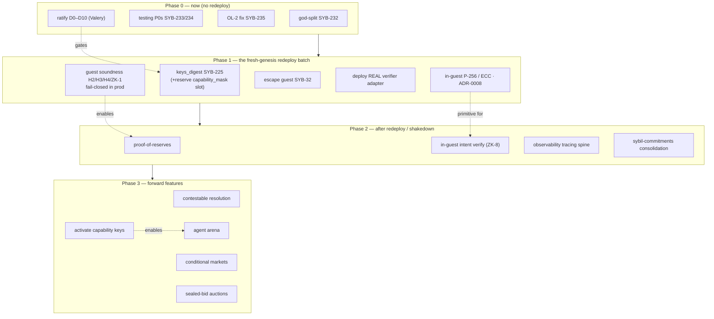

# Execution order — the current spine (2026-07-07)

The integration layer over today's design work: **given all the specs, in what
order does it happen, and why.** This sequences by *dependency*, not wish — it
points into the detailed docs rather than repeating them. Complements the
finding-level [`../docs/review/30-roadmap.md`](../docs/review/30-roadmap.md); this
is the founder's-eye execution spine.

The organizing spine is the **trust-minimization sequence** from the
[[Threat Model]] — each phase flips a 🟡/🔴 toward 🟢 — interleaved with the
enabling cleanup.

## Phase 0 — now, independent of the redeploy

Low-risk, unblock everything else. Can run in parallel (codex).

| Do | Why now | Ref |
|---|---|---|
| **God-split** (`actor`→`store`→`sequencer`) | keys_digest should build on clean boundaries; pure relocation, low risk | SYB-232 · [god-module-decomposition](../docs/review/god-module-decomposition.md) |
| **Guest-rebuild as a scoped merge gate** | a silent reproducibility break during the redeploy would be worst-case | SYB-233 · [testing-strategy](testing-strategy-2026-07.md) |
| **Golden-vector single-source generator** | kills Rust↔Solidity drift *before* the redeploy adds vectors | SYB-234 |
| **OL-2 market_id binding** | latent wrong-market settlement bug; prereq for propose/challenge | SYB-235 |
| **Ratify D0–D10** (Valery) | gates keys_digest scope (esp. D0 raw-P256-only, D1 reserve the mask slot) | [keys-and-escape-ratification](keys-and-escape-ratification.md) |

## Phase 1 — the fresh-genesis redeploy batch

All consensus/trust changes ride **one** fresh genesis
([ADR-0009](../docs/adr/0009-fresh-genesis-for-consensus-changes.md)) — batch them.
This is the phase that flips the big trust items.

1. **keys_digest** (SYB-225) — proven key-ops; **reserve the `capability_mask`
   byte slot** now ([capability-mask-keys](capability-mask-keys.md), D1 refinement).
2. **In-guest P-256 / OpenVM ECC** ([ADR-0008](../docs/adr/0008-in-guest-p256-openvm-ecc.md),
   [openvm-p256-integration](openvm-p256-integration.md)) — the `app_vm_commit`
   move; shared by keys_digest and escape.
3. **Escape-claim guest + vault entrypoint** (SYB-32) — flips the "no exit yet"
   trust item (H14). The most user-visible promise to make real.
4. **Deploy the real verifier adapter** (retire `UnsafeAcceptAll`) — *the* first
   trust flip; without it the withdrawal/root gating is theater.
5. **Guest soundness** (H2/H3/H4/ZK-1) + run guest verification **fail-closed in
   production** — flips "correct state transition."

> Ordering within the batch: adapter + soundness are the highest-leverage trust
> flips; keys_digest/P-256/escape are the feature spine. They share the genesis
> window because each moves the commitment.

## Phase 2 — after the redeploy (shakedown + capstones)

- **Proof of reserves** ([proof-of-reserves](proof-of-reserves.md)) — capstone on
  guest soundness; ship *after* Phase 1 or it attests an aggregate a broken
  transition could corrupt.
- **In-guest intent verification** (ZK-8) — verify order/cancel signatures in the
  guest using the P-256 primitive from Phase 1; flips the intent-forgery trust item.
- **Observability tracing spine** ([observability-otel](observability-otel-2026-07.md))
  — correlation + block-production span tree + a trace backend.
- **sybil-commitments consolidation** ([sybil-commitments](sybil-commitments-consolidation.md))
  — byte-identical, so it can land any time; do it before conditional markets add
  new encoders.

## Phase 3 — forward features (once trust is solid)

Sequenced so each rests on the prior. A market isn't compelling until the exit is
real (Phase 1), so features come last.

1. **Contestable resolution** ([trust-minimized-resolution](trust-minimized-resolution.md))
   — build the **bonding/`BalanceLock` primitive** first (reusable); flips the
   last big trusted surface.
2. **Activate capability-masked keys** ([capability-mask-keys](capability-mask-keys.md))
   — pure application-layer *if* the slot was reserved in Phase 1.
3. **Conditional / combinatorial markets** ([conditional-combinatorial-markets](conditional-combinatorial-markets.md))
   — the Fisher-market headline; bounded generality first.
4. **Sealed-bid batch auctions** ([sealed-bid-batch-auctions](sealed-bid-batch-auctions.md))
   — MEV-resistance; commit-reveal first, threshold later.
5. **The agent arena as product** — gated on capability keys (#2); the growth
   engine.

Further headroom (decentralization, validium/volition, recursive aggregation,
quorum/external-court resolution) is mapped in
[possibility-space-2026-07](possibility-space-2026-07.md) — build when measured as
needed, not before.

## The one-line summary

**Clean up and gate (Phase 0) → flip the big trust items in one redeploy
(Phase 1) → prove solvency and finish the trust story (Phase 2) → then build the
features the architecture uniquely enables (Phase 3).** Trust first, features
second — because the features are only worth having on a base you don't have to
trust.
