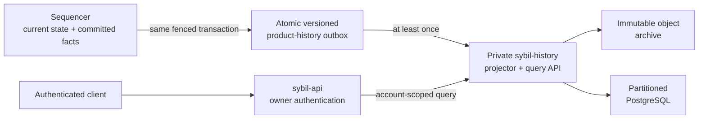

# Long-term historical data architecture

> **Status:** superseded by the accepted implementation decision in
> [ADR-0018](../docs/adr/0018-extract-private-history-service.md). Originally
> generated by Codex on 2026-07-12 and not independently reviewed.
>
> The implemented boundary follows this report's transactional-outbox shape,
> but starts with an independent redb service rather than PostgreSQL/object
> archive. Those stores remain later, measurement-driven steps.

## Executive recommendation

Sybil should eventually move historical indexing and serving out of the
sequencer. The current 30/31-day windows and 1M/2M row ceilings are good
operational safety rails for an embedded redb read model, but they are not a
credible long-term retention policy.

It is too early to operate another database-backed service on the current
shared 2 GB dev box. It is not too early to define the extraction seam. The
recommended sequence is:

1. Keep the bounded implementation for the current devnet.
2. Before users are promised history beyond the retained window, define a
   versioned, transactional `CommittedHistoryBatch` outbox at the fenced block
   commit boundary.
3. Add a private history projector when retained data matters. Start with
   PostgreSQL for serving and cheap immutable object storage for archive and
   rebuilds.
4. After a verified cutover, remove historical tables, pruning, pagination,
   downsampling, and historical query RPCs from the sequencer.

The intended ownership boundary is:



This is a transactional-outbox architecture, not a synchronous dual write.
History lag or an indexing outage must not participate in matching, settlement,
state roots, or block validity.

## What the current implementation is doing

Fills, account events, equity samples, prices, and several aggregate views are
derived data. They do not affect validity. Today, however, their rows are
constructed by `matching-sequencer`, appended to redb in the fenced block
transaction, read synchronously through sequencer actor messages, and served by
`sybil-api`.

The code audit found three concrete critical-path couplings:

1. `matching-sequencer/src/store/commit.rs` writes the account-history rows,
   price points, indexes, and candle rollups in the fenced redb transaction.
   Global history-cap eviction also runs in that transaction.
2. `matching-sequencer/src/actor/handlers/dispatch.rs` executes fill, equity,
   event, price, candle, and windowed-leaderboard reads through the sequencer
   actor. A large historical scan can therefore delay the actor that admits
   orders and produces blocks.
3. `matching-sequencer/src/actor/production.rs` awaits periodic history pruning
   before swapping live state and publishing the already-persisted block.
   Startup also rebuilds history indexes by scanning the retained tables in
   `matching-sequencer/src/store/retention.rs`.

No committed, private, replayable export boundary exists today. The public
block tape is deliberately insufficient for one because it removes private
account attribution.

That design has useful properties for an early devnet:

- a failed candidate block cannot leak historical rows;
- committed rows have zero indexing lag;
- restart and query behavior require only one local database;
- deployment, testing, and backup have few moving parts.

It also puts responsibilities with different scaling and failure modes into the
single-writer process:

- canonical current state and the commit fence;
- long-lived append storage;
- time and account indexes;
- retention and deletion work;
- pagination and cursor-gap semantics;
- equity downsampling and leaderboard baselines;
- API-oriented historical queries.

Indefinite retention would couple sequencer disk growth, redb maintenance,
backup and restore time, actor latency, query load, and historical schema
evolution. Raising the row caps only postpones that coupling.

### Are the current limits arbitrary?

The exact numbers are provisional. The need for limits is not. On the current
architecture, an unbounded append-only product view is an operational risk.
ADR 0017 correctly makes the risk bounded and makes truncation visible to
clients.

The limits should therefore be interpreted as:

> the amount of history the sequencer is willing to serve locally, not the
> amount of history the product intends to preserve forever.

The recent retention work is still valuable after extraction. Its honest gap
and cursor semantics provide a safe migration runway and a bounded local
fallback.

## Target responsibility split

### Sequencer owns

- canonical current balances, positions, orders, and counters;
- block construction, settlement, verification inputs, and the commit fence;
- exact block-local facts needed to construct a history export;
- the small durable export outbox and its delivery/checkpoint metadata;
- optionally a small live overlay for accepted-but-not-yet-committed account
  activity.

### History system owns

- multi-month and multi-year retention;
- account/time/market indexes and pagination;
- rollups, chart sampling, leaderboards, and exports;
- historical query schema evolution and backfills;
- history-specific backups, restore drills, and completeness reporting;
- eventually cross-account analytical workloads.

### Main API owns

- passkey/session authentication and account ownership checks;
- the external history contract;
- forwarding only an authorized, account-scoped internal query;
- reporting indexing lag and completeness without pretending eventual data is
  current.

The history service should be private. It does not need passkey secrets and
should not expose account-wide queries directly to browsers. Its database and
backups contain sensitive trading activity and need encryption, access audit,
and explicit deletion/export policies.

Canonical block/DA retention, proof artifacts, and recovery data remain a
separate product with a separate SLO. Moving product history does not solve data
availability or escape recovery.

## Export contract

Add a versioned `CommittedHistoryBatchV1`, keyed by network genesis and block
height and written in the same redb transaction as the sealed block and commit
fence. An indicative shape is:

```text
CommittedHistoryBatchV1
  schema_version
  chain_id / genesis_hash
  height
  block_hash / state_root
  committed_at_ms
  account_fill_deltas[]
  account_event_deltas[]
  equity_samples[]
  market_price_points[]
  public_market_statistics[]
  payload_hash
```

The exact DTO deserves a separate design review. Important properties are:

- it is emitted only for a committed block;
- it contains stable domain facts, not redb keys or table layouts;
- batches are immutable and replayable;
- every record has a deterministic idempotency key;
- the consumer applies a batch and advances a contiguous checkpoint in one
  database transaction;
- delivery is at least once, so duplicate application is harmless;
- schema version and genesis are part of identity.

The exporter must not scrape the public block stream. Public blocks
intentionally omit account-attributed fills and private lifecycle events. It
also should not share or tail the sequencer's redb file: that would expose
private layout and fence details without establishing a real service contract.

For the first version, exporting the exact block-local fill, event, equity, and
price deltas already generated by the sequencer is preferable to introducing a
new universal event-sourcing model. Raw domain events can become the basis of
more projections later. Forcing the whole sequencer into event sourcing now
would be a much larger, unrelated architectural change.

## Storage recommendation

### Serving store: PostgreSQL first

Partitioned PostgreSQL is the best initial fit for authenticated, account-
scoped pagination and modest aggregates. Use monthly/time partitions and
indexes beginning with:

- `(genesis_hash, account_id, height, sequence)` for stable account cursors;
- `(genesis_hash, account_id, timestamp)` for activity ranges;
- `(genesis_hash, market_id, timestamp)` for prices and candles;
- deterministic primary keys for every exported fact.

PostgreSQL gives Sybil mature migrations, constraints, backups, and ordinary
query tooling without operating a streaming platform. It should run outside
the latency-critical sequencer process and, once this becomes production
infrastructure, preferably outside the sequencer host.

### Archive: immutable object storage

Store compressed raw export batches in S3-compatible object storage before
considering them durably ingested. This is cheap insurance for re-projection,
schema migration, audit, and rebuilding PostgreSQL. Parquet partitions can be
added for offline analysis, but the initial durable artifact can simply be the
canonical versioned batch format.

### What not to add yet

- **Kafka:** unnecessary for one producer, one main consumer, and current
  volume. The redb outbox is already a durable ordered log.
- **ClickHouse:** excellent for large aggregate scans, but less natural than
  PostgreSQL for the first owner-scoped product API. Add it only when measured
  analytical workloads justify a separate projection.
- **A shared redb reader:** operationally couples both processes to one file
  and private schema. It does not provide independent retention or restore.
- **Synchronous external dual writes:** would make a database/network outage
  part of the block commit path and require a distributed transaction.

## Retention should be data-class specific

One global 30-day policy mixes records with very different value and cost.
A sensible starting policy is:

| Data class | Suggested long-term treatment |
|---|---|
| Account fills and financial lifecycle events | Preserve for network lifetime, subject to an explicit product/legal policy |
| Raw history export batches | Immutable archive for network lifetime or a declared archival SLO |
| Raw per-account equity samples | Keep at full resolution for 60–90 days |
| Hourly/daily equity rollups | Preserve long term |
| Public committed prices and candles | Preserve long term; roll up older raw points |
| Derived leaderboards/aggregates | Rebuildable projections with policy-specific windows |
| Private canonical blocks and recovery DA | Separate security/recovery retention decision |

These are recommended categories, not final durations. Actual rates should be
measured before fixing production quotas.

## API and consistency semantics

After extraction, history is committed but eventually indexed. Responses
should expose enough information for a bot or UI to reason about that:

- `indexed_through_height`;
- current sequencer `head_height` or `lag_blocks`;
- `complete_from_height` / `complete_from_timestamp_ms`;
- genesis-bound opaque cursors;
- typed retention, ingestion, and permanent-gap conditions.

A new genesis invalidates prior cursors. Clients that require read-your-block
behavior can wait for `indexed_through_height`, while current portfolio state
continues to come from the sequencer. The API should use one historical source
after cutover rather than merging pages from redb and PostgreSQL; dual-source
pagination is difficult to make correct.

An unavailable history backend should make history endpoints explicitly
unavailable or lagged, not return empty success and not stop trading. The local
outbox needs a monitored backlog large enough to survive ordinary outages.
Exhaustion policy must be explicit: the default recommendation for devnet is an
alerted, disclosed history gap rather than halting sequencing. A later
production or regulatory policy may instead require the operator to halt
before discarding an unarchived financial record. Silent checkpoint advancement
is never acceptable.

## Migration plan

### Phase 0 — current devnet

Keep ADR 0017 and the current embedded read path. Measure:

- rows and bytes per stream per day;
- redb file growth and backup/restore time;
- rows pruned per maintenance pass and pruning lag;
- historical endpoint p95/p99 and actor mailbox wait;
- block commit latency attributable to history writes and cap enforcement.

Do not deploy PostgreSQL on the shared 2 GB box merely to establish the future
shape.

### Phase 1 — establish the seam

Before promising more than the local retained window:

1. Define `CommittedHistoryBatchV1` in a small shared crate or API-types module.
2. Write one outbox batch atomically with each fenced block.
3. Expose a private, service-authenticated pull/replay endpoint or equivalent
   local consumer interface.
4. Add consumer checkpoint, backlog, and oldest-unarchived-height metrics.
5. Add replay, duplicate-delivery, missing-height, restart, schema-version, and
   new-genesis conformance tests.
6. Introduce a `HistoryReader` boundary at the API with embedded and remote
   implementations, while production still selects embedded.

This phase creates architectural optionality without requiring a new runtime
service.

### Phase 2 — archive and project

Add a private `sybil-history` process. It consumes batches in height order,
archives them, projects them into PostgreSQL, and exposes an internal query
API. Backfill whatever is still in the embedded retained window, then shadow
production reads and compare results, cursor ordering, gaps, and equity
rollups.

If historical preservation matters from the first public devnet block, at
least the outbox and archival consumer must be live before the 30-day window
starts deleting those facts. The current private, resettable devnet does not
need an elaborate migration of old rows.

### Phase 3 — cut over and simplify

After the remote projection has caught up and passed parity checks, switch the
API to the remote `HistoryReader`. Then remove from the sequencer:

- primary fill/event/equity serving tables and their time indexes;
- raw historical price/candle tables, rollups, and their time indexes;
- per-account pruning high-water tables and global history row caps;
- account/price-history age pruning and index backfill logic;
- actor messages that synchronously read historical account and market pages;
- historical leaderboard/equity downsampling query work.

Keep:

- canonical current portfolio state and all-time counters needed by matching;
- block-local fact/delta construction;
- the bounded outbox and its delivery metadata;
- a small pending/live overlay if product semantics require it;
- canonical blocks, commit fence, DA, proof, and recovery storage.

This is where the service split creates a materially crisper sequencer. Adding
a new service without completing this removal would only duplicate complexity.

### Phase 4 — scale only from evidence

Move the history database to independent infrastructure, add richer rollups and
exports, and consider ClickHouse or a warehouse only when aggregate scan volume
or analyst concurrency exceeds PostgreSQL's intended role.

## Pros and costs

### Benefits

- Clear validity/current-state versus historical-read-model ownership.
- Multi-year retention no longer expands the sequencer database.
- Query load, migrations, backups, and rollups scale independently.
- Rich analytics cannot directly stall the single-writer actor.
- Different streams can have appropriate retention and compaction policies.
- Historical projections can be rebuilt from immutable exported facts.
- The sequencer becomes smaller after—not merely before—the cutover cleanup.

### Costs and new risks

- Eventual consistency and visible index lag.
- Another sensitive database, runtime, backup, and alerting surface.
- Export schema compatibility and backfill tooling become permanent concerns.
- At-least-once ingestion, checkpoints, and gap handling require care.
- Account privacy must cross an internal service boundary.
- Small deployments pay a meaningful operational cost before they receive a
  scaling benefit.

## Alternatives considered

| Option | Assessment |
|---|---|
| Keep all history in sequencer redb forever | Simple and zero-lag, but poor long-term isolation, retention flexibility, scaling, and restore characteristics |
| Increase redb caps substantially | Buys time but preserves every coupling and makes eventual migration harder |
| Let a sidecar read the sequencer redb file | Reject: private-schema and file-lifecycle coupling without a replay contract |
| Synchronously write redb and an external DB | Reject: history availability becomes block-production availability |
| Transactional outbox plus asynchronous projector | Recommended: committed ordering without distributed transactions |
| Kafka/ClickHouse immediately | Too much operational machinery for current scale; possible later projections, not starting requirements |

## Decision and timing

The recommended decision is:

> Keep bounded embedded history for the current devnet. Design the export seam
> next, but deploy the separate history store only when history is product-
> critical or measurements justify it.

Any one of these is a strong deployment trigger:

- the product promises more than 30 days or network-lifetime history;
- retained data must survive devnet resets;
- historical queries or pruning measurably affect block production;
- history dominates redb size, backup, or restore time;
- richer exports, cross-account analytics, or independent history SLOs are
  required;
- multiple API replicas need a shared historical read model.

The user's expected need for records beyond 30 days already justifies designing
the seam. It does not, by itself, justify placing PostgreSQL and another service
on today's dev box before launch. The next best work item is Phase 1; the next
best deployment item is an archive-first projector before a public devnet makes
long-retention promises.

## Related current documentation

- `docs/adr/0017-bounded-durable-account-history.md`
- `docs/architecture/03-sequencing/Historical Data Serving.md`
- `docs/architecture/03-sequencing/Persistence.md`
- `docs/architecture/03-sequencing/Block Data Boundaries.md`
- `docs/architecture/07-operations/Deployment Profiles.md`
