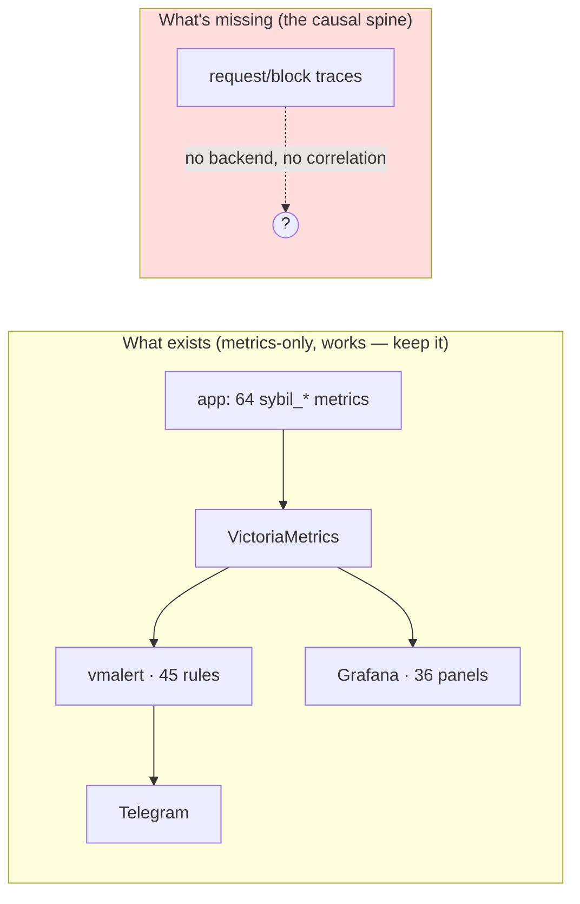
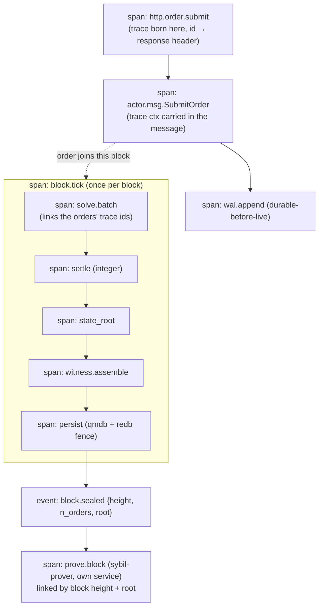

# Observability (OpenTelemetry / OTLP) — strategy

> **Status note (2026-07-11):** the inventory and counts below are dated.
> Resurvey the deployed metrics/tracing pipeline before using this as a plan.

How Sybil should see itself. Grounded in an inventory of what exists today:
`tracing` everywhere, ~64 Prometheus metrics, a VictoriaMetrics → vmalert →
Telegram → Grafana pipeline (45 alert rules, 36 panels), and OpenTelemetry
**half-installed** in `sybil-api` only.

## The intuition: three signals, three questions

- **Metrics** answer *"is something wrong?"* — cheap, aggregate, alertable.
- **Traces** answer *"where, and why?"* — the causal chain of one request/block.
- **Logs** answer *"what exactly happened here?"* — discrete events at a point.

Sybil today is **metrics-rich and trace-poor.** You can see `sybil_actor_queue_
depth` spike or `sybil_solve_time_seconds` p99 breach — but you cannot answer
*"which submission caused that spike"* or *"where did the 800 ms in block N
go."* Metrics tell you the house is on fire; traces tell you which room. For a
pipeline that fans a request across an HTTP handler → a ractor mailbox → the
solver → settlement → persistence → the prover, **the missing signal is the
trace that stitches those hops together.** That's the whole thesis of this doc.

## Current state, precisely

- **Good foundation, half-wired.** `tracing` is the logging crate everywhere;
  `sybil-api` already depends on `opentelemetry` / `tracing-opentelemetry` /
  `opentelemetry-otlp` and exports OTLP spans **when `OTEL_EXPORTER_OTLP_ENDPOINT`
  is set** — deliberately off by default because the public demo runs on a 2 GB
  host and "metrics/alerts are the default path." So OTel is a *seed*, not a
  green field: ~20% there.
- **But the spine is absent.** Zero `#[instrument]` in the workspace; only 3
  manual spans (all in two `sybil-api` routes). The block-production hot path
  (`matching-sequencer` actor → tick → solve → settle → persist) and the whole
  `sybil-prover` pipeline emit **no spans at all**. `matching-engine`,
  `sybil-verifier`, `sybil-zk`, `sybil-signing` have neither logs nor metrics.
- **No correlation.** No `request_id`/`trace_id` is generated at the API edge or
  propagated across the ractor mailbox. An HTTP request and the block that
  eventually includes it cannot be stitched together.
- **No trace backend deployed.** The compose stack has VictoriaMetrics + Grafana
  but no Tempo/Jaeger/collector — even with the env var set, spans have nowhere
  to land.
- **Logs are plain-text**, not structured — no field-level correlation with
  metrics or (future) traces.

## Design principles

1. **Keep metrics where they are.** The Prometheus/VictoriaMetrics/vmalert/
   Grafana pipeline is cheap, battle-tested, and right for aggregate health and
   alerting. **Do not migrate metrics to OTel** for its own sake — that's churn
   for a 2 GB host. Metrics stay the alerting spine.
- 2. **Add tracing as the *causal* layer**, not a replacement. Traces are for
   debugging *why*, sampled, not for alerting.
3. **One correlation id, end to end.** A trace id born at the API edge must ride
   every hop — including *through* the ractor message — or traces are just
   per-process fragments.
4. **Respect the host.** Sample aggressively (head-sample low, **always keep
   error/slow traces** via tail sampling at a collector). Tracing is opt-in per
   deployment; the big prod box turns it on, the 2 GB demo may not.
5. **Clean signal responsibilities:** metric = a number over time; span = a unit
   of work with a duration and a parent; log = a discrete event, **structured
   (JSON) and stamped with the trace id.**

## Target: the block-production span tree

The high-value trace is the life of a block and the requests folded into it.

Two things make this work:

- **Trace context through the mailbox.** Add an OTel `Context`/trace-id field to
  the actor-message envelope (or attach a span per `SequencerMsg` handle) so the
  submit span and the tick that clears it share a trace. This is the one genuinely
  new mechanism; everything else is `#[instrument]` annotations.
- **Span links, not a single giant trace.** A block folds in many requests;
  model each request as its own trace **linked** to the `block.tick` span (OTel
  span links), rather than one unbounded trace. The prover runs in a separate
  process and links by `{height, root}`.

## What to instrument (in priority order)

- **P0 — correlation + the block span tree.** Request-id middleware at the axum
  edge (emit `x-trace-id` response header); propagate trace context into
  `SequencerMsg`; `#[instrument]` on `on_tick_inner`, `solve_batch_phase`,
  `finalize_block_state_phase`, `assemble_witness_artifacts`, the commit fence.
  This alone answers "where did block N's latency go" and "what happened to my
  order."
- **P0 — a trace backend in compose.** Add an **OTel Collector + Tempo** (or
  Jaeger) service, wire Grafana to it (traces↔metrics correlation via exemplars),
  gate behind the prod profile so the small host is unaffected. Without a
  backend, the existing exporter is dead weight.
- **P1 — extend the OTel seed to `matching-sequencer` and `sybil-prover`.** Reuse
  `sybil-api`'s opt-in `init_telemetry` pattern verbatim; the prover pipeline is
  currently *completely dark* (a proving-time regression is invisible).
- **P1 — structured (JSON) logs stamped with trace id** behind a prod flag, so
  logs, metrics (exemplars), and traces share one id.
- **P2 — SLOs with error budgets** to replace hand-tuned absolute thresholds
  where it makes sense: e.g. *block cadence p99 ≤ target*, *order-accept latency
  p99*, *proof latency*, *root-mismatch = 0 (hard)*. Keep the hard-invariant
  alerts (`StoreQmdbRootMismatch`, `SequencerDown`) as absolute — those aren't
  SLOs, they're "the system is broken."

## What NOT to do

- Don't rip out Prometheus for OTel metrics — no payoff, real churn.
- Don't trace every span unsampled on the small host — head-sample + tail-keep
  errors/slow.
- Don't instrument the proven *core* crates (`matching-engine`,
  `sybil-verifier`, `sybil-zk`) with host tracing — they're guest-safe and must
  stay dependency-austere ([ADR-0003](../docs/adr/0003-guest-host-crate-split.md)).
  Observe them from the *caller's* spans in the sequencer, not from inside.

## Rollout

1. **P0:** request-id + trace context through the mailbox; `#[instrument]` the
   block span tree; add Collector+Tempo to the prod compose profile.
2. **P1:** extend OTel to sequencer + prover; JSON logs with trace id.
3. **P2:** define the handful of SLOs; wire exemplars so a Grafana metric spike
   links to an exemplar trace.

The result: the same alert that fires today ("solve time p99 high") becomes a
*click-through to the exact slow block's span tree* — from "something's wrong" to
"here's the room that's on fire."
