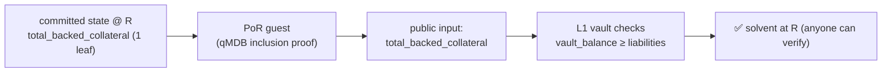

# Proof of reserves / solvency

Expands brainstorm idea #7 ([[possibility-space-2026-07]]). Turns "trust that the
vault backs every balance" — item #4 on the [[Threat Model]]'s trust list — into a
cryptographic check anyone can verify.

## The intuition (and why it's cheap here)

Most exchanges' "proof of reserves" is a hard, adversarial accounting exercise
because their internal ledger is opaque. Sybil's isn't: **the exchange is already
solvent by construction, and the state root already commits to the ledger.** Two
facts make it so:

1. **Minting is fully collateralized.** A YES+NO share pair is minted from exactly
   one unit of collateral ([[Minting]]); shares only exist because collateral was
   locked. So total exposure is bounded by locked collateral by construction.
2. **Every block conserves value.** The verifier already enforces
   `Σ balances + minted = Σ deposits` per block
   (`collect_account_invariant_failures`, the conservation invariant) —
   [[Settlement]], [ADR-0001](../docs/adr/0001-eg-fisher-market-matching.md).

So solvency isn't something to *establish* — it's something to *expose*. Proof of
reserves is: **prove, against an L1-accepted root, that the committed aggregate
liabilities ≤ the vault's actual collateral.**

## The design

Naively, summing every account leaf in-guest is O(n) — bad as state grows.
Instead, **maintain the aggregate as committed state**:

- Add a `total_backed_collateral` field to the committed state (a state leaf or
  header field), updated on every deposit (+), withdrawal (−), and mint/settle
  (net-zero, since minting is collateral-neutral). It's the running sum of what
  the vault must be able to pay out.
- Because it's *committed*, the state root already attests it. A **proof of
  reserves is then O(1)**: a small guest program (sibling of the escape-claim
  guest, [ADR-0005](../docs/adr/0005-escape-via-operator-replacement.md)) that
  takes an accepted root R, proves the single `total_backed_collateral` leaf via a
  qMDB inclusion proof, and emits it as a public input. The L1 vault (which knows
  its own balance) checks `vault_collateral ≥ total_backed_collateral@R`.

No per-account disclosure, no trusted auditor, no Merkle-sum tree to maintain
separately — the authenticated state we already keep *is* the reserve ledger.

## Honest caveats

- **It's only as strong as guest soundness.** The aggregate is trustworthy iff the
  per-block conservation it accumulates is actually enforced — i.e. it inherits
  the H2/H3/H4/ZK-1 caveats from the [[Threat Model]]. Proof of reserves is a
  *capstone* on guest soundness, not a substitute; ship it *after* those close, or
  it proves an aggregate that a broken transition could have corrupted.
- **It proves accounting solvency, not honesty elsewhere.** It says the vault can
  cover liabilities at R; it says nothing about censorship, intent forgery
  (ZK-8), or resolution correctness. Scope it precisely in any public claim.
- **Position valuation.** For binary markets the liability is exact (each share
  pair is 1 unit of collateral). If scalar/conditional markets land
  ([[conditional-combinatorial-markets]]), the max-payout accounting per
  instrument must feed `total_backed_collateral` — design it into the aggregate
  from the start.

## Why it's worth it

For a system whose identity is verifiability, "the vault provably covers every
balance, checkable by anyone, every block" is a natural and cheap credibility
feature — the aggregate is one committed field and the guest is tiny. It pairs
with an **insurance/backstop fund** (idea #12, whose balance is provable the same
way) and completes the trust story: escape proves *you* can exit; proof of
reserves proves *everyone* can. It slots into the trust-minimization sequence
right after guest soundness, reusing the escape guest's qMDB-proof machinery.
