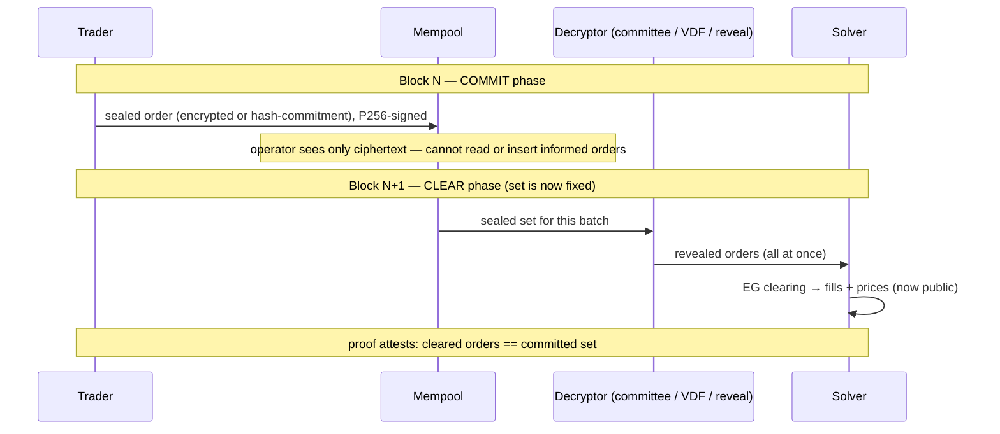

# Sealed-bid batch auctions — MEV-resistance as a structural property

Expands brainstorm idea #6 ([[possibility-space-2026-07]]) into a concrete
design. Thesis: Sybil can make front-running and order-flow leakage
**structurally impossible**, not merely discouraged — and it can do so almost for
free, because the batch auction already removed the thing that makes MEV possible.

## The intuition

In a continuous order book, matching happens the instant an order arrives, so the
order *must* be public immediately — and whoever sees it first (searchers, the
sequencer) can react before it clears. That reaction *is* MEV: front-running,
sandwiching, back-running.

Sybil's frequent batch auction already killed **intra-batch time priority**:
every order in a batch clears at one price, simultaneously
([ADR-0001](../docs/adr/0001-eg-fisher-market-matching.md)). So ask the question:
**why do orders need to be visible before the batch clears at all?** For fairness,
they don't — the clearing doesn't care about arrival order. The only parties who
benefit from seeing orders early are the ones who want to trade *against* that
information. So: **keep every order sealed until the batch closes, then reveal and
clear them together.** Front-running has nothing to run in front of; order flow
leaks nothing until it's already priced. A CLOB *cannot* copy this (it needs
plaintext to match continuously); an AMM leaks to the mempool. This is a moat.

## What sealing buys, precisely

- **No front-running / sandwiching.** The operator (and everyone) sees only
  ciphertext until the order set is *fixed*, so no informed order can be inserted
  into the same batch.
- **No order-flow leakage.** Strategies aren't exposed pre-trade.
- **Censorship becomes detectable.** A commitment is public even when its content
  isn't, so dropping a committed order is observable (feeds anti-censorship).

**Scope: pre-trade privacy only.** After clearing, fills and prices are public —
they must be, for verifiability ([ADR-0006](../docs/adr/0006-witness-v3-full-snapshot.md)).
This is MEV-resistance, not a dark pool. Full post-trade privacy would fight the
proof system and is explicitly out of scope.

## Three ways to seal (pick by trust model)

### Option A — Commit–reveal (simplest; single-operator-friendly)
Block N: submit `commit = H(order ‖ salt)`, signed. Block N+1: reveal
`(order, salt)`; the clearing uses revealed orders whose commitment appeared in
N. **The operator cannot alter or inform-insert into the fixed set.**
- *The free-option problem (must address):* a committer can watch others reveal,
  then choose *not* to reveal their own — a free look at the batch. **Mitigation:**
  require a **bond** at commit that is forfeited on non-reveal, or treat the commit
  as economically binding (reserve the collateral at commit). Without this,
  commit-reveal leaks via selective non-reveal.
- *Latency:* two block-times per order. Acceptable at current cadence; noticeable
  if cadence tightens.

### Option B — Threshold encryption (strongest; needs a committee)
Users encrypt orders to a committee's shared key (DKG); after the batch is sealed
the committee threshold-decrypts (Shutter-style). **No reveal decision exists —
decryption is forced — so the free-option problem vanishes.** Orders are hidden
from *everyone*, including the operator, until the set is committed.
- *Cost:* a decryption committee with a liveness/honest-majority assumption; DKG
  and key-rotation machinery. Pairs naturally with the **multi-operator /
  decentralization** direction (brainstorm #15) — the operator set *is* the
  committee.

### Option C — Time-lock / VDF (no committee, no reveal)
Encrypt with a time-lock puzzle openable only after time T (> batch close).
Nobody — not even the operator — can read early; no committee needed.
- *Cost:* VDF/time-lock parameter tuning and opening compute; weaker practical
  guarantees than threshold (T must exceed the clearing horizon reliably).

**Recommendation: A first, B later.** Commit–reveal with bonding ships the
property for the single-operator devnet and proves the lifecycle + validity
plumbing. Threshold encryption is the endgame and rides the decentralization
roadmap. C is a fallback if a committee is undesirable but single-operator
hiding is wanted.

## How it fits the block lifecycle & validity

The load-bearing validity property: **the proof must attest that the orders
cleared in the CLEAR block are exactly the set committed in the COMMIT block —
no operator substitution, omission (beyond provable censorship rules), or
insertion.**

- **New canonical encoding**: the order *commitment* (a domain-separated,
  genesis-bound hash per [ADR-0007](../docs/adr/0007-canonical-bytes-domain-separation.md)),
  and — for Option B — the ciphertext + decryption transcript.
- **Witness additions**: the committed set for the batch and the
  commitment→reveal binding, so the guest can check each cleared order's
  commitment was present and its reveal matches. This is another witness-schema
  version bump — **batch it with other validity changes** (it's not free).
- **The solver is unaffected** — it just runs at CLEAR time on the decrypted set;
  it already sits *outside* the trust boundary (the verifier re-derives).
- **Fits the "one home for encodings"** goal: the commitment encoder belongs in
  [`sybil-commitments`](sybil-commitments-consolidation.md), defined once.

## Honest failure modes

| Risk | Mitigation |
|---|---|
| Free option (commit, watch, don't reveal) — Option A | Bond forfeited on non-reveal, or bind collateral at commit. Option B removes it entirely. |
| Committee unavailable/dishonest — Option B | Honest-threshold assumption; fallback decrypt path; rotate. Ties liveness to the operator-set design. |
| Operator censors a *revealed* order | Commitments are public → omission is detectable → feeds the censorship/escape story. |
| Reveal-time MEV (last revealer advantage) | None under batch clearing *if* all committed orders must clear or forfeit — no intra-batch priority to exploit. Option B has no reveal race at all. |
| Latency (two-phase) | Acceptable at ~1s cadence; the cost of fairness. Threshold adds only a decrypt step, not a round. |

## Why this is *Sybil's* to win

Every ingredient is already here: a discrete clearing instant with no time
priority (the precondition CLOBs lack), a mempool
([[Mempool]]), a signature/commitment discipline
([ADR-0007](../docs/adr/0007-canonical-bytes-domain-separation.md)), and a proof
layer that can attest the commit→clear binding. Sealed-bid batch auctions turn
"we don't front-run you" from a *promise* into a *theorem*. For a prediction-market
exchange whose whole identity is verifiability, that's the most on-brand feature
in the possibility space — and the one a competitor built on a CLOB or AMM
structurally cannot ship.
