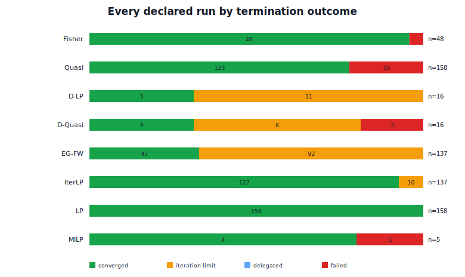
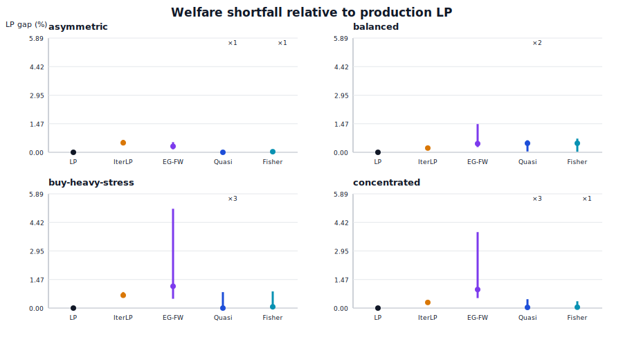
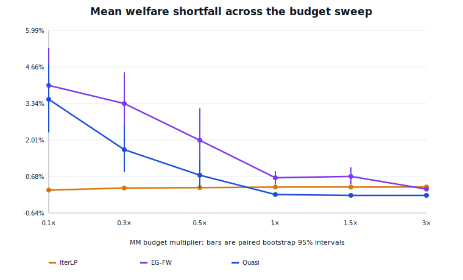
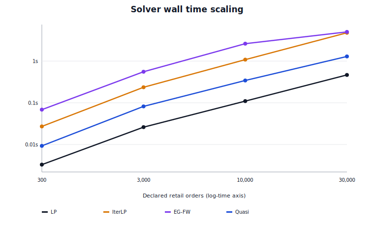

# Solver evaluation: 2026-07-13

> **Superseded by v2.** This report correctly describes the historical v1
> implementations and is retained as negative evidence. Its recommendation to
> keep LP-SLP as the production default no longer applies after the old IterLP
> and EG algorithms were replaced by certified retained-cash generalized
> Frank--Wolfe. Use
> [`solver-benchmark-report-2026-07-13-v2.md`](solver-benchmark-report-2026-07-13-v2.md)
> and the frozen v2 artifacts for the current decision.

## Decision summary

Keep the monolithic LP solver as the production default.

The expanded experiment does not support replacing LP with IterLP, EG,
quasi-Fisher conic, or either decomposed solver today. LP returned a
verifier-valid result in all 158 declared runs, converged in all of them, and
had a 26.9 ms overall median wall time. IterLP was reliable but slower and does
not optimize the paper's logarithmic objective. The logarithmic solvers are
useful research comparators, but their present convergence and numerical
behavior are not production quality.

The strongest paper-aligned result is conditional: on the 123 of 158
quasi-Fisher runs that succeeded, the median LP-relative welfare shortfall was
0.034%. That number cannot be reported without the equally important 35/158
numerical-failure count. At the tightest budget multiplier, all ten
quasi-Fisher runs succeeded but their mean shortfall was 3.488%, not the
sub-0.7% value suggested by the old single-book experiment.

The complete generated summary is
[`summary.md`](../benchmarks/solver/results/2026-07-13-v1/summary.md). Raw rows,
the frozen protocol, machine metadata, CSV/JSON summaries, and figures are in
[`benchmarks/solver/results/2026-07-13-v1/`](../benchmarks/solver/results/2026-07-13-v1/README.md).

## What was fixed before measurement

The experiment runner was frozen at revision
`831dda777e1bc11fb66a13d335401284868a3f03` before the full run. That revision
also removed hidden LP substitution from the conic and EG paths. A requested
research solver now reports its own panic, numerical failure, empty result,
timeout, iteration cap, or verifier failure. Explicit delegation remains only
where the mathematical problem is actually LP, such as Conic `Linear` mode or
a no-MM instance.

Every `PipelineResult` now carries solver diagnostics and a termination state.
The benchmark catches panics at the run boundary and emits one row for every
declared run. This matters operationally: before that change, an apparently
successful “conic” observation could really be an LP result and make both
reliability and welfare comparisons look better than they were.

The benchmark uses verifier-recomputed integer net welfare, including the
signed complete-set mint/burn adjustment. It does not rank solvers using a
floating backend objective or the previously broken absolute-value welfare
display.

## Experimental protocol

Protocol `solver-evaluation-v1` was checked in before the full run. It declares
675 solver runs over 158 independently generated scenario groups:

- quality: four medium-book profiles, 12 seeds each;
- scaling: 300, 3,000, 10,000, and 30,000 declared retail orders, with eight,
  eight, eight, and five seeds respectively;
- budget sensitivity: ten paired books at MM budget multipliers 0.1, 0.3, 0.5,
  1, 1.5, and 3;
- decomposition: balanced and asymmetric books, eight seeds each; and
- exact-reference: five small books with a three-second MILP limit.

The structural profiles vary side imbalance, hot-market concentration,
heavy-tailed order sizes, depth levels, liquidity dispersion, group frequency,
and MM market coverage. These are synthetic stress tests, not calibrated
replays of deployed order flow.

For a scenario group, every solver receives a byte-identical `Problem`.
Solver order is rotated to reduce systematic warm-cache and frequency-scaling
bias, and one declared warm-up runs before timing. The analysis rejects
duplicate or unexpected run keys, missing declared runs, and cross-solver
scenario-fingerprint mismatches.

The run completed in 242 seconds on an AMD Ryzen 7 5800X (8 cores/16 threads),
32 GB RAM, Linux 6.6.144, Rust 1.97.0. There were 675/675 rows, zero duplicates,
zero missing or unexpected rows, and zero fingerprint mismatches. The analysis
script SHA-256 is recorded in `summary.json`; the protocol BLAKE3 and full host
and toolchain metadata are in `metadata.json`.

## Metrics and estimands

“Success” means the solver returned a non-empty, verifier-valid candidate. It
does not imply convergence: iteration-limit results remain successful rows but
are also counted explicitly as capped. A failure or timeout remains in the
declared denominator. Runtime and welfare distributions are conditional on
successful runs and are always paired with `successful/declared`.

The primary quality comparison is verifier-recomputed net welfare relative to
the production LP on the identical problem. LP is an operational reference,
not a claimed global optimum for the exact bilinear MM-budget model. The MILP
suite is the only exact reference, and only an observation where SCIP reports
`Optimal` is called exact.

The paired budget confidence intervals use 10,000 seed-level bootstrap
resamples with a fixed seed. They quantify variation across the ten synthetic
books; they do not cover workload-model uncertainty or numerical failures.

## Results

### Reliability, convergence, and runtime

| Solver | Valid result | Iteration cap | Failure | Median time | Median LP gap |
|---|---:|---:|---:|---:|---:|
| LP | 158/158 | 0 | 0 | 0.0269 s | 0.000% |
| IterLP | 137/137 | 10 | 0 | 0.2548 s | 0.295% |
| EG Frank-Wolfe | 137/137 | 92 | 0 | 0.5710 s | 0.681% |
| Conic quasi-Fisher | 123/158 | 0 | 35 | 0.0868 s | 0.034% |
| Conic Fisher | 46/48 | 0 | 2 | 0.1026 s | 0.053% |
| Decomposed LP | 16/16 | 11 | 0 | 0.5894 s | 0.000% |
| Decomposed quasi-Fisher | 13/16 | 8 | 3 | 1.3275 s | 1.918% |
| MILP exact reference | 4/5 | 0 | 1 timeout | 0.0529 s | 0.000% |

All 634 candidates returned as benchmark successes passed the integer
verifier. The other 41 rows were 40 numerical solver failures plus the MILP
timeout; failure rows do not masquerade as empty but “valid” allocations.

Iteration caps are material. EG reached its cap in 92/137 runs (67.2%), IterLP
in 10/137, decomposed LP in 11/16, and decomposed quasi-Fisher in 8/16. A
verifier-valid capped result can be operationally usable, but it is not evidence
of algorithmic convergence.

The LP median was roughly 9.5 times faster than IterLP and 21 times faster than
EG over their mixed suites. Comparing the conic median to LP is less clean
because the conic statistic excludes 35 failures; among successful runs it was
still about 3.2 times the LP median.



### Quality profiles

The four profiles avoid reducing the conclusion to one favorable book. Median
LP-relative welfare shortfalls among successful runs were:

| Profile | IterLP | EG | Quasi-Fisher | Fisher | Quasi success | Fisher success |
|---|---:|---:|---:|---:|---:|---:|
| Asymmetric depth | 0.491% | 0.309% | 0.000% | 0.032% | 11/12 | 11/12 |
| Balanced | 0.219% | 0.446% | 0.467% | 0.467% | 10/12 | 12/12 |
| Buy-heavy stress | 0.659% | 1.125% | 0.000% | 0.065% | 9/12 | 12/12 |
| Concentrated | 0.290% | 0.957% | 0.034% | 0.045% | 9/12 | 11/12 |

Quasi-Fisher often recovered the LP allocation or nearly did so, especially on
the asymmetric and buy-heavy books. Balanced books are a counterexample to a
blanket “near identical” claim, and failures were not confined to a single
profile. The successful-run welfare summaries are therefore conditional and
may be optimistic if harder instances are also more likely to fail.



### Budget sensitivity

| MM budget | IterLP mean gap | EG mean gap | Quasi mean gap | Quasi success |
|---:|---:|---:|---:|---:|
| 0.1× | 0.191% | 3.993% | 3.488% | 10/10 |
| 0.3× | 0.268% | 3.335% | 1.660% | 8/10 |
| 0.5× | 0.280% | 2.000% | 0.733% | 8/10 |
| 1× | 0.301% | 0.637% | 0.031% | 9/10 |
| 1.5× | 0.301% | 0.689% | 0.000% | 7/10 |
| 3× | 0.305% | 0.227% | 0.000% | 8/10 |

The quasi-Fisher recovery pattern is visible: conditional welfare approaches
LP as budgets become slack. The experiment also refutes the historical claim
that the gap stays below 0.7% over the whole range. Tight budgets produced a
3.488% mean shortfall at 0.1× and 1.660% at 0.3×. Numerical reliability was
non-monotone, so slack budgets cannot be described as universally easier for
the current conic implementation.



This sweep does not yet evaluate the theorem's instance-specific quadratic
upper bound. A future protocol must record each instance's bound and the ratio
of the measured gap to it before the experiment can claim quantitative bound
validation.

### Scaling

| Declared retail orders | LP | IterLP | EG | Quasi-Fisher success / median successful time |
|---:|---:|---:|---:|---:|
| 300 | 0.0033 s | 0.0271 s | 0.0684 s | 8/8 / 0.0093 s |
| 3,000 | 0.0260 s | 0.2354 s | 0.5549 s | 2/8 / 0.0819 s |
| 10,000 | 0.1097 s | 1.0823 s | 2.6138 s | 3/8 / 0.3422 s |
| 30,000 | 0.4649 s | 4.7761 s | 5.0078 s | 2/5 / 1.2923 s |

LP scaled predictably and completed every run. IterLP and EG also returned a
valid candidate every time, albeit frequently capped for EG. Quasi-Fisher's
successful runtime was competitive with the iterative methods, but its
reliability collapsed outside the small suite: only 7/21 medium-to-xlarge
scaling runs succeeded. Dropping the failures would produce a misleading
runtime curve, which is why the success denominator is part of the table.



### Decomposition

Decomposed LP matched the monolithic LP allocation and welfare in all 16 runs,
but reached its coordination cap in 11 and was slower: median 0.575 seconds
versus 0.026 seconds on balanced books, and 0.886 versus 0.047 seconds on
asymmetric books. This workload has independent single-market groups, where
the monolithic LP is already cheap; no decomposition speedup should be claimed.

Decomposed quasi-Fisher was worse operationally. It succeeded in 13/16 runs,
reached the cap in eight, and had a 1.918% median LP-relative welfare shortfall.
Three asymmetric runs failed because a component conic solve failed. The
runner now propagates that failure instead of assembling a partial result.

These experiments do not exercise the regime decomposition is intended to
unlock: bundle orders over a joint state space whose coupling graph splits into
smaller components. They test implementation behavior and budget coordination,
not the claimed combinatorial asymptotic benefit.

### Exact reference

On five small reference books, SCIP proved four MILP optima and hit its
three-second limit once. On the four proven cases, LP welfare matched the MILP
to integer-rounding precision. This is a useful regression check, not evidence
that LP is globally exact on larger or more adversarial hard-budget instances.
The timeout remains a timeout; its incumbent is not relabeled as an optimum.

## Operational recommendations

1. Keep `LpSolver` as the deployment default. It is the only evaluated solver
   combining complete reliability, convergence, verifier validity, and the
   best runtime across scale.
2. Keep IterLP as an opt-in diagnostic for tight MM budgets, not as the default.
   It returned valid candidates and did well in the budget sweep, but it was
   slower, capped 10 times, and its damped fixed point is not the paper's
   logarithmic welfare program and has no convergence guarantee here.
3. Treat conic quasi-Fisher as a research implementation. Before production
   consideration, diagnose numerical conditioning, add primal/dual residual
   traces, and demonstrate robustness under a new frozen protocol. Do not add
   an automatic LP fallback inside the solver; fallback policy belongs at a
   caller boundary and must be visible in telemetry.
4. Treat EG Frank-Wolfe as a research baseline. Its valid capped candidates are
   useful for comparisons, but a 67% cap rate is not convergence evidence.
5. Do not use decomposed solving for current independent-market production
   books. Revisit it only with coupled bundle workloads and explicit
   component-size measurements.

## Limits and the next honest experiment

The experiment is broader than the historical benchmark but still synthetic,
single-machine, and solver-only. It does not measure end-to-end sequencer
latency, resident memory, CPU cycles, performance under concurrent service
load, or calibrated deployed order flow. Timing has multiple seeds but only one
timed observation per solver/book. The profiles contain single-market orders;
they do not cover spreads, conditional bundles, or joint-state inference.

A version-2 protocol should be added rather than editing version 1. Before
running it, freeze:

- an anonymized or generated-from-frozen-statistics replay corpus, plus a
  clearly separate synthetic stress corpus;
- per-run peak RSS, CPU time, solver iterations, primal/dual residuals,
  objective trace, and conditioning diagnostics;
- the per-instance theoretical welfare bound and a predeclared bound-ratio
  analysis;
- adversarial numerical-scale and near-zero-deployed-value cases;
- exact-reference strata sized so MILP obtains both proven optima and honest
  timeouts across a difficulty curve; and
- bundle/coupling-graph strata varying component count, treewidth, and
  cross-group order density for the decomposition claim.

Any tuning prompted by these results must be evaluated on new held-out seeds or
a new frozen protocol. Re-running version 1 after tuning is a regression test,
not an unbiased estimate of the tuned method's generalization.

## Reproduction and artifact map

Run the frozen protocol and analysis with:

```bash
just solver-bench-run 831dda777e1bc11fb66a13d335401284868a3f03 \
  benchmarks/solver/results/2026-07-13-v1
just solver-bench-analyze benchmarks/solver/results/2026-07-13-v1
```

Artifacts:

- `protocol.json`: exact copied protocol used by the runner;
- `metadata.json`: source revision, protocol hash, host, toolchain, counts, and
  elapsed time;
- `results.jsonl`: one raw record per declared run;
- `summary.json` and `summary.csv`: machine-readable aggregates;
- `summary.md`: generated tables, including denominators; and
- `figures/*.svg`: deterministic plots generated from the complete raw file.

The checked-in result directory is immutable evidence. Corrections to analysis
or prose should preserve the raw JSONL and state the analysis-script hash;
different scenarios, exclusions, metrics, or solver parameters require a new
protocol ID and result directory.

## Post-run conformance follow-up

An all-feature test run after the evidence was frozen exposed two assumptions
left over from silent fallback. The shared property test used to require every
solver invocation to contain fills. It now separates availability from
conformance: LP, IterLP, decomposed LP, and the small MILP configuration must
return a candidate on every generated crossing case; research EG and conic
solvers may instead report an explicit numerical, post-processing, iteration,
or time-limit outcome. Every candidate they do return still goes through the
same fill, price, settlement, and independent-verifier checks. The fixed-seed
64-case run reports the availability outcomes instead of concealing them.

That rerun also found and fixed a test-witness bug: multi-market MINT events
were hashed in `HashMap` iteration order while the verifier uses canonical
market order. Finally, an EG projection that returned no fills despite a
positive LP warm start had been labeled `Converged`; it is now labeled
`PostProcessingFailure`. This follow-up changes test semantics and future
diagnostics, not the retained experiment. The 675 raw observations remain
exactly those produced by the frozen runner revision above, and no aggregate
was recomputed from a selectively patched solver.
