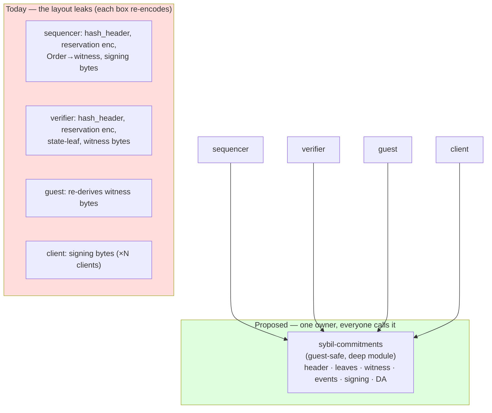

# `sybil-commitments` — one home for every canonical encoding

The concrete "crisp boundaries" deliverable: turn the diagnosed duplicated
consensus encodings into a single owning module. This is not a re-diagnosis —
`design/architecture-review-2026-07.md` (P5) and `docs/review/02-cross-cutting-
themes.md` (Theme 6) already found the problem; this says exactly what to build.

## The problem, in one sentence

**The knowledge of "how a consensus value is turned into bytes" is spread across
many modules, so getting it right requires changing all of them consistently —
and today they've already drifted.** Concretely:

- `hash_header` is implemented **three times**.
- there are **two divergent reservation encoders**.
- `Order` exists in **three representations** (`matching-engine::Order`, the
  witness `WitnessOrder`, the API/wire DTO), each hand-encoded.
- canonical **signing-bytes** builders (order / cancel / key-op / escape /
  withdrawal) are duplicated per client, and must all lead with the
  `genesis_hash` domain separator ([ADR-0007](../docs/adr/0007-canonical-bytes-domain-separation.md)).

This is textbook **information leakage** (Ousterhout): one design decision — the
byte layout — leaks into many modules. For an *ordinary* system that's ugly. For
a *consensus* system it's a live bug class: two encoders that were meant to be
identical but drift produce **different state roots or signatures**, i.e. a fork
or a rejected proof. It is the same enemy the
[testing strategy](testing-strategy-2026-07.md) calls "divergence," attacked at
the source instead of with more tests.

## The design: a deep module with a hard-to-misuse interface

One crate — `sybil-commitments` (or finish `sybil-verifier::commitments`, already
roadmapped 2.1) — is **the single definition** of every canonical encoding. It's
a *deep module*: a small, typed, obvious interface hiding all the fussy
byte-layout complexity. Callers pass typed values and get bytes/hashes; **no
caller ever writes a `to_le_bytes` for a consensus value again.**

It owns:

| Encoder family | Replaces | Notes |
|---|---|---|
| **Header hashing** | the 3× `hash_header` | one def |
| **State leaves** | `acct/`, `market/`, reservation, withdrawal-sidecar encoders | the state-root inputs |
| **Witness canonical bytes + decoder** | `canonical_witness_bytes` / `decode_canonical_witness_bytes` | the v3 (→v4) format |
| **Event schema** | `system_event_leaf_value` tags | the `events_root` inputs |
| **Signing bytes** | per-client order/cancel/key-op/escape/withdrawal builders | all lead with `genesis_hash` |
| **DA commitment** | `file_da_provider_ref_bytes` etc. | feeds `public_input_hash` |

**Hard constraints on the crate:**

- **Guest-safe** ([ADR-0003](../docs/adr/0003-guest-host-crate-split.md)): it sits
  *inside* the consensus core, so it must be dependency-austere (`no_std`-friendly,
  no host crates) — the guest imports it directly.
- **Byte-frozen**: every encoder is pinned by a golden vector before it moves
  (see migration). The crate's whole reason to exist is that its output must
  *never* change unintentionally.
- **No behavior, just bytes**: it encodes; it does not validate, settle, or
  decide. Validation stays in the verifier; the commitments crate is a pure
  function library. (This keeps it a *deep* module, not a god-crate.)

### The three `Order` representations

Collapse to **one canonical `Order`** in `matching-engine` plus **explicit typed
conversions** to the witness and wire forms — where the *encoding* of each is a
`sybil-commitments` function, not a hand-rolled `impl` in three places. The three
*views* can remain (they carry different auxiliary fields), but there is exactly
one byte encoding per view, defined once.

## Migration — a byte-identical consolidation, gated

This is a **SAFE-MOVE at the consensus layer**: the bytes must not change, only
where the encoder lives. The discipline mirrors the god-module decomposition.

1. **Net first (Phase 0).** Ensure a golden vector exists for *every* encoder
   being consolidated (many already do in `byte_identity.rs`; add the missing
   ones). These freeze the current bytes. This is also the
   [testing-strategy](testing-strategy-2026-07.md) P0 "golden-vector single
   source of truth" — do it here and both efforts win.
2. **Move one encoder family at a time**, delete the duplicates, repoint call
   sites. Each move is byte-identical → **the golden vectors + the native↔guest
   fingerprint are the gate**: if a hash changes, the move was wrong, full stop.
3. **Order the moves low-risk first**: header hashing (self-contained) →
   reservation encoders (kills the known divergence) → signing bytes → state
   leaves → witness bytes/decoder (highest risk, do last, full fingerprint gate).
4. **Cross-language**: the Rust client uses the crate directly; the frontend (TS)
   and Python must be **golden-vector-tested against** the crate's output (ideally
   codegen later). No more hand-copied byte layouts across languages — the same
   principle as the Solidity golden-vector generator.

## Sequencing vs keys_digest and the god-split

- The **god-split** (SYB-232) and this are the same species of work (consolidate,
  crisp boundaries) but independent files — either order is fine.
- **keys_digest (SYB-225) tension:** v3→v4 adds `keys_digest` encoders. Ideal
  world: consolidate *first* so the new field is defined once. Real world:
  keys_digest is time-pressured for the fresh-genesis redeploy. **Pragmatic rule:
  do not create NEW duplicates** — when keys_digest adds an encoder, add it in
  the consolidated location if the crate exists yet, otherwise add it in exactly
  *one* place and note it for the consolidation. Don't let the deadline mint a
  fourth `Order` encoding.
- Because the move is byte-identical, it can land **before or after** the
  redeploy without affecting genesis — it changes no bytes.

## What NOT to do

- Don't turn it into a dumping ground for "shared stuff" — it's *canonical
  encodings only*. Utilities, error types, and validation do not belong.
- Don't add a host dependency for convenience — it would break the guest build or
  byte-identity.
- Don't "improve" any encoding during the move. Consolidation and format change
  are two different PRs; mixing them forfeits the golden-vector safety net.

## Payoff

One place to read (and review) every consensus encoding; the
divergent-encoder bug class **designed out of existence** rather than tested for;
a single source that clients in every language derive from; and a natural home
for the v4/keys_digest encoders. It is the encoder-level counterpart to the
single commit fence ([ADR-0002](../docs/adr/0002-qmdb-state-single-commit-fence.md)):
*one authority for one thing.*
