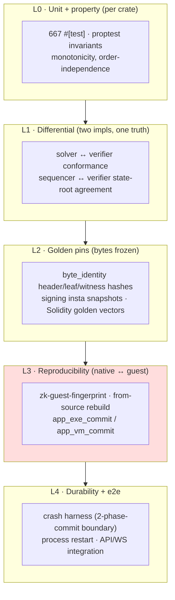

# Bulletproof Testing — strategy

Companion to the descriptive vault note [[Testing Strategy]]. That note says what
exists; this says **how testing becomes bulletproof for a consensus system** and
what to fix, in priority order. Grounded in an inventory of the current suite
(667 `#[test]`s, proptest, the differential conformance harness, the crash
harness, the byte-identity golden pins).

## Why testing a consensus system is different

In an ordinary service a bug is a crash or a wrong response — bad, but local and
loud. In Sybil a bug is usually a **divergence**: the sequencer and the verifier,
or the native verifier and the ZK guest, or the Rust encoder and the Solidity
one, compute *different bytes* for the same input. That's silent, and it's fatal
— it forks the chain or invalidates a proof. So the testing strategy is not
"cover the code"; it is **"pin every place two implementations must agree, and
make disagreement impossible to merge."** Three enemies:

1. **Divergence** — two implementations of one truth drifting apart.
2. **Non-determinism** — anything (float, hash-map order, platform) that makes
   the same input yield different bytes.
3. **Silent regression** — a consensus encoding changing without the pin that
   should have screamed.

Everything below is defense against those three.

## What's already strong (keep and lean on)

- **Differential conformance is the crown jewel.** `solver_conformance.rs`
  re-derives settlement through `sybil-verifier` and checks it against solver
  output; proptests like `prop_sequencer_and_verifier_state_roots_agree` pin the
  two implementations together. This is exactly the right weapon against enemy #1.
- **The state-root property suite** (`prop_state_root_changes_when_*`,
  `prop_state_root_invariant_to_position_order`) pins determinism and
  sensitivity — enemy #2.
- **The crash harness is genuinely good**: 9 recovery boundaries across the
  qMDB↔redb two-phase-commit fence ([ADR-0002](../docs/adr/0002-qmdb-state-single-commit-fence.md),
  [ADR-0010](../docs/adr/0010-acknowledged-write-wal.md)).
- **Byte-identity golden pins** (`byte_identity.rs`) freeze header/leaf/witness
  bytes with hard SHA-256 assertions — enemy #3, for the encoders it covers.
- **The fingerprint gate** fingerprints the guest's dependency closure on every
  PR.

The bones are strong. The gaps are about **closing the net**, not rebuilding it.

## The gaps, by priority

### P0 — Reproducibility can regress without blocking a merge
The only check that **rebuilds the guest from source and compares commitments**
(`zk-rebuild.yml`) runs *weekly/manual and report-only* — it is **not a PR gate**.
The per-PR check is the fast fingerprint (source-hash), which by construction
cannot catch a bug in the fingerprint script itself or a toolchain-level
reproducibility break. This is the single most dangerous gap: a PR that breaks
guest reproducibility (the SYB-170/208 class) can merge and sit undetected for up
to a week. **Fix:** make a from-source guest rebuild-and-compare a **required
gate on any PR touching the guest closure** (`sybil-zk`/`sybil-verifier`/
`matching-engine`/`sybil-l1-protocol`), even if it's slow — gate only when those
paths change so most PRs stay fast. Cheapest high-value fix on this list.

### P0 — Golden vectors are hand-copied across languages
`SybilGoldenVectors.t.sol` hard-codes hashes "claimed to match the Rust suite,"
and `byte_identity.rs` hard-codes them on the Rust side. **Two hand-maintained
copies of one truth** — enemy #1, in the test layer itself. If one side updates
and the other doesn't, the cross-check passes while the systems diverge.
**Fix:** one **generator** (a Rust `--emit-golden` binary/`xtask`) writes the
canonical vectors to a committed JSON; both the Rust golden test and the Solidity
test *read that file* (Foundry can `vm.readFile`/parse). Single source of truth,
drift becomes impossible. Model it on the guest fingerprint's lock+cross-check.

### P1 — No coverage visibility
No `llvm-cov`/tarpaulin anywhere — we don't know what fraction of *consensus*
code is exercised. **Fix:** add `cargo llvm-cov` in CI, report-only at first, then
set a floor on the consensus crates (`matching-engine`, `sybil-verifier`,
`sybil-zk`, settlement). Coverage is a spotlight, not a target — use it to find
untested branches in the money path, not to chase a number.

### P1 — The property catalog is incomplete and one test is disabled
`iter_lp_solver_conformance` is `#[ignore]`d (the workspace's only ignore) —
re-enable or delete it; a silently-skipped conformance test is worse than none.
More broadly, adopt a **property-catalog discipline**: every consensus invariant
gets a *named* property test, and the catalog is reviewed when the schema changes.
Invariant classes to guarantee coverage of: conservation (Σ balances + minted =
Σ deposits), monotonicity (more balance ⇒ ⊇ admissibility), order-independence
(fills/accounts/positions), idempotence (zero-fill = no-op), and the big one —
**native≡guest** on random valid blocks (fuzz the block, assert identical roots
both ways).

### P1 — insta is used in one crate only
Snapshots cover only `sybil-signing` canonical bytes. Extend to the highest-value
regression surfaces: **witness/block canonical encodings**, **API response
shapes** (catches accidental DTO/OpenAPI drift — complements `openapi_drift.rs`),
and the golden-vector JSON. insta's review workflow makes intentional changes
cheap and accidental ones loud.

### P2 — Durability + e2e blind spots
- Crash harness is **single-seeded** (`0x5eed_0158`); widen to many seeds
  (nightly) so crash *timing* is fuzzed against the proptest-driven paths.
- The **sim/scenario crates** (`matching-sim`, `sequencer-sim`) are exploratory,
  not asserting — no CI, no pass/fail. Wire a nightly job that runs a medium
  preset and **asserts the economic invariants** from `invariants.rs` hold at
  scale (turns a load tool into a regression net).
- **No L1 round-trip e2e**: `sybil-l1-indexer` has no `tests/`; nothing exercises
  deposit→index→settle→withdraw against a local chain (anvil). Add one — the
  bridge is money-path.
- **Arena has no property testing**: the Kelly/sizing math is a natural
  `hypothesis` fit (calibration monotonicity, sizing bounds).

## Principles to hold

- **One truth, one definition.** Every value two implementations must agree on
  is generated once and *read* by both — never hand-copied (P0 golden vectors,
  and the [`sybil-commitments` consolidation](../design/) for the encoders).
- **Gate what can silently diverge.** Reproducibility and cross-language goldens
  belong in the *required* set, scoped to fire only when the relevant paths
  change so the common PR stays fast.
- **Prefer designing errors out over testing for them** (Ousterhout): the single
  commit fence and float-search/integer-truth split exist so whole *classes* of
  bug can't occur — that's worth more than any test. When a test is hard to
  write because the invariant is fuzzy, fix the design, not the test.

## Suggested program

1. **P0**: guest rebuild as a scoped required gate; golden-vector single-source
   generator. *(Small, highest risk reduction.)*
2. **P1**: `cargo llvm-cov` in CI; re-enable/delete the ignored conformance test;
   native≡guest random-block fuzz property; extend insta to witness + API.
3. **P2**: multi-seed crash nightly; sim-as-regression nightly; L1 round-trip
   e2e; arena `hypothesis` tests.

None of this blocks the current queue; P0 items are worth slotting in *before* the
fresh-genesis redeploy, since that's exactly when a silent reproducibility or
golden-vector break would hurt most.
