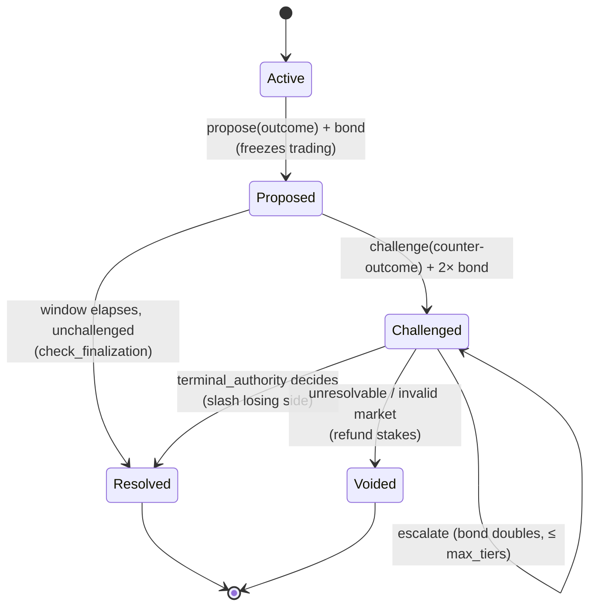

# Trust-minimized resolution (optimistic propose/challenge)

Expands brainstorm idea #13 ([[possibility-space-2026-07]]) and closes the
biggest remaining **trusted** surface for user funds — resolution — flagged as
gap #6 on the [[Threat Model]]. Operationalizes the roadmap already sketched in
[[Market Resolution]].

## The intuition

Everything else in Sybil is trending trust-minimized — cash escapes, the state
transition gets proven, positions survive operator failure. But **who decides the
outcome of a market?** Today: a single registered feed signs one attestation and
the market settles, no window, no recourse (`ResolutionPolicy::Immediate`). A
dishonest feed can simply pick the winner. That's the weakest link — a market you
can't trust to resolve honestly isn't worth trading, no matter how good the
clearing is.

**Optimistic resolution** fixes it the way rollups fix state: *anyone proposes an
outcome; anyone can challenge it with a bond during a window; disputes escalate
by doubling bonds until a terminal authority decides; the wrong side is slashed.*
Trust shifts from **"the feed is honest"** to **"at least one honest party is
watching and is paid to be right"** — a 1-of-N honesty assumption instead of
1-of-1.

## What already exists (this is filling reserved arms, not greenfield)

The `sybil-oracle` state machine is **already stubbed for this**:
- `MarketStatus::{Proposed{proposal, challenge_deadline_ms}, Challenged{proposal,
  challenge}, Voided}` — present, always `None`/unused today (`types.rs`).
- `ResolutionProposal`, `Challenge{challenger, bond_amount, proposed_payout,…}`,
  and `ResolutionRecord.proposal/challenge` — structs exist.
- `ResolutionAction::{Propose{challenge_window_ms}, Reject}`,
  `ChallengeAction::{Escalate, Reject}`, and the `Oracle::challenge` /
  `Oracle::check_finalization` hooks (no-op defaults) — the seams are cut.
- `Oracle System.md` already specifies the `Optimistic{proposer_feed,
  challenge_window_ms, bond_schedule, terminal_authority, max_tiers}` policy with
  geometric bond-doubling and losing-side slashing.

So the design is a new `ResolutionPolicy::Optimistic` arm plus the machinery to
drive the existing states — not a new subsystem.

## The four missing pieces (the honest work)

1. **Bonding / escrow — the key new validity-critical primitive.** There is no
   `BalanceLock` on `Account` today. Proposing and challenging must **lock
   collateral** as a bond (slashable), which means bonds are *account state* → in
   the guest commitment. This primitive is reusable (MM budget reservations, the
   insurance fund). Design it once, cleanly: a locked-balance sub-ledger with a
   reason tag.
2. **A finalization driver.** A periodic sequencer tick calling
   `check_finalization` to auto-settle proposals whose challenge window expired
   (mirrors the pending-order TTL sweep). Today the hook is a no-op.
3. **Challenge/propose ingress.** `SequencerMsg::{ProposeResolution,
   ChallengeMarket}` + API routes, with the propose/challenge canonical bytes
   domain-separated and genesis-bound ([ADR-0007](../docs/adr/0007-canonical-bytes-domain-separation.md)).
   `is_tradeable()` flips to freeze trading in `Proposed` (one line, per the doc).
4. **Prerequisite bug fix — OL-2.** `evaluate`/`resolve_from_attestation` must
   assert `attestation.market_id == market_id` before *any* non-HTTP proposer path
   is trusted (today safety rests only on the HTTP route reconstructing the id).
   Close this **before** opening a permissionless propose path — it's a latent
   wrong-market settlement bug. *(Worth a ticket now regardless.)*

## Validity & trust implications

- **Proven, not just operational.** Bonds (account state) and
  proposal/challenge records (witness-visible, like system events) enter the
  commitment — so the escalation is auditable and recoverable, and settlement of a
  disputed market is provable. This is a schema move; batch it.
- **Trust shift, honestly stated.** Optimistic resolution needs **1 honest,
  watchful, bonded party** rather than 1 honest feed — a large improvement, but
  *not* zero-trust: there is still a `terminal_authority` for exhausted disputes.
  The endgame is pointing `terminal_authority` at a decentralized court via the
  reserved `External{bridge_feed_id}` arm (UMA/Kleros) — a clean later step.
- **Voided path matters.** A market that's invalid/unresolvable resolves to
  `Voided` → stakes refunded. Shares the void/refund semantics with scalar and
  conditional markets ([[conditional-combinatorial-markets]]); design them
  together.

## Sequencing

Behind the escape/guest-soundness work on the trust-minimization path ([[Threat
Model]]) — a market's resolution matters most once the transition and the exit
are themselves trustworthy — but it is **the** step that makes the *markets*
credible, not just the plumbing. The **bonding primitive is the gating
dependency** and is broadly reusable, so it's the right first increment. OL-2 is a
cheap prerequisite worth doing immediately.

Everything downstream (feed reputation counters, quorum, predicate resolution,
the external-court bridge) is further reserved headroom in the same enum — this
arm is the one that moves resolution from *trusted* to *contestable*.
