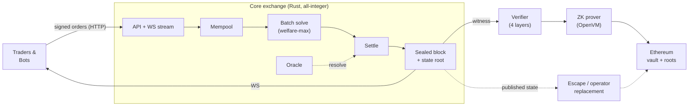
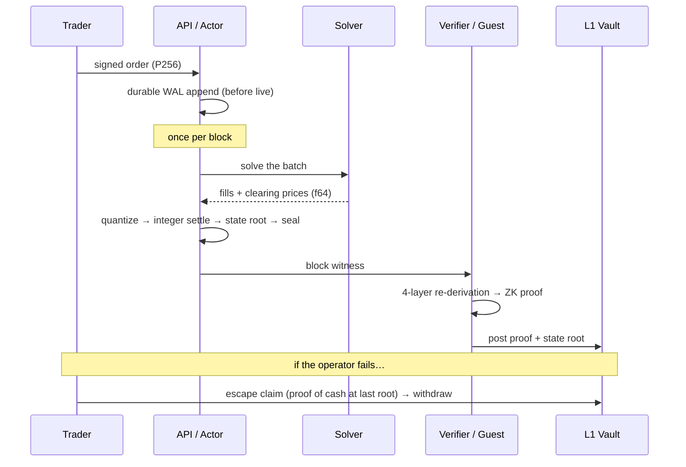

# Sybil — Documentation & Architecture Guide

> **Sybil is a verifiable prediction-market exchange.** Traders bet on
> outcomes ("Will X happen?"); every block, all pending orders clear
> *together* at one fair price; and every block is *proven correct* so nobody —
> not even the operator — has to be trusted to run it honestly.

This is the front door. It gives you the whole system in one read, then points
you to the right depth. If you read nothing else, read the **six ideas** below —
they explain almost everything.

---

## The one-paragraph version

Orders arrive and wait in a mempool. Once per block the exchange takes every
pending order and clears them **all at once** with a welfare-maximizing solver —
no first-mover advantage, everyone in the batch gets the same price. The result
(fills, prices, new balances) is sealed into a **block** with a cryptographic
**state root**. A **verifier** re-derives that block from first principles, and a
**ZK prover** turns that check into a succinct proof posted to Ethereum. Because
the full state is published, anyone can reconstruct it — so if the operator ever
misbehaves or disappears, users can **replace the operator or withdraw their
cash on L1 without permission**. On top of all this runs an **arena** of trading
bots that compete through the same public API.

---

## Six ideas that explain the whole system

Read these in order — each builds on the last. Each links to the deep note and,
where relevant, the decision record (**[ADR](adr/)**) that says *why*.

**1. Frequent Batch Auctions — time doesn't buy you a better price.**
Instead of a continuous order book where the fastest trader wins, Sybil collects
orders over a short window and clears them simultaneously. Within a batch there
is *no* time priority, so there is no latency race and no front-running to be
had. → [[Frequent Batch Auctions]]

**2. Prediction markets are Fisher markets — one program prices everything.**
The clearing isn't a pile of independent order books; it's a single convex
optimization (an Eisenberg–Gale / Fisher-market equilibrium) whose *dual
variables are the prices*. This is the deep idea: prices across related outcomes
come out **coherent by construction**, which is what will one day let Sybil price
*conditional* and *combinatorial* markets ("A if B") that a normal exchange
can't. → [[Welfare Maximization]], [ADR-0001](adr/0001-eg-fisher-market-matching.md)

**3. Float search, integer truth — fast *and* reproducible.**
Solvers explore in floating point (fast, approximate). But the moment a result
becomes *state*, it's quantized to integers and all money math is exact. That
split is why the exchange can be both quick and **bit-for-bit reproducible** —
essential for a system that gets proven. → [[Nanos and Integer Arithmetic]],
[ADR-0004](adr/0004-float-search-integer-truth.md)

**4. Every block is proven — the operator earns no trust.**
The same state-transition code runs natively *and* inside a zero-knowledge VM, so
a block is checked by an independent verifier and then attested by a succinct
proof on Ethereum. Correctness is a *property of the system*, not a promise. →
[[Four-Layer Verification]], [ADR-0003](adr/0003-guest-host-crate-split.md),
[ADR-0006](adr/0006-witness-v3-full-snapshot.md)

**5. Your money can always leave — even if the operator turns hostile.**
Because every block publishes enough data to rebuild the full state, a
*replacement operator* can take over on the last good root (positions survive),
and any user can prove their cash balance on L1 and withdraw it directly (an
"escape claim") — no permission required. → [[L1 Settlement and Vault]],
[ADR-0005](adr/0005-escape-via-operator-replacement.md)

**6. Bots are first-class — the exchange is an agent arena.**
Trading agents (including LLM-driven ones) compete through the same public API as
humans, with a leaderboard and reproducible scoring. Prediction markets are an
ideal agent benchmark — ground truth arrives when markets resolve. → [[Bot
Framework]], [[LLM Trader]]

---

## How a block flows (and how money escapes)

Durability, WAL ordering, and the single commit fence are
[ADR-0010](adr/0010-acknowledged-write-wal.md) and
[ADR-0002](adr/0002-qmdb-state-single-commit-fence.md). Signature/replay
discipline is [ADR-0007](adr/0007-canonical-bytes-domain-separation.md).

---

## The documentation map — where things live and why

Sybil's docs are five trees with five different jobs. Use the right one:

| Tree | Question it answers | When to read |
|---|---|---|
| **[`architecture/`](architecture/Sybil%20Architecture.md)** (the MOC) | *How does it work today?* | Understanding a subsystem |
| **[`adr/`](adr/)** | *Why is it this way?* | Before changing a load-bearing decision |
| **[`../design/`](../design/)** | *Where is it going?* (specs, proofs, brainstorm) | Planning new work |
| **[`review/`](review/00-executive-summary.md)** | *What's the honest state?* (bugs, debt, do-not-break) | Before touching consensus code |
| **[`runbooks/`](runbooks/)** | *How do I operate it?* | Deploying / on-call |

**Reading paths:**
- *New to Sybil* → the six ideas above → [[Frequent Batch Auctions]] →
  [[Block Lifecycle]] → [architecture MOC](architecture/Sybil%20Architecture.md).
- *Changing consensus code* → [`review/40-do-not-break.md`](review/40-do-not-break.md)
  → the relevant ADR → [[Block Witness]] / [[State Root Schema]].
- *Operating a deployment* → [[Deployment Profiles]] →
  [`runbooks/devnet-redeploy.md`](runbooks/devnet-redeploy.md).
- *Building a trading bot* → [[REST API]] → [[P256 Authentication]] →
  [[Bot Framework]] → [[Python SDK]].

> **Status legend.** Notes carry a `status:` in their frontmatter — `current`
> (built & verified) or a planned/draft marker. When a note describes something
> not yet built, it says so. The **[review](review/00-executive-summary.md)** tree
> is the ground truth for built-vs-aspirational; the **[design](../design/)** tree
> is deliberately forward-looking.

---

*This guide is intentionally high-level and drift-resistant — it avoids exact
counts (checks, solvers, cadence) that change over time. For precise current
numbers, follow the links. The vault linter is `just docs-check`.*
