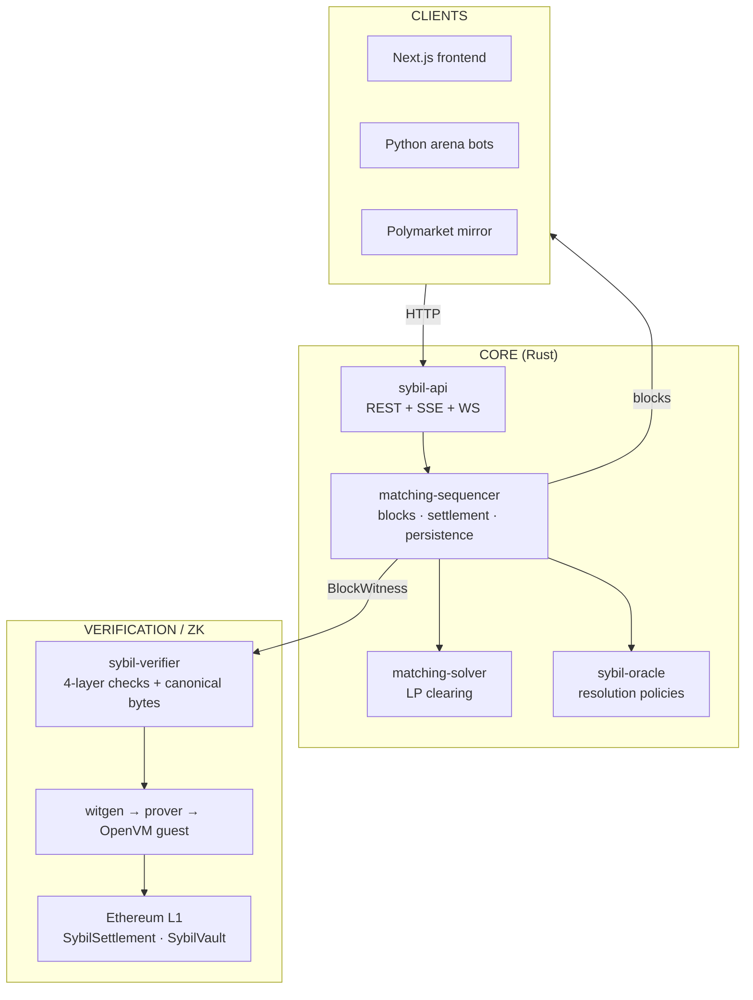

# Sybil — System Specification

*One linear document covering the whole system: what it is, how every part works, and the invariants that hold it together. Written for someone who knows the main ideas (prediction markets, batch auctions, ZK rollups) but not the system details.*

*The Obsidian vault at `docs/architecture/` remains the per-concept canonical reference; this document is the connected walkthrough. Where they disagree, the vault note's `last_verified` date wins. Last full verification of this document: 2026-07-02.*

---

## 1. What Sybil is

Sybil is a prediction-market exchange built on three commitments:

1. **Frequent Batch Auctions, cleared by optimization.** Orders accumulate for a short interval, then a solver matches the whole batch at once at a single uniform clearing price per market, maximizing total welfare (consumer surplus). There is no speed race and no order-book priority — only willingness to pay matters. The clearing problem is a linear program; the only hard part is a handful of bilinear market-maker budget constraints.

2. **Deterministic integer arithmetic.** No floating point anywhere in protocol-critical computation. Prices are nanodollars (u64), quantities are fixed-point share-units, intermediates are i128/u128. Any third party can replay a block and get bit-identical results — the precondition for verification.

3. **Verifiability as architecture, not afterthought (Validium).** Every block emits a self-contained `BlockWitness`. A four-layer verifier re-derives everything the block claims. The same verification logic runs inside an OpenVM (RISC-V zkVM) guest, producing proofs that an Ethereum contract accepts; L1 custodies collateral and releases it only against proven state. Data stays off-chain; validity goes on-chain.

Around that core sit: an **oracle** system for market resolution, a **Polymarket mirror** that imports real markets, prices, and resolutions, an **HTTP API** with server-sent-event and WebSocket block streams, a **Python arena** where LLM-driven bots trade, a **Next.js frontend**, and a single-box **Docker deployment** with full monitoring.



---

## 2. Numbers, units, and limits

Everything below is defined in `crates/matching-engine/src/types.rs`.

| Constant | Value | Meaning |
|---|---|---|
| `NANOS_PER_DOLLAR` | 1,000,000,000 | $1.00 in nanos. `Nanos = u64` → max ≈ $18.4B |
| `SHARE_SCALE` | 1,000 | Quantity fixed point. `Qty = u64`; 1000 units = 1 share, 1 unit = 0.001 share |
| `MAX_MARKETS_PER_ORDER` | 5 | Payoff vector spans ≤ 5 markets |
| `MAX_STATES` | 32 | 2^5 world states; payoff arrays are stack-allocated |

**Money arithmetic.** `notional = price_nanos × qty_units / SHARE_SCALE`, computed in u128/i128. Rounding is directional by design:

- **Floor** for settlement debits and welfare (`notional_nanos`) — never overcharge.
- **Ceil** for capital reservations and MM budget usage (`notional_nanos_ceil`) — never under-reserve.

**Why integers.** Determinism (same result on every CPU, required for verification) and ZK-friendliness (finite-field circuits emulate floats at enormous cost). The solvers *internally* use f64 in HiGHS/Clarabel/SCIP, but their output is rounded back to integer fills and integer prices, and correctness is judged only on the integer output by the verifier — the float region is an untrusted search heuristic. That boundary (float search, integer truth) is a core design idea.

---

## 3. Domain model

### 3.1 Markets and groups

Every market is **binary**: outcomes YES (index 0) and NO (index 1); at resolution YES pays `payout_nanos` per share and NO pays the complement (fractional resolutions like 70/30 are allowed). Multi-outcome events are modeled as a **market group**: K binary markets that are mutually exclusive (an election with 5 candidates = 5 binary markets in one group). Group structure matters for two things: the price constraint `Σ YES_price ≤ $1` across the group, and cheap group minting (§3.5).

Types: `Market`, `MarketSet` (`market.rs`), `MarketGroup` (`problem.rs`), `MarketId(u32)`.

### 3.2 Orders are payoff vectors

The central abstraction. An order spanning N markets defines a payoff over the 2^N atomic world states, indexed mixed-radix: `state = o₀ + 2·o₁ + 4·o₂ + …` where `oᵢ` is market i's outcome. The order struct (`order.rs`):

```rust
Order {
    id: u64,
    markets: [MarketId; 5],       // unused slots = MarketId::NONE
    num_markets: u8,
    payoffs: [i8; 32],            // per-state: + long, − short, 0 flat
    num_states: u8,               // 2^num_markets
    limit_price: Nanos,           // per unit of position
    max_fill: Qty,                // share-units
    condition: Option<PriceCondition>,   // conditional activation
    expires_at_block: Option<u64>,       // GTD expiry
}
```

Convention: outcome 0 = YES. Over markets {A, B} with index `o_A + 2·o_B`, "A is YES" covers states 0 and 2, so "Buy YES on A" is payoff `[+1, 0, +1, 0]`. A spread "Buy A YES / Sell B YES" is `[0, −1, +1, 0]` (profits in A-yes-B-no, loses in A-no-B-yes). A bundle "A YES and B YES" pays only in state 0: `[+1, 0, 0, 0]`. The solver never knows order "types" — it sees vectors and limit prices. Factory functions for common shapes (simple buys, spreads, bundles, butterflies, conditionals) live in `order_builder.rs`.

**Buyer/seller and the unified YES space.** `is_seller()` = any negative payoff entry. Buying NO at limit L is economically selling YES at `$1 − L`; all four directions (`BuyYes/SellYes/BuyNo/SellNo`, `types.rs::OrderDirection`) reduce to YES demand or YES supply with a transformed limit. This is what makes one LP handle everything.

**Marginal decomposition.** For settlement of multi-market orders, per-market marginal payoffs are extracted (`marginal_payoffs_i64`), normalized by 2^(N−1). Non-separable bundles truncate to zero in the integer form — a documented limitation of the generic settlement path.

### 3.3 Fills

`Fill { order_id, fill_qty, fill_price, account_id }`. The fill price is the uniform clearing price of the order's market (YES price for YES-side orders, `$1 − p_yes` for NO-side). Fills carry their account so settlement needs no side lookup.

### 3.4 Market-maker constraints

An MM submits orders across many markets plus one budget: `MmConstraint { mm_id, max_capital, order_ids, order_sides }`. Capital consumed by a fill depends on the clearing price:

| Side | Capital per fill |
|---|---|
| BuyYes / SellNo | `ceil(price × qty / SHARE_SCALE)` |
| SellYes / BuyNo | `ceil(($1 − price) × qty / SHARE_SCALE)` |

Since the price is itself an output of the optimization (a dual variable), the budget constraint `Σ capital(price, qty) ≤ budget` couples primal and dual variables — bilinear, non-convex, and the **sole source of NP-hardness** in the whole matching problem. The saving grace: realistic batches have 2–10 MMs, so specialized methods work (§5).

### 3.5 Minting

The exchange can create a matched pair (1 YES + 1 NO) for exactly $1, because they redeem for $1 combined. Per-market minting is variable `mint_m`; **group minting** creates 1 YES in *every* market of a K-market group for $1 total (exactly one will pay out) — K× cheaper per YES share, variable `gmint_g`. Minting costs enter the objective as −$1 per unit, so the solver mints only when enabled fills gain more welfare than the mint costs. Through LP duality, minting stationarity *is* the price-normalization constraint: `YES + NO ≤ $1` per market and `Σ YES ≤ $1` per group, with equality when minting is active. Nothing enforces prices post-hoc; they are correct by duality.

At settlement, minting is not a synthetic order: the sequencer computes each market's YES/NO position imbalance after real fills and books the offset against the reserved `AccountId::MINT` (`u64::MAX`) account (`matching-engine/src/settlement.rs::derive_minting`). The witness records only real participant fills; the verifier independently re-derives the MINT adjustment. (The Lean development proves the theory: MINT's expected P&L is zero — see §9.4.)

### 3.6 The Problem

One batch = one `Problem { name, markets, orders, mm_constraints, market_groups }` (`problem.rs`), with `validate()` checking referential integrity. This is the entire solver input; solvers are pure functions of it.

---

## 4. The matching problem

**Objective — welfare, not volume.** Each fill's welfare is the surplus versus the trader's limit: `(limit − price) × qty` for buyers, `(price − limit) × qty` for sellers (both ≥ 0 for a valid fill). Total welfare = Σ fill welfare − minting cost. Maximizing volume instead would reward churning worthless trades; welfare maximization prices information. (Deep-dive: `design/welfare-vs-volume.md`.)

**The LP core.** Without MM budgets the problem is a plain LP (`design/problem-statement.md` §7 for the boxed formulation):

- Variables: fills `q_i ∈ [0, max_fill_i]`, per-market mint `mint_m`, group mint `gmint_g ≥ 0`.
- Objective: `max Σ ±L_i·q_i/SHARE_SCALE − $1·Σ mint − $1·Σ gmint` (sign by buyer/seller).
- Constraints: per market, per outcome, **position balance** — total YES demanded = supplied + minted (`Σ payoff·q = mint_m + gmint_g` for YES rows, `= mint_m` for NO rows).

Size is O(N+M+G) variables — HiGHS solves 10k-order batches in ~1 ms. **Clearing prices are the dual variables** of the balance constraints, normalized so YES+NO = $1. Uniform pricing, complementarity, and group consistency all emerge from duality; the verifier re-checks them anyway.

**Adding MM budgets** makes it an LP with a few bilinear side constraints. Each solver is a different answer to "how do you handle the bilinear term" (§5).

---

## 5. Solvers

All in `crates/matching-solver`, all implementing `Solver { solve(&Problem) -> PipelineResult, name() }`. `PipelineResult` carries `MatchingResult` (fills, welfare, minting cost, counts), clearing prices, and timings. There are **six** implementations (older docs say five — `IterLpSolver` is the sixth):

| Solver | Feature | MM-budget mechanism | Role |
|---|---|---|---|
| `LpSolver` | `lp` | Single-pass SLP: solve → linearize violated budgets at resulting prices → re-solve | **Production default** (used by the sequencer) |
| `IterLpSolver` | `lp` | Fixed-point on the EG multiplier `μ_k = min(1, B_k/U_k)`, damped, then projection LP | Better than LP under tight budgets |
| `EgSolver` | `lp` | Frank–Wolfe on the Eisenberg–Gale objective `Σ B_k ln U_k`; budgets absorbed into log-utility | Fisher-market reference, ~13× slower |
| `ConicSolver` | `conic` | One Clarabel interior-point solve; exponential-cone `t ≤ ln V`; QuasiFisher adds a cash variable for conditioning | Close to LP welfare at moderate cost |
| `MilpSolver` | `milp` | Exact bilinear `p·q` via SCIP MIQCQP (or McCormick relaxation), Big-M UCP | Ground truth with timeout |
| `DecomposedSolver<S>` | `lp` | Partition by market group; mirror descent redistributes spanning-MM budgets across components | Parallelism experiment |

Shared machinery worth knowing:

- **One LP oracle** (`lp_solver.rs::build_and_solve_lp`) is reused by LP, EG, IterLP, and Conic's final step.
- **Projection LP epilogue**: EG/IterLP/Conic all converge in float space, then cap `max_fill` at the converged allocation and re-solve the plain welfare LP — this recovers *exact* LP duals for prices from an approximate primal.
- **Integer landing**: fills round (`q < 0.5 → unfilled`), then `trim_mm_budget_overflows` shaves the smallest MM fills so integer rounding never breaches a budget, then welfare is recomputed from integer fills. Negative-total-welfare results are discarded entirely.

**Known inconsistency (spec'd here so nobody trips on it):** the LP-family solvers report `total_welfare` *gross* with `minting_cost = 0`; MILP reports it *net* of minting and fills in `minting_cost`. Cross-solver welfare comparisons must recompute from fills (matching-sim does this via the verifier). See the architecture review (`design/architecture-review-2026-07.md`) for the proposed fix.

**Benchmarks** live in `design/solver-benchmarks.md`; `just compare` reruns them. LP is fastest and highest-welfare on all presets; that plus determinism of its integer landing is why it's the production solver.

---

## 6. The sequencer

`crates/matching-sequencer` is the heart of the exchange: a **synchronous, deterministic core** (`BlockSequencer`, `sequencer.rs`) wrapped by an **actor** (`SequencerActor` + `SequencerHandle`, `actor.rs`, using `ractor`). All state mutation is serialized through the actor mailbox — no locks around exchange state. The API talks to it purely by message passing. A supervisor actor restarts it from the last committed snapshot on panic.

### 6.1 Order admission — two paths

There is no broad mempool (older docs describing one are stale). Admission (`Mempool` vault note):

- **Direct admit** — simple single-market, non-MM orders are validated and capital-reserved *at submission time*, entering the resting order book immediately. The order is durably appended to the `ADMIT_LOG` write-ahead table **before** the API returns 200. Visible and matchable in the next block.
- **Deferred bundles** — MM-constrained orders, multi-order bundles, and multi-market orders can't be admitted one at a time (atomicity, flash liquidity, self-trade prevention). They append durably to `PENDING_BUNDLES` and are drained at the next block, validated batch-locally.

Backpressure is layered: HTTP token buckets (global + per-client, before JSON parsing and signature checks), actor-level buckets (global + per-account), caps on open orders per account (1,000), pending bundles (10,000 total, 100/account), and orders per submission. Mailbox depth is exported as a metric with alert thresholds.

### 6.2 Block lifecycle

A timer tick (interval configurable: `SequencerConfig::block_interval`, nominally 1 s; the deployed devnet runs 10 s) triggers `prepare_block` **on a clone** of the state; the prepared block is persisted, and only then does `commit_prepared_block` swap the new state in and broadcast the `SealedBlock`. If persistence fails, the prepared block is discarded and inputs are retained for retry — the API's acknowledgements are never silently lost.

Inside `produce_block_in_place` (`sequencer.rs:2227`):

1. **Apply system events** queued since the last block (account creation, funding, L1 deposits, withdrawal creation, resolutions), updating each touched account's `events_digest` (a running BLAKE3 accumulator committed in the state root).
2. **Expire & revalidate** the resting book: drop TTL-expired orders, orders on resolved markets, and orders whose reservations no longer hold.
3. **Collect** all resting orders into the batch.
4. **Process fresh submissions**: direct-admit stragglers and drained deferred bundles, with group-coverage self-trade prevention; MM quotes join as one-shot flash liquidity (never rested, never carried over).
5. **Solve**: build the `Problem`, run the LP solver, obtain fills + clearing prices + welfare.
6. **Settle** (`settlement.rs`): apply each fill via the shared `matching_engine::compute_fill_settlement` (simple path for single-market orders; marginal path for bundles), i128 intermediates; then `derive_minting` books the protocol counterparty on `AccountId::MINT`. Inline solvency assertions (per-market YES = NO totals; balance-delta conservation) log at error level on violation.
7. **Update the book**: release filled reservations, keep partials, sweep IOC.
8. **Update analytics trackers** (prices, volume, liquidity depth, equity, welfare, per-account history) — derived views, not consensus state.
9. **Seal**: compute the typed qMDB `state_root` and keyless-qMDB `events_root`, chain `parent_hash`, build `BlockHeader` and the full `BlockWitness`.
10. **Verify inline**: `sybil_verifier::verify_full` currently runs on every block in-process (logs on failure; the plan is to move this to the async prover path).

Two artifacts leave the sequencer per block: **`SealedBlock`** (canonical block + analytics sidecar, for traders via SSE/WS/REST) and **`BlockWitness`** (the audit trail, for verification and proving).

### 6.3 Resting orders, reservations, TTL

The order book (`order_book.rs`) holds unfilled non-MM orders with their **reservations**: buys reserve balance (ceil-rounded notional), sells reserve position. Default TTL is effectively GTC (`order_ttl_blocks = 63,072,000`); GTD orders carry explicit expiry; IOC never rests. Cancellation (signed, P256) releases reservations and emits an `OrderCancelled` system event.

### 6.4 Market lifecycle and resolution

`market_lifecycle.rs` holds statuses, the oracle handle, feed and template registries. Resolution comes in two flavors (§10): unsigned admin (dev-mode) or a **signed attestation** from a registered feed, verified against the market's resolution template. Settlement of a resolution converts positions to balance at the payout ratio, irreversibly, and emits a system event in the next block so the witness explains the pre-state change.

### 6.5 Persistence and crash recovery

Design: **block-boundary snapshots + small WALs for acknowledged writes** — not event sourcing. Two engines with one commit point (`Persistence` vault note, `store.rs`):

- **redb** — ~30 tables: markets/metadata/statuses/groups, block headers and witnesses, pubkey registry, counters, resting orders, the WALs (`ADMIT_LOG`, `PENDING_BUNDLES`, control-plane commands, bridge deposits/withdrawals), and derived views (fill history, account events, equity points, full blocks, price points, candles). The redb transaction that flips the **fence** (`account_state_slot`) is the *only* commit point.
- **qMDB** (commonware) ×2 — an account-snapshot store and a typed-state store, each with A/B slots on dedicated OS threads. The committed typed-state slot's root **is** the block header's `state_root`, so inclusion/exclusion proofs verify directly against the header.

Recovery is fence-driven, never "newest wins": read the fence from redb, open exactly that qMDB slot, reject anything inconsistent as corrupt. Replay order is an invariant: committed snapshot → admit log → control-plane WAL → bridge WALs (withdrawals validate against balances that earlier WALs may change). `next_order_id` must advance past all replayed ids before fresh assignment. Crash windows are explicit: qMDB written but fence not flipped ⇒ ignored; fence flipped ⇒ authoritative.

The 200-OK contract: anything acknowledged (orders, account creation, funding, market creation, resolution, cancellation, feed/template installs, bridge ops) is either in the committed snapshot or replayed from a WAL.

---

## 7. Blocks, roots, and the witness

**Header** (`block.rs`): `height, parent_hash, state_root, events_root, order_count, fill_count, timestamp` — BLAKE3-hashed for chaining. Three roots with distinct scopes:

| Root | Commits | Consumer |
|---|---|---|
| `state_root` | complete typed validium state: `acct/*`, `acct_resv/*`, `market/*`, `market_group/*`, `order/*`, `withdrawal/*`, `sys/*` leaves in an ordered qMDB | ZK settlement, bridge claims, recovery |
| `events_root` | keyless qMDB over this block's canonical events (orders, rejections, fills, system events) | "did fill F happen in block N" proofs |
| `witness_root` | `BLAKE3("sybil/witness" ‖ canonical witness bytes)` | the prover; full-block auditability (in proof public inputs; not yet in the header) |

**`BlockWitness`** (`sybil-verifier/src/types.rs`, 16 fields) is self-contained and reproducible: header + parent header, accepted orders, rejections with reasons, system events, fills, clearing prices, welfare + minting cost, MM constraints, market groups, three account-state snapshots (`pre_state`, `post_system_state`, `post_state`), the non-account `state_sidecar`, and resolved markets. Two invariants define validity: *(a)* replaying `pre_state + system_events + fills` yields `post_state`; *(b)* recomputing the roots from the witness matches the header.

**Canonical serialization** (`sybil-verifier::commitments` — `state_schema.rs`, `event_schema.rs`, `witness_schema.rs`): hand-specified little-endian byte layouts with domain-separation strings, version bytes, and golden test vectors. This is *the* byte truth consumed by native verification, witness generation, and the zkVM guest. (A separate, unrelated system — `sybil-canonical`, borsh-based — defines the bytes that *clients sign*: orders, cancels, attestations. Signing bytes and commitment bytes are deliberately different systems.)

**Public/private split** for ZK: prices, welfare, counts, and roots are public; individual orders, fills, balances, and MM constraints are private, provable selectively via `events_root`/`state_root` membership proofs.

---

## 8. Verification — four layers

`crates/sybil-verifier`, entry `verify_full` (or per-layer functions). Input: a `BlockWitness`. Output: pass/fail + a list of ~38 typed violations (`violations.rs`).

| Layer | File | Re-derives / checks |
|---|---|---|
| 1 — Match | `match_verifier.rs` | fill ↔ order existence, `qty ≤ max_fill`, seller-aware limit compliance, per-fill welfare ≥ 0, welfare totals, uniform clearing price, YES+NO = $1, no fills on resolved markets, conditional activation |
| 2 — Settlement | `settlement.rs` | replays fills over `post_system_state` with the *same shared* `matching-engine` settlement functions, re-derives the MINT adjustment, compares every balance/position to claimed `post_state`, non-negativity |
| 3 — Block integrity | `block.rs`, `event_commitment.rs` | recomputes `state_root` (typed qMDB) and `events_root` (keyless qMDB), parent-hash chain, consecutive heights, count fields *(feature `qmdb`; native only)* |
| 4 — Orders | `orders.rs` | pre-state balance sufficiency for buys (with intra-batch reservation accumulation — double-spend detection), position sufficiency for sells, expiry eligibility, no false rejections, correct rejection reasons |

The zkVM guest runs layers 1, 2, and 4 directly, and replaces layer 3 with proof-based equivalents (§9.2). Layer 2 sharing the sequencer's settlement code is intentional: settlement is written once and *checked* twice, not written twice.

---

## 9. The ZK pipeline

### 9.1 Host-side flow

```
sequencer  ──persists──▶  BlockWitness + qMDB leaf proofs (redb/qMDB)
sybil-witgen-cli  ──exports──▶  StateTransitionProofJob (portable MessagePack)
sybil-prover prepare  ──validates via sybil-witgen, runs native sybil-zk verifier──▶
    StateTransitionGuestInput + public-input hash + DA payload/manifest
zk/openvm-tools  ──encodes──▶  OpenVM CLI input JSON
cargo openvm run / prove app / prove evm   (the actual proving)
sybil-prover submit-state-root  ──ABI-encodes──▶  SybilSettlement.submitStateRoot(inputs, proof)
```

Crate boundaries and why they exist:

- **`sybil-zk`** — guest-safe: the public-input binding (`StateTransitionPublicInputs`, keccak hash `"sybil/openvm/state-transition/v1"`), the transition verifier the guest calls, and `guest_commitments`: a from-scratch SHA-256/MMR/qMDB-range-proof verifier so the guest never links commonware. Golden tests pin guest roots == native roots.
- **`sybil-witgen`** — owns the portable `StateTransitionProofJob` (committed witness + ordered post-state leaf proofs) and job→guest-input conversion; the optional `sequencer-store` feature is the only thing touching sequencer storage.
- **`sybil-witgen-cli`** — sequencer-side export tool (needs the store).
- **`sybil-prover`** — job inbox worker, artifact store (`status.json` per height), HTTP serving (`GET /proofs/{height}`, `/metrics`), DA publication, and L1 calldata encoding. It orchestrates; actual proof generation is invoked through the `just openvm-*` recipes. A `mock-live` mode fabricates artifacts for dashboard wiring.
- **`zk/openvm-guest`, `zk/openvm-tools`** — standalone workspaces pinned to OpenVM `v2.0.0-beta.2`, kept outside the root workspace so normal builds never need the OpenVM toolchain.

`just zk-smoke` runs the full local pipeline on a one-block fixture; `just zk-smoke true` adds app-proof generation and verification.

### 9.2 What the guest proves

Decode `StateTransitionGuestInput` → verify public-input binding (heights monotonic, roots and counts match the witness, DA commitment binds the canonical witness payload) → verify the post-state **exact-keyspace qMDB proof** (every witness leaf present; the `next_key` ring proves nothing is hidden) → recompute `events_root` and `witness_root` → run match/settlement/order verification layers → reveal the keccak public-input hash as the single public value.

### 9.3 Status (honest)

Working today: witness export, job preparation, native + guest verification, local guest execution in OpenVM, app-proof generation/verification, file-based DA scaffolding, calldata encoding, Anvil end-to-end with the `UnsafeAcceptAllVerifierAdapter`. Not yet: production proof orchestration (the worker writes `proof_status: "not_started"`), generated Halo2 EVM verifier deployment, a real DA network, operator-replacement recovery.

### 9.4 The Lean proofs

`lean/FisherClearing` (~1.9k lines, Lean 4 + Mathlib, **zero `sorry`**) formalizes the economic theory: the clearing objective is concave, clearing prices are unique (strict convexity of the entropy term), minting has zero expected P&L (Theorem 1, cited at `settlement.rs`), the Fisher formulation recovers the LP below budget, and the welfare gap is bounded (`≤ Δ²/2B`). It proves the *continuous* theory; nothing mechanically connects it to the integer implementation — the informal bridge is the `.typ` papers in `design/`.

---

## 10. L1 contracts

`contracts/` (Foundry, Solidity 0.8.28, dependency-light). Two production contracts plus one adapter:

- **`SybilSettlement`** — the root of trust. `submitStateRoot(inputs, proof)` enforces: monotonic height continuing from the latest root, previous-root linkage, no duplicate roots, **deposit-checkpoint cross-check** (`inputs.depositRoot == vault.depositRootByCount(inputs.depositCount)` — an off-chain block cannot credit unbacked deposits), and verifier-adapter acceptance of the public-input hash. Stores a `RootRecord` per accepted height (roots, DA commitment, deposit checkpoint, verifier version). Permissionless submission.
- **`SybilVault`** — sole custodian of collateral (one USDC-like ERC20; `amount_nanos = token_units × 1000`). Deposits append to a fixed depth-32 incremental keccak Merkle tree consumed by the sequencer in id order via a single `sys/deposit_cursor`. Withdrawals are claims against typed `withdrawal/*` state leaves: proof-checked, nullifier-deduplicated, queued behind `withdrawalDelay` (an operational safety window, not a fraud window). **Escape mode** activates permissionlessly when roots stop arriving past `escapeTimeout`; escape claims are conservative proof-backed *cash* exits (`max(0, balance − reservations)`) — positions and resting orders are deliberately not unwound on L1; full recovery is DA-backed operator replacement.
- **`OpenVmVerifierAdapter`** — pins the Sybil guest's `appExeCommit`/`appVmCommit` (a generic OpenVM verifier only proves *some* program ran; the pin proves it was *Sybil's* program), checks the 32-word public-values layout, delegates to the generated OpenVM Halo2 verifier. `dev/UnsafeAcceptAllVerifierAdapter` accepts everything, for Anvil only.

Roles: multisig admin, granular pausers (deposits / roots / withdrawal-requests / finalization separately), guardian cancel during pause, parameter admin within caps. The bridge sidecar in the sequencer (`bridge.rs`) mirrors this: deposit cursor, withdrawal leaves, WAL-backed acknowledgement, `/v1/bridge/*` dev endpoints pending a real L1 indexer.

---

## 11. Oracle

`crates/sybil-oracle` makes **resolution decisions only**; the sequencer executes them, and all external I/O lives in untrusted signers. The design (full roadmap: `Oracle System` vault note):

- A **`DataFeed`** is a registered P256 identity (33-byte compressed pubkey + name).
- A **`ResolutionAttestation`** `{market_id, payout_nanos, nonce}` is signed over `sybil-canonical` borsh bytes.
- A market's **`ResolutionTemplate`** names a **`ResolutionPolicy`**. Shipped today: `Immediate { feed_id }` — one attestation from the named feed settles the market. Templates shipped: `admin_immediate` (default), `polymarket_mirror`. The state machine today is `Active → Resolved`; `Proposed/Challenged/Voided` are reserved for future optimistic/quorum policies.
- Signature verification happens in the sequencer (`crypto.rs`); the API's `POST /v1/markets/{id}/resolve` accepts either a signed attestation (any mode) or an unsigned admin call (dev-mode only).

---

## 12. HTTP API

`crates/sybil-api` (axum) is a deliberately thin transport: every handler is `SequencerHandle` call → convert → JSON. It owns HTTP concerns (rate limits, CORS, metrics, OpenAPI), the SSE/WS fan-out, and **off-block display data** (Polymarket reference prices, market metadata, raw event JSON — never hashed into blocks). Wire types live in `sybil-api-types`, shared with the Polymarket mirror and the admin CLI; the frontend's TypeScript types are generated from `/openapi.json`.

Surface (~50 endpoints; the OpenAPI spec currently under-reports a few — candles, pause/resume, raw events, bot decisions):

| Group | Endpoints (abridged) |
|---|---|
| System | `GET /v1/health`, `/v1/state-root`; `POST /v1/simulation/pause|resume` (dev) |
| Accounts | `POST /v1/accounts` (dev), `GET /{id}`, `POST /{id}/fund` (dev), `POST /{id}/keys` (register P256 key), `GET .../portfolio·fills·equity·events·orders·bridge-key` |
| Markets | `GET /v1/markets`, `/summary`, `/search`, `/prices`, `/{id}`, `/{id}/prices/history·candles`, `/{id}/orderbook` (dev), `/{id}/open-batch`, `POST /v1/markets` (dev), `/groups`, `/{id}/resolve` (attested or dev-admin), `/{id}/metadata` (dev), `/prices/reference` (dev) |
| Orders | `POST /v1/orders` (unsigned, optional `mm_budget_nanos`), `POST /v1/orders/signed`, `POST /v1/orders/cancel/signed`, `GET /v1/orders/pending` (dev) |
| Blocks | `GET /v1/blocks`, `/latest`, `/{height}`, **SSE** `/v1/blocks/stream`, **WS** `/v1/blocks/ws?from_block=N` (versioned envelope, replay/resume, lag + retention-gap signals) |
| Bridge | `GET /v1/bridge/status`, `POST deposits|withdrawals` (dev), `GET /withdrawals/{id}` |
| Proofs | `GET /v1/proofs/state/{leaf_key_hex}` — qMDB inclusion/exclusion against the committed root |
| Feeds | `GET|POST /v1/feeds` (POST dev) |
| Misc | `/v1/activity/overview`, `/v1/events/{id}/traders`, `/v1/events/{id}/raw`, `/v1/bots/decisions`, `/metrics`, `/openapi.json`, static dashboard `/` |

**Authentication model.** No sessions. Two mechanisms: P256 ECDSA signatures over canonical bytes (orders, cancels, attestations; keys registered per account), and the `dev_mode` flag gating all admin-ish mutation. Order writes additionally pass token-bucket rate limits keyed by client IP.

> **Caveat (current reality):** the deployed devnet runs with `SYBIL_DEV_MODE=true` and permissive CORS — the Polymarket mirror depends on dev endpoints for market creation and reference prices. "Prod disables dev endpoints" is an aspiration, not an enforced invariant. Treated as an open item in the architecture review.

**`sybil-admin`** (binary in the same crate): market curation from YAML, resolution, JSONL audit log — an HTTP client of the API.

---

## 13. Polymarket mirror

`crates/sybil-polymarket` — a standalone binary, purely an HTTP/WS *client* of both Polymarket and sybil-api (no shared engine state). Four actors over tokio channels, panic ⇒ whole-process restart:

| Actor | Feed in | Effect on Sybil |
|---|---|---|
| `SyncActor` | Gamma REST `/events?active=true` | creates markets (`resolution_template=polymarket_mirror`) and NegRisk groups; pushes display metadata + raw event JSON; persists bidirectional ID mapping |
| `FeedActor` | CLOB WebSocket midpoints (REST fallback, 15-min proactive reconnect) | publishes `PriceSnapshot` via watch channel |
| `MmActor` | Sybil SSE block stream + `PriceSnapshot` | per block: Avellaneda–Stoikov quotes (inventory-skewed reservation price, adaptive spread, position caps), rotated across markets with NegRisk group-coverage awareness, submitted as one-shot IOC orders with `mm_budget_nanos` |
| `ResolutionActor` | Gamma `/events?closed=true` | signs P256 attestations for clean binary settlements and resolves the mirrored markets |

This is the system's liquidity and reality anchor on the devnet: real markets, real reference prices, real resolutions.

---

## 14. Arena (Python)

`arena/` connects to the exchange only via HTTP — no Rust toolchain needed. Layout:

- **`sybil_client/`** — hand-written async SDK (`SybilClient`, httpx): accounts, markets, orders (+ convenience `buy_yes` etc.), blocks, and an SSE `stream_blocks()` iterator. Covers a subset of the API (no bridge/proofs/feeds/signed orders).
- **`bots/`** — `BaseAgent` framework: implement `async on_block(block) -> list[OrderSpec]`; mechanical bots (market maker, informed, momentum, random).
- **`sim/`** — backtesting: time-compressed clock, news article pipeline (two-phase relevance filtering), `LlmTrader` (LLM makes full trading decisions from news via OpenRouter), results analysis. Entry: `python -m sim.runner --market iran ...`.
- **`live/`** — the same idea against the real server: LLM trader personas, SQLite decision log (read by the API's `/v1/bots/decisions` and the dashboard), news feed.
- **`markets/`** — per-market config packs (personas, sources, datasets).
- Legacy sports-trading framework removed; jj history preserves it.

## 15. Frontends and dashboards

- **`frontend/web`** — the product UI: Next.js 16 / React 19 / Tailwind 4, TanStack Query + Zustand, typed REST via `openapi-fetch` against generated `schema.d.ts` (with `*_nanos` fields patched to strings), realtime via the **WebSocket** stream with height-based resume. Routes: markets, market detail, activity, portfolio, plus a `/dev/*` zone (a port of the Rust console). `frontend/handoff/tokens/colors_and_type.css` is the token source consumed by `pnpm tokens:sync`.
- **`crates/sybil-api/static/`** — the original Alpine.js dev console served at `/`.
- **`viz/`** — Streamlit analyzer of solver pipeline snapshots (offline, JSON in).
- **`arena/viz/`** — Streamlit news-dataset explorer for LLM sims (unrelated to the above despite the shared framework).

## 16. Deployment and operations

Single Linode (2 GB), Debian, everything in Docker Compose. The real deploy path is `just deploy-*`: build locally, `docker save | ssh docker load`, then compose up. Services: sybil-api (dev-mode, 10 s blocks), polymarket mirror, prover (serve) + mock prover (+ optional worker profile), two arena containers, VictoriaMetrics + vmalert (~40 alert rules) + Grafana + node-exporter, Caddy (TLS, SSE/WS-aware proxying), optional Telegram alert bridge. Monitoring is unusually thorough for the stage: solve latency, mailbox depth, qMDB root mismatches, price divergence vs Polymarket, prover artifact staleness, host memory/swap.

---

## 17. Consolidated invariants

The things that must always hold, and who enforces them:

| # | Invariant | Enforced by | Checked by |
|---|---|---|---|
| 1 | No floating point in protocol state; all money math u64/u128, i128 signed | matching-engine types | verifier replay determinism |
| 2 | Notional rounding: floor for settlement/welfare, ceil for reservations/budgets | engine helpers | verifier layers 1–2 |
| 3 | Per-fill: `qty ≤ max_fill`, buyer pays ≤ limit, seller receives ≥ limit, welfare ≥ 0 | solver construction | Layer 1 |
| 4 | Uniform clearing price per market; YES + NO = $1; group YES sum ≤ $1 (= when minting) | LP duality | Layer 1 |
| 5 | MM capital used ≤ budget at clearing prices (ceil rounding) | SLP/trim in solver | Layer 1 |
| 6 | `post_state = replay(pre_state, system_events, fills)`, exactly | sequencer settlement | Layer 2 (shared code) |
| 7 | Per-market YES total = NO total across all accounts (MINT account absorbs imbalance) | `derive_minting` | Layer 2 re-derivation |
| 8 | No balance/position goes negative; buys funded in pre-state incl. intra-batch accumulation | reservations + validation | Layers 2 & 4 |
| 9 | `state_root` = typed qMDB over post-state + sidecar; `events_root` = keyless qMDB over events; parent-hash chain unbroken | sequencer seal | Layer 3 / guest proofs |
| 10 | Acknowledged (200 OK) writes survive crashes | WALs + fence commit | restart tests |
| 11 | Recovery reads only the fenced qMDB slot; replay order: snapshot → admit log → control-plane → bridge | store | recovery invariant checks |
| 12 | Order ids strictly increase across replay and fresh assignment | restore logic | verifier duplicate-order check |
| 13 | Resolution is irreversible; no fills on resolved markets | lifecycle | Layer 1 |
| 14 | L1: monotonic heights, deposit-checkpoint binding, nullifier single-use, pinned guest commits | contracts | Foundry tests |
| 15 | MM quotes are one-shot; never rest, never carry over | sequencer step 4 | — (by construction) |

## 18. Source map

| Unit | LOC (approx) | Responsibility |
|---|---|---|
| `crates/matching-engine` | 3.3k | domain types, payoff vectors, settlement math — the leaf everything depends on |
| `crates/matching-solver` | 7.5k | six solvers + in-crate result verifier |
| `crates/matching-scenarios` / `matching-sim` | 0.7k / 2.2k | synthetic problems; CLI benchmark/compare harness |
| `crates/matching-sequencer` | 25.5k (~45% tests) | block production, order book, settlement, persistence, actor, analytics, bridge sidecar, embedded agent sim |
| `crates/sybil-api` / `sybil-api-types` | 6.3k / 1.4k | HTTP transport + wire DTOs |
| `crates/sybil-oracle` | 0.9k | resolution policies, feeds, templates |
| `crates/sybil-polymarket` | 4.3k | mirror: sync, prices, MM, resolution |
| `crates/sybil-verifier` | 5.7k | witness types, 4 layers, canonical byte schemas |
| `crates/sybil-zk` / `sybil-witgen(+cli)` / `sybil-prover` | 1.9k / 0.7k / 2.3k | guest-safe verification / proof jobs / prover orchestration |
| `zk/` | small | OpenVM guest + input encoder (separate workspaces) |
| `contracts/` | 1.5k | vault, settlement, verifier adapter + tests |
| `lean/` | 1.9k | Fisher-market theory, fully proved |
| `arena/` | 16k | Python SDK, bots, sims, live trading |
| `frontend/web` | 34k | product UI |
| `viz/` | 2.2k | solver pipeline dashboard |

## 19. Known drift (as of 2026-07-02)

Documentation that currently disagrees with the code — kept here so readers aren't misled; fixes proposed in `design/architecture-review-2026-07.md`:

- Vault/AGENTS "five solvers" vs six in code; violation count "37" vs "38".
