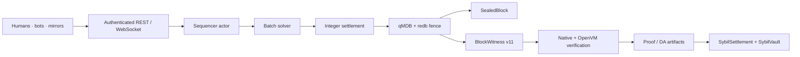

# Sybil system specification

> **Executive summary:** Sybil is an off-chain prediction-market exchange built around frequent batch auctions, deterministic integer settlement, authenticated state, and validity proofs. A single-writer sequencer admits orders, clears each eligible batch with a welfare solver, commits the next state behind a redb/qMDB fence, and emits a canonical block plus `BlockWitness` v11. Native verification checks each transition; the OpenVM guest verifies and folds contiguous multi-block epochs. Ethereum holds collateral and accepted roots; canonical witness publication supports audit and recovery.

This is the connected implementation guide. Start with the [Architecture Guide](README.md) for intuition and [Sybil Architecture](architecture/Sybil%20Architecture.md) for the full map and reading paths. Per-concept notes and ADRs own detailed rationale. Code, canonical schemas, and tests are the final source of truth.

Status snapshot: **2026-07-16**, through witness v11 executable oracle lifecycle, client-action authorization, the streamed epoch guest, transactional proof-job delivery, and the durable STARK-first prover daemon.

---

## 1. System shape

Sybil rests on five commitments:

1. **Frequent batch auctions.** Eligible orders clear together at one uniform price per market; arrival nanoseconds do not create queue priority.
2. **Welfare maximization.** The allocation maximizes trader surplus net of minting, rather than maximizing raw volume.
3. **Float search, integer truth.** Numerical solvers may search in `f64`; protocol fills, prices, settlement, commitments, and verification use deterministic integers.
4. **Authenticated trading intent.** Key mutations and ordinary signed orders/cancels retain their RawP256/WebAuthn envelopes; verification replays the active key set, exact action, genesis domain, and committed trading nonce.
5. **Validity plus availability.** OpenVM proves correctness; L1 anchors collateral and accepted roots; witness/DA publication supplies the data required for audit and recovery.

## 2. Numbers and domain model

Protocol-critical numbers are defined in `matching-engine`:

| Value | Representation | Meaning |
|---|---|---|
| Price/balance | `Nanos = u64` | 1 dollar = `1_000_000_000` nanos |
| Quantity | `Qty = u64` | `SHARE_SCALE = 1000`; 1000 units = 1 share |
| Money intermediate | `u128` / `i128` | Prevent overflow during price×quantity arithmetic |
| Market | `MarketId(u32)` | Binary YES (outcome 0) / NO (outcome 1) |

Notional conversion is `price_nanos × qty_units / SHARE_SCALE`. Settlement and welfare floor; reservation and MM-capital checks ceil. Rounding direction is protocol behavior.

### Markets, groups, and minting

Every market is binary. Mutually exclusive outcomes are represented as a `MarketGroup` of binary markets. Per-market minting creates one YES plus one NO for $1. Group minting creates one YES in each surviving mutually exclusive market for $1. The complete-set term in welfare is signed: creation consumes collateral and has positive cost, while burning releases collateral and has negative cost. These variables induce price-normalization constraints through LP duality.

When one member resolves, the group retains its unresolved members while at least two remain; a singleton group dissolves. This preserves group constraints for the surviving outcomes.

### Orders and supported execution

`matching-engine::Order` represents an order as a payoff vector over up to five binary markets (32 atomic states). This is the long-term unifying domain model for simple positions, spreads, and bundles.

**Current clearing support is intentionally narrower:** production execution supports single-market binary shapes. Unsupported multi-market/custom payoff shapes are rejected at API, admission, solver, and verification boundaries. An expressive type is not treated as proof that every shape is safely executable.

User-facing `BuyYes`, `BuyNo`, `SellYes`, and `SellNo` reduce to YES demand/supply with transformed prices. `GTC`, `GTD`, and `IOC` become explicit block eligibility/expiry behavior.

## 3. Matching and prices

One batch is a `Problem`: markets, supported orders, MM constraints, and market groups. Without MM budgets, the supported clearing problem is a linear program:

- Fill variables `q_i ∈ [0, max_fill_i]`.
- Per-market and group mint variables.
- Per-outcome position-balance constraints.
- Objective: signed limit-value of fills minus signed complete-set cost.

Clearing prices are dual variables of the balance constraints. Complementary slackness gives limit compliance; minting stationarity gives YES/NO and group price coherence. The verifier checks the landed integer result rather than trusting dual theory or floating output.

The solver implementations share the `Solver` interface:

| Solver | Role |
|---|---|
| `ProductionSolver` | Production facade: monolithic fully corrective retained-cash bundle |
| `RetainedCashSolver` | Independent certified generalized Frank--Wolfe retained-cash reference |
| `PacingBundleSolver` | Fully corrective core for the same retained-cash objective |
| `LpSolver` | Low-latency risk-neutral baseline; HiGHS plus budget-linearized re-solve |
| `ConicSolver` | Independent Clarabel retained-cash reference and no-cash ablation |
| `MilpSolver` | Feature-gated SCIP exact/reference route with timeout |
| `DecomposedSolver<S>` | Per-group mirror-descent coordination experiment |
| `ExactComponentSolver<S>` | Opt-in exact economic-connectivity decomposition and topology benchmark |

All solvers report one net-of-minting welfare convention and cross an integer
fill/price boundary before settlement. Retained-cash projections must reach a
budget-consistent price/quantity fixed point or fail explicitly; the LP-SLP
baseline retains its separately diagnosed cap-and-trim behavior. The
retained-cash paths pace MM bids and the complementary-buy value of MM asks
under one shared budget. `sybil-verifier` is the single trusted correctness
verifier.

## 4. Admission and block production

The sequencer is a synchronous deterministic `BlockSequencer` inside a `ractor` actor. All exchange mutation is serialized through the actor; API handlers use `SequencerHandle` messages.

Admission has two durable paths:

- **Direct admission:** supported simple non-MM orders validate, reserve capital, and enter the resting book immediately. The admit WAL is durable before acknowledgement.
- **Deferred atomic admission:** MM-constrained, multi-order, or otherwise batch-local submissions persist in the deferred queue and revalidate at the next block. MM quotes are one-shot and never rest.

Unsupported value-relevant order shapes are rejected rather than deferred into an incapable solver.

### Block transition

The block is prepared on a clone. Persistence precedes live-state swap and publication. If persistence fails, the candidate is discarded and acknowledged inputs remain replayable.

Two products leave the transition:

- `SealedBlock`: canonical block plus a non-validity `DerivedViewSidecar` for product consumers.
- `BlockWitness`: private transition package for verification, proving, DA, and recovery.

## 5. Persistence, history, and recovery

Sybil uses block snapshots plus small acknowledged-write WALs—not event sourcing.

- **qMDB A/B slots** store authenticated account and complete typed state. The committed typed-state root equals the header `state_root`.
- **sequencer redb** stores the commit fence, blocks/witnesses,
  configuration/state records, WAL tables, and one transactional history
  outbox row per committed block.
- **history redb** is owned by the private `sybil-history` process and stores
  immutable raw history batches plus account/time/market query projections.
- **The redb fence is the commit decision.** Recovery opens exactly the fenced qMDB slot and rejects height/root mismatch.

Between blocks, one globally sequenced acknowledged-write WAL protects direct
admits, deferred bundles, control-plane commands, deposits, withdrawals, and L1
lifecycle inputs. Recovery requires the exact `[floor, next)` interval and
replays actor acceptance order; deferred bundles still wait for the next normal
solve.

Full canonical block replay and private recovery DA remain sequencer concerns.
Product history—fills, account events, equity, committed prices, and candles—is
delivered at least once from the fenced outbox. Projection is contiguous,
genesis-bound, idempotent, and atomic. Historical reads bypass the sequencer
actor and expose indexing/completeness metadata. Neither the outbox nor its
projections are validity inputs or recovery DA. Exact logical backlog bytes,
rows, oldest/newest height, and oldest age are observable even when no projector
URL is configured; root-filesystem alerts cover redb/page and shared-volume
overhead that logical bytes exclude.

Canonical witness import can initialize a fresh store at a verified height. This is the implemented disaster-recovery basis for operator replacement.

## 6. Blocks, state, and witness v11

`BlockHeader` commits height, parent hash, typed `state_root`, `events_root`, counts, and timestamp. Public transition inputs additionally bind witness/DA and bridge fields.

`state_root` covers the committed state required to continue safely: accounts, balances, positions, deposited totals, event/key digests, per-account trading nonces, markets and last clearing prices, groups, resting orders/reservations, system counters, bridge deposit frontier/quarantine, and withdrawal/claim state. Analytics and display metadata are excluded.

`BlockWitness` v11 contains the accepted/rejected instructions, system events, fills/prices/constraints, authenticated pre/post account state, pre/post sidecars, account-key universe, key operations, exact order/cancel authorization envelopes, deposit dispositions, bridge state, the two-state executable market lifecycle, and the signature-bound `genesis_hash`. Canonical witness bytes—not MessagePack/serde transport bytes—determine `witness_root` and DA binding.

Canonical encoding is owned by `sybil-verifier`; signing bytes are owned by `sybil-signing`. Native and guest implementations are pinned by golden vectors.

## 7. Verification and authorization

`verify_full` combines four named layers with additional system, sidecar, and key-transition passes:

| Pass | Re-derives/checks |
|---|---|
| Match | Fill/order existence, positive quantity/limits, uniform prices, binary complementarity, MM budgets, welfare; group-price distance is diagnostic |
| Settlement | Integer balance/position/minting transition and event digests |
| Block integrity | Roots, parent/height chain, counts, exact keyspace proofs |
| Orders | Pre-state funding/positions, expiry, double-spend accumulation, rejection validity |
| System/sidecar | Deposits, withdrawals, resolution, order book/reservations, market/bridge transition |
| Keys/intent | Key universe/digests, register/revoke, uniqueness/last-key rules, RawP256/WebAuthn signatures |

Every canonical signed action starts with its own versioned domain and binds the chain `genesis_hash`, preventing both cross-action substitution and replay after a fresh-genesis deployment. Key operations additionally bind current `keys_digest` and `events_digest`. Signed orders/cancels use a strictly increasing committed `last_trading_nonce`. Witness v11 carries both key-operation and trading envelopes in actor acknowledgement order, and shared native/guest verification checks scheme-matching active-key membership, exact RawP256/WebAuthn signatures, action/effect binding, and nonce replay. WebAuthn additionally pins RP/origin/challenge, rejects cross-origin assertions, and requires user presence/verification.

## 8. ZK, DA, L1, and escape

The host/guest boundary has two main Rust homes:

- `sybil-zk`: guest-safe per-block verification, streamed epoch chaining/folds,
  and public-input binding.
- `sybil-proof-protocol`: portable proof jobs, epoch identities, typed proof kinds/envelopes, and exact-byte transport digests.
- `sybil-prover`: authenticated proof-job ingest, durable epoch scheduling/recovery, mock and locally verified OpenVM STARK backends, immutable artifacts/API, optional sequencer-store debug export, DA publication, and L1 calldata support.
- `sybil-custody`: user-side own-leaf snapshots, full-payload reconstruction,
  Form-L proving, adapter wrapping, and optional `escapeClaim` submission.

OpenVM guest/tool workspaces remain separately pinned. The main guest reads a
bounded epoch header followed by one independently encoded block at a time and
reveals the ordered epoch hash. Local guest execution, proof smoke paths,
canonical inputs, contracts, and calldata exist. The redb-backed daemon now
assembles and schedules epochs continuously; sustained STARK capacity/restart
soak and real EVM verifier deployment remain operational requirements;
unsafe/mock adapters are development-only.

`SybilVault` custodies collateral and builds the deposit tree. `SybilSettlement` accepts consecutive proven roots bound to the vault checkpoint and pinned guest commitments. Normal withdrawals use typed leaves, proofs, nullifiers, and a queue. The API fail-closes monetary bridge admission unless one chain/vault/token domain is configured; the unsafe Sepolia-only relay validates that domain and the live mock deployment before submitting a root or queue request. This runtime guard is not yet the validity-level domain proof tracked in GitHub #92.

The escape path proves a conservative cash floor; it does not unwind positions.
DA manifests and canonical witness payloads are served per height, witness
import supports disaster recovery, and the custody CLI lets a user retain
openings and independently construct/submit an escape claim. Production
provider retention, emergency-disclosure policy, real verifier deployment, and
hostile-operator successor governance remain incomplete.

## 9. API, oracle, mirrors, and agents

`sybil-api` is the transport/operations boundary around the actor and the
private history service. It owns REST, OpenAPI, rate limits,
deployment/service auth, account-owner checks, read-scoped bearers,
P256/WebAuthn ceremonies, metrics, resumable WebSocket,
proofs/DA endpoints, and static-free frontend integration. Historical requests
are owner-authorized here, then proxied with a separate private history token.
Realtime clients use WebSocket height resume and fail explicitly when requested
history has fallen below the retained replay floor.

Anonymous fixed grants use a dedicated durable sequencer counter, independent
from service account ids. Operator account creation requires a caller-stable
key that is domain-separated by genesis and bound to the exact parameters;
durable receipts make exact retries return one funded identity across WAL and
snapshot restart, while conflicting reuse is rejected.

`sybil-oracle` implements immediate signed-feed resolution. It verifies feed identity, market binding, signature, payout range, and irreversible lifecycle state. Truthfulness of the feed remains a trust assumption; richer quorum/bond/challenge policy is not part of the core implementation.

`sybil-polymarket` is an untrusted client integration: it mirrors curated events/groups, follows CLOB reference prices, submits one-shot MM liquidity, and signs clean closed-market resolutions. It imports no exchange state. Its off-block mapping file is schema-versioned, atomically replaced, and bound to one Sybil genesis; a mismatched file fails startup rather than guessing chain identity from market IDs. Native product markets are separate: `sybil-native-admin` applies the checked-in catalog idempotently and writes a genesis-bound deployment manifest; `sybil-native-mm` provides static-anchor flash liquidity from that manifest. Both MM processes reuse the provider-neutral `sybil-market-maker` actor and validate every numeric policy before account creation or float-to-integer conversion. The actor treats paired YES+NO as a redeemable complete set, submits paired sells as a separate ordinary IOC request to return its collateral to cash, and measures exposure only on the unpaired directional residual. Redemption therefore does not compete with the retained-cash MM budget. Crossing the configured exposure cap switches to reduce-only orders without removing the fixed per-block MM budget. Baseline cash-backed quotes receive catalog-wide order capacity before extra inventory depth. The actor publishes read-only operational progress; the native owner exposes it through private liveness, readiness, and Prometheus endpoints. The Polymarket owner composes the same MM snapshot with write-only sync, feed, and optional resolution progress on its own private endpoint. Readiness requires current quote coverage and accepted submissions, not merely a running loop. Neither service coordinates through monitoring state, and the API does not infer integration health from trading activity. The API timestamps external reference updates per market, publishes the exact expiry, and omits values older than its configured TTL, so a dead or partially updating publisher cannot leave a stale reference available to web/Arena consumers; this cache is volatile and empty after restart until republish. Arena consumes that one API-owned view, enforces the expiry between refreshes, and clears on refresh failure rather than maintaining a second CLOB/mapping cache.

The Python arena and web frontend use the same public interfaces. The Rust client is shared by first-party Rust consumers; OpenAPI generates frontend types.

## 10. Deployment and trust boundary

`SYBIL_DEPLOYMENT_PROFILE` distinguishes local, devnet, prelaunch, and prod
postures. Prelaunch keeps the locked persistence and authentication
guardrails but requires its bounded fixed play-money grant; prod requires that
grant to be zero. Both locked profiles fail-close dangerous combinations such
as dev mode, missing service/history tokens, missing history URL, or missing
persistent sequencer data.

Before real value, operators must deploy the pinned real verifier, eliminate mock/unsafe acceptance, retain DA payloads, exercise backup/import/withdrawal/escape drills, operate and independently review the unanimous finalized-provider set, drill checkpoint/source-integrity recovery, and protect admin/feed/verifier keys under the chosen governance policy. See [[Threat Model]], [[L1 Settlement and Vault]], and [[Deployment Profiles]].

The current permissionless API is not yet fully economically resource-bounded.
Anonymous onboarding has a durable lifetime account-stock cap, a server-chosen
fixed play-money grant, and dedicated flow limits; account ids are never reused.
Unbounded product-history outbox growth during a prolonged projector outage can
still grow storage without deposited capital. This availability gap must be
closed by an explicit overflow/archive policy before real-value deployment;
devnet monitors it without silently deleting rows. The
[dated audit](https://github.com/MetaB0y/sybil/blob/main/design/dos-audit-2026-07-11.md)
owns the detailed evidence, and
[GitHub #90](https://github.com/MetaB0y/sybil/issues/90) owns the decision.

## 11. Consolidated invariants

1. Protocol state and verification contain no floating point; solver search is outside the trusted boundary.
2. Unsupported order shapes never reach value execution.
3. Floor/ceil money rounding follows the shared engine helpers.
4. Landed fills respect quantity, limits, uniform prices, groups, and MM budgets.
5. Welfare is net of minting and has one verifier-owned definition.
6. `post_state` and sidecar equal exact replay of authenticated pre-state, system events, key operations, fills, and minting.
7. Key-operation and ordinary order/cancel P256/WebAuthn signatures, active-key ordering, action bindings, and trading nonces are checked at admission and by shared native/guest verification.
8. The header roots equal canonical typed state/events; public inputs bind witness, DA, bridge, height, and parent transition.
9. Acknowledged writes survive restart; no block is published before the redb fence commits it.
10. Recovery reads only the fenced qMDB slot and replays the complete global
    acknowledged-write interval in exact actor acceptance order.
11. Derived analytics/history never affect validity.
12. Resolution is irreversible; resolved markets cannot trade and groups retain only valid unresolved structure.
13. L1 roots are consecutive, deposit-checkpoint bound, verifier-gated, and withdrawal/escape claims are nullifier-protected.
14. Availability and hostile-operator governance are not implied by validity alone.

## 12. Source map

| Area | Owner |
|---|---|
| Domain and settlement arithmetic | `crates/matching-engine` |
| Solvers and integer landing | `crates/matching-solver` |
| Admission, blocks, canonical persistence, product-history outbox, bridge | `crates/matching-sequencer` |
| Private history contract, projection, and query serving | `crates/sybil-history-types`, `crates/sybil-history` |
| Wire types, API, WebAuthn, realtime, operations | `crates/sybil-api-types`, `crates/sybil-api` |
| Resolution policy | `crates/sybil-oracle` |
| Native witness and canonical verification | `crates/sybil-verifier` |
| Guest-safe verification and public inputs | `crates/sybil-zk` |
| Proof jobs, DA, artifacts, submission | `crates/sybil-prover`, `zk/` |
| User custody, reconstruction, escape proving | `crates/sybil-custody`, `crates/sybil-escape-claim` |
| L1 protocol/indexing and contracts | `crates/sybil-l1-*`, `contracts/` |
| External mirror | `crates/sybil-polymarket` |
| Native market catalog/runtime | `crates/sybil-native` |
| Shared flash-liquidity actor | `crates/sybil-market-maker` |
| Agents and clients | `arena/`, `frontend/web/`, `crates/sybil-client` |

For why these boundaries exist, follow the ADRs and focused notes from [Sybil Architecture](architecture/Sybil%20Architecture.md).
