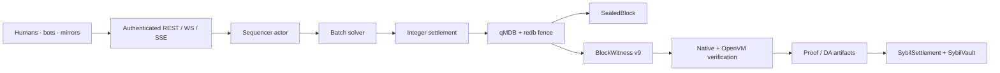

# Sybil system specification

> **Executive summary:** Sybil is an off-chain prediction-market exchange built around frequent batch auctions, deterministic integer settlement, authenticated state, and validity proofs. A single-writer sequencer admits orders, clears each eligible batch with a welfare solver, commits the next state behind a redb/qMDB fence, and emits a canonical block plus `BlockWitness` v9. Native and OpenVM verification re-derive the transition. Ethereum holds collateral and accepted roots; canonical witness publication supports audit and recovery.

This is the connected implementation guide. Start with the [Architecture Guide](README.md) for intuition and [Sybil Architecture](architecture/Sybil%20Architecture.md) for the full map and reading paths. Per-concept notes and ADRs own detailed rationale. Code, canonical schemas, and tests are the final source of truth.

Status snapshot: **2026-07-11**, based on `main` through witness v9 and the user-side custody CLI.

---

## 1. System shape

Sybil rests on five commitments:

1. **Frequent batch auctions.** Eligible orders clear together at one uniform price per market; arrival nanoseconds do not create queue priority.
2. **Welfare maximization.** The allocation maximizes trader surplus net of minting, rather than maximizing raw volume.
3. **Float search, integer truth.** Numerical solvers may search in `f64`; protocol fills, prices, settlement, commitments, and verification use deterministic integers.
4. **Authenticated keys, with a split intent boundary.** Key mutations and active-key digests are validity-checked; ordinary signed actions use genesis-bound canonical bytes and durable admission nonces that are not yet re-proved by the guest.
5. **Validity plus availability.** OpenVM proves correctness; L1 anchors collateral and accepted roots; witness/DA publication supplies the data required for audit and recovery.

## 2. Numbers and domain model

Protocol-critical numbers are defined in `matching-engine`:

| Value | Representation | Meaning |
|---|---|---|
| Price/balance | `Nanos = u64` | 1 dollar = `1_000_000_000` nanos |
| Quantity | `Qty = u64` | `SHARE_SCALE = 1000`; 1000 units = 1 share |
| Money intermediate | `u128` / `i128` | Prevent overflow during price×quantity arithmetic |
| Market | `MarketId(u32)` | Binary YES (outcome 0) / NO (outcome 1) |

Notional conversion is `price_nanos × qty_units / SHARE_SCALE`. Settlement and welfare floor; reservation and MM-capital checks ceil. Rounding direction is protocol behavior.

### Markets, groups, and minting

Every market is binary. Mutually exclusive outcomes are represented as a `MarketGroup` of binary markets. Per-market minting creates one YES plus one NO for $1. Group minting creates one YES in each surviving mutually exclusive market for $1. Minting variables enter the welfare objective as costs and induce price-normalization constraints through LP duality.

When one member resolves, the group retains its unresolved members while at least two remain; a singleton group dissolves. This preserves group constraints for the surviving outcomes.

### Orders and supported execution

`matching-engine::Order` represents an order as a payoff vector over up to five binary markets (32 atomic states). This is the long-term unifying domain model for simple positions, spreads, and bundles.

**Current clearing support is intentionally narrower:** production execution supports single-market binary shapes. Unsupported multi-market/custom payoff shapes are rejected at API, admission, solver, and verification boundaries. An expressive type is not treated as proof that every shape is safely executable.

User-facing `BuyYes`, `BuyNo`, `SellYes`, and `SellNo` reduce to YES demand/supply with transformed prices. `GTC`, `GTD`, and `IOC` become explicit block eligibility/expiry behavior.

## 3. Matching and prices

One batch is a `Problem`: markets, supported orders, MM constraints, and market groups. Without MM budgets, the supported clearing problem is a linear program:

- Fill variables `q_i ∈ [0, max_fill_i]`.
- Per-market and group mint variables.
- Per-outcome position-balance constraints.
- Objective: signed limit-value of fills minus mint costs.

Clearing prices are dual variables of the balance constraints. Complementary slackness gives limit compliance; minting stationarity gives YES/NO and group price coherence. The verifier checks the landed integer result rather than trusting dual theory or floating output.

Six solver implementations share the `Solver` interface:

| Solver | Role |
|---|---|
| `LpSolver` | Production default; HiGHS plus budget-linearized re-solve |
| `IterLpSolver` | Damped fixed-point LP for tighter MM budgets |
| `EgSolver` | Eisenberg–Gale / Fisher-market reference |
| `ConicSolver` | Clarabel Linear/Fisher/QuasiFisher reference |
| `MilpSolver` | Feature-gated SCIP exact/reference route with timeout |
| `DecomposedSolver<S>` | Per-group mirror-descent coordination experiment |

All solvers land integer fills/prices, trim rounding-induced MM overflow, and report one net-of-minting welfare convention. `sybil-verifier` is the single trusted correctness verifier.

## 4. Admission and block production

The sequencer is a synchronous deterministic `BlockSequencer` inside a `ractor` actor. All exchange mutation is serialized through the actor; API handlers use `SequencerHandle` messages.

Admission has two durable paths:

- **Direct admission:** supported simple non-MM orders validate, reserve capital, and enter the resting book immediately. The admit WAL is durable before acknowledgement.
- **Deferred atomic admission:** MM-constrained, multi-order, or otherwise batch-local submissions persist in the deferred queue and revalidate at the next block. MM quotes are one-shot and never rest.

Unsupported value-relevant order shapes are rejected rather than deferred into an incapable solver.

### Block transition

The block is prepared on a clone. Persistence precedes live-state swap and publication. If persistence fails, the candidate is discarded and acknowledged inputs remain replayable.

Two products leave the transition:

- `SealedBlock`: canonical block plus a non-validity `DerivedViewSidecar` for product consumers.
- `BlockWitness`: private transition package for verification, proving, DA, and recovery.

## 5. Persistence, history, and recovery

Sybil uses block snapshots plus small acknowledged-write WALs—not event sourcing.

- **qMDB A/B slots** store authenticated account and complete typed state. The committed typed-state root equals the header `state_root`.
- **redb** stores the commit fence, blocks/witnesses, configuration/state records, WAL tables, and durable derived history.
- **The redb fence is the commit decision.** Recovery opens exactly the fenced qMDB slot and rejects height/root mismatch.

Between blocks, separate WAL tables protect direct admits, deferred bundles, control-plane commands, deposits, withdrawals, and L1 lifecycle inputs. Replay order is fixed and tested: committed snapshot/book → admit rows/id advance → control plane/expiry → deposits → withdrawal creation → L1 lifecycle inputs; deferred bundles wait for the next normal solve.

History tables—full blocks, fills, account events, raw prices, candles, and aggregates—are derived from committed blocks. They support bounded pagination, explicit retention floors, WebSocket replay, restart tests, and backup/restore drills. They never become validity inputs.

Canonical witness import can initialize a fresh store at a verified height. This is the implemented disaster-recovery basis for operator replacement.

## 6. Blocks, state, and witness v9

`BlockHeader` commits height, parent hash, typed `state_root`, `events_root`, counts, and timestamp. Public transition inputs additionally bind witness/DA and bridge fields.

`state_root` covers the committed state required to continue safely: accounts, balances, positions, deposited totals, event/key digests, markets and last clearing prices, groups, resting orders/reservations, system counters, bridge deposit frontier/quarantine, and withdrawal/claim state. Per-account ordinary-action replay nonces are durable sequencer state but are not validity leaves. Analytics and display metadata are excluded.

`BlockWitness` v9 contains the accepted/rejected instructions, system events, fills/prices/constraints, authenticated pre/post account state, pre/post sidecars, account-key universe and key operations, deposit dispositions, bridge state, and the signature-bound `genesis_hash`. Canonical witness bytes—not MessagePack/serde transport bytes—determine `witness_root` and DA binding.

Canonical encoding is owned by `sybil-verifier`; signing bytes are owned by `sybil-signing`. Native and guest implementations are pinned by golden vectors.

## 7. Verification and authorization

`verify_full` combines four named layers with additional system, sidecar, and key-transition passes:

| Pass | Re-derives/checks |
|---|---|
| Match | Fill/order existence, quantity/limits, uniform prices, groups, MM budgets, welfare |
| Settlement | Integer balance/position/minting transition and event digests |
| Block integrity | Roots, parent/height chain, counts, exact keyspace proofs |
| Orders | Pre-state funding/positions, expiry, double-spend accumulation, rejection validity |
| System/sidecar | Deposits, withdrawals, resolution, order book/reservations, market/bridge transition |
| Keys/intent | Key universe/digests, register/revoke, uniqueness/last-key rules, RawP256/WebAuthn signatures |

Authorization has two boundaries. Key operations bind current `keys_digest` and `events_digest`; their RawP256/WebAuthn envelopes are carried in the witness and re-proved by the guest. Ordinary signed orders/cancels use a strictly increasing per-account nonce and genesis-bound canonical bytes checked at API/sequencer admission. Their signature envelopes and previous cross-block nonce are not currently guest inputs. WebAuthn uses the same canonical action bytes as raw P256 while additionally checking RP/origin/challenge and user-presence/verification requirements.

## 8. ZK, DA, L1, and escape

The host/guest boundary has two main Rust homes:

- `sybil-zk`: guest-safe transition and escape-claim verification plus public-input binding.
- `sybil-prover`: proof jobs, optional sequencer-store export, preparation, artifacts/API, DA publication, and L1 calldata/submission support.
- `sybil-custody`: user-side own-leaf snapshots, full-payload reconstruction,
  Form-L proving, adapter wrapping, and optional `escapeClaim` submission.

OpenVM guest/tool workspaces remain separately pinned. Local guest execution, proof smoke paths, canonical inputs, contracts, and calldata exist. Production proving and real verifier deployment are operational requirements; unsafe/mock adapters are development-only.

`SybilVault` custodies collateral and builds the deposit tree. `SybilSettlement` accepts consecutive proven roots bound to the vault checkpoint and pinned guest commitments. Normal withdrawals use typed leaves, proofs, nullifiers, and a queue.

The escape path proves a conservative cash floor; it does not unwind positions.
DA manifests and canonical witness payloads are served per height, witness
import supports disaster recovery, and the custody CLI lets a user retain
openings and independently construct/submit an escape claim. Production
provider retention, emergency-disclosure policy, real verifier deployment, and
hostile-operator successor governance remain incomplete.

## 9. API, oracle, mirrors, and agents

`sybil-api` is a thin transport/operations layer around the actor. It owns REST, OpenAPI, rate limits, deployment/service auth, read-scoped bearers, P256/WebAuthn ceremonies, metrics, resumable WebSocket, convenience SSE, bounded history, proofs/DA endpoints, and static-free frontend integration. First-party realtime clients use WebSocket height resume; SSE remains a simple third-party stream.

`sybil-oracle` implements immediate signed-feed resolution. It verifies feed identity, market binding, signature, payout range, and irreversible lifecycle state. Truthfulness of the feed remains a trust assumption; richer quorum/bond/challenge policy is not part of the core implementation.

`sybil-polymarket` is an untrusted client integration: it mirrors curated events/groups, follows CLOB reference prices, submits one-shot MM liquidity, and signs clean closed-market resolutions. It imports no exchange state.

The Python arena and web frontend use the same public interfaces. The Rust client is shared by first-party Rust consumers; OpenAPI generates frontend types.

## 10. Deployment and trust boundary

`SYBIL_DEPLOYMENT_PROFILE` distinguishes local, devnet, and prod postures. Production preflight fail-closes dangerous combinations such as dev mode, missing service token, or missing persistent data directory. The current public devnet is intentionally not the production trust posture.

Before real value, operators must deploy the pinned real verifier, eliminate mock/unsafe acceptance, retain DA payloads, exercise backup/import/withdrawal/escape drills, configure L1 confirmation depth and monitoring, and protect admin/feed/verifier keys under the chosen governance policy. See [[Threat Model]] and [[Deployment Profiles]].

The current permissionless API is also not economically resource-bounded:
unlimited demo accounts, unbounded API-key records, zero-reservation orders,
and unbudgeted history/read paths can grow or wedge state without deposited
capital. These critical availability gaps must be closed or service-gated
before real-value deployment; the [dated audit](https://github.com/MetaB0y/sybil/blob/main/design/dos-audit-2026-07-11.md)
owns the detailed evidence and remediation order.

## 11. Consolidated invariants

1. Protocol state and verification contain no floating point; solver search is outside the trusted boundary.
2. Unsupported order shapes never reach value execution.
3. Floor/ceil money rounding follows the shared engine helpers.
4. Landed fills respect quantity, limits, uniform prices, groups, and MM budgets.
5. Welfare is net of minting and has one verifier-owned definition.
6. `post_state` and sidecar equal exact replay of authenticated pre-state, system events, key operations, fills, and minting.
7. Key-operation P256/WebAuthn signatures and state bindings are checked at admission and in the guest; ordinary signed-action replay protection remains an admission/WAL guarantee.
8. The header roots equal canonical typed state/events; public inputs bind witness, DA, bridge, height, and parent transition.
9. Acknowledged writes survive restart; no block is published before the redb fence commits it.
10. Recovery reads only the fenced qMDB slot and follows the fixed WAL replay order.
11. Derived analytics/history never affect validity.
12. Resolution is irreversible; resolved markets cannot trade and groups retain only valid unresolved structure.
13. L1 roots are consecutive, deposit-checkpoint bound, verifier-gated, and withdrawal/escape claims are nullifier-protected.
14. Availability and hostile-operator governance are not implied by validity alone.

## 12. Source map

| Area | Owner |
|---|---|
| Domain and settlement arithmetic | `crates/matching-engine` |
| Solvers and integer landing | `crates/matching-solver` |
| Admission, blocks, persistence, history, bridge | `crates/matching-sequencer` |
| Wire types, API, WebAuthn, realtime, operations | `crates/sybil-api-types`, `crates/sybil-api` |
| Resolution policy | `crates/sybil-oracle` |
| Native witness and canonical verification | `crates/sybil-verifier` |
| Guest-safe verification and public inputs | `crates/sybil-zk` |
| Proof jobs, DA, artifacts, submission | `crates/sybil-prover`, `zk/` |
| User custody, reconstruction, escape proving | `crates/sybil-custody`, `crates/sybil-escape-claim` |
| L1 protocol/indexing and contracts | `crates/sybil-l1-*`, `contracts/` |
| External mirror | `crates/sybil-polymarket` |
| Agents and clients | `arena/`, `frontend/web/`, `crates/sybil-client` |

For why these boundaries exist, follow the ADRs and focused notes from [Sybil Architecture](architecture/Sybil%20Architecture.md).
