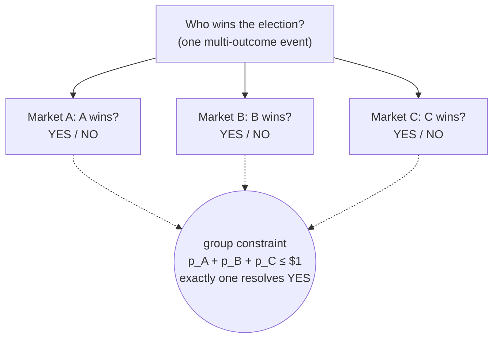

Every market in Sybil is binary: it has exactly two outcomes, YES and NO. At resolution, YES shares pay out a fixed amount (typically $1) and NO shares pay the complement. This simplicity is a deliberate design choice — multi-outcome events like "Who wins the election: A, B, or C?" are modeled as groups of binary markets rather than as a single multi-outcome market.

A market group is a set of binary markets representing mutually exclusive outcomes. If candidate A wins, markets B and C resolve NO. The key constraint is that the YES prices across all markets in a group must sum to at most $1 (with equality when [[Minting|group minting]] is active). This is enforced automatically by the solver through LP duality — the group minting stationarity condition gives you price consistency for free. Groups enable powerful arbitrage: if A-YES + B-YES + C-YES prices sum to more than $1, the solver will mint group shares and sell them to capture the surplus.

The event is *not* one three-way market — it is three independent binary markets stitched together by a single group constraint. Each is atomic and easy to settle; the group only adds the sum-to-$1 coupling on top.

This design trades off expressiveness for simplicity. A binary market is the atomic unit — easy to reason about, easy to settle, easy to verify. The group structure adds back the multi-outcome semantics where needed. From the solver's perspective, groups primarily matter for [[Minting|group minting]] (which is K times cheaper than per-market minting) and for the price sum constraint. The [[Payoff Vectors]] abstraction handles cross-market orders naturally regardless of group membership.

## Key Properties
- Each market has outcomes YES (0) and NO (1) — exactly one resolves to $1
- Market groups = mutually exclusive binary markets
- Sum-to-$1 constraint: `sum(YES_price_m for m in group) <= $1`
- Groups enable cheaper [[Minting|group minting]] and price consistency
- All multi-outcome events decompose into binary market groups

## Where This Lives
> `crates/matching-engine/src/problem.rs` — `MarketGroup` struct
> `crates/matching-engine/src/types.rs` — `MarketId`

## See Also
- [[Minting]] — per-market vs group minting and cost differences
- [[LP Duality and Clearing Prices]] — how group constraints emerge from duality
- [[Payoff Vectors]] — cross-market orders spanning group members
- [[Market Resolution]] — how binary markets resolve to final payouts
