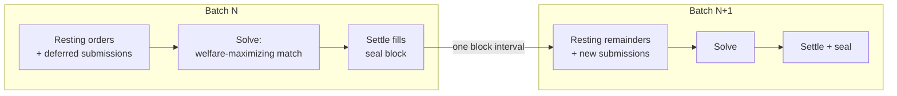

A Frequent Batch Auction (FBA) collects all incoming orders over a short time window — a second or several — and then matches them simultaneously at uniform clearing prices. Every participant in the batch gets the same deal. This stands in contrast to continuous limit order books, where the first order to arrive gets priority, creating an arms race for speed that benefits high-frequency traders at the expense of everyone else.

The intellectual foundation comes from Budish, Cramton, and Shim (2015), who proposed FBAs for equity markets as a solution to the HFT arms race. In prediction markets, FBAs are even more natural: the information environment changes discretely (news events, data releases), so there's no fundamental reason to match continuously. Batching also makes the clearing problem well-defined — you have a fixed set of orders and can solve for the welfare-maximizing allocation.

The batch cadence is configurable through `SYBIL_BLOCK_INTERVAL_MS`. At each tick the sequencer combines eligible resting orders with atomically admitted deferred submissions, assembles a supported [[The LP Core|Problem]], solves, settles, and seals a block. Because allocation is batch-wide and uniformly priced, millisecond arrival priority does not decide the result.

## Key Properties
- All orders in a batch trade at the same [[LP Duality and Clearing Prices|uniform clearing price]]
- Eliminates speed advantages — only [[Welfare Maximization|willingness to pay]] matters
- Makes the matching problem a well-defined optimization over a finite order set
- Natural fit for prediction markets where information arrives discretely

## Where This Lives
> `crates/matching-sequencer/src/actor.rs` — the block-interval timer triggers batch production via `BlockSequencer::produce_block()`
> `crates/sybil-api/src/config.rs` — `SYBIL_BLOCK_INTERVAL_MS` configuration

## See Also
- [[Block Lifecycle]] — the full flow from order submission to sealed block
- [[Order Admission]] — how orders are collected before each batch
- [[Welfare Maximization]] — the objective function optimized each batch
