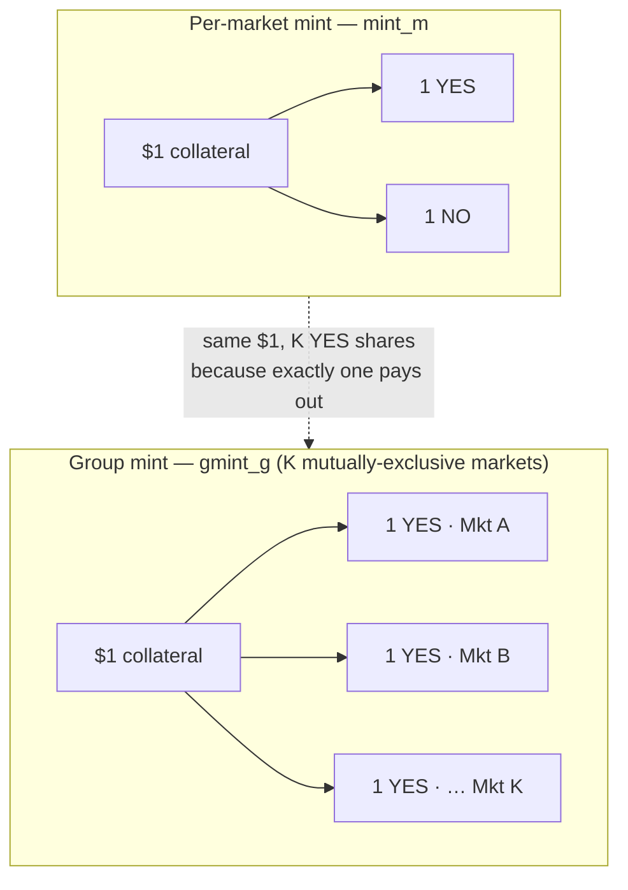

The idea in plain words: when buyers want more YES shares than sellers are offering, the exchange doesn't turn them away — it manufactures fresh shares out of collateral. The trick is that every share the protocol mints is fully backed. A binary market's YES and NO always sum to exactly $1 at resolution, so the protocol can safely stamp out a matched pair — 1 YES + 1 NO — for $1 of collateral and sell the side people want. It never mints something it can't redeem.

This is per-market minting: it shows up as a decision variable `mint_m` in the [[The LP Core|LP]] and appears as a cost term in the [[Welfare Maximization|welfare objective]].

Group minting is the powerful generalization. For a [[Binary Markets and Market Groups|market group]] of K mutually exclusive markets, creating 1 YES share on *every* market in the group costs just $1 total — because exactly one of them will ever pay out, so one dollar of collateral covers all K. That makes group minting K times cheaper per YES share than per-market minting: a 5-candidate election yields 5 YES shares for $1 instead of $5. The solver uses group minting variables `gmint_g` to exploit this, and the [[MILP Solver]] is particularly good at spotting group-minting opportunities that heuristic solvers miss. (In the [[The LP Core|LP]] this shows up as `gmint_g` feeding the YES balance of every group member while only per-market `mint_m` feeds the NO side.)

In the LP formulation, complete-set terms enter welfare as `-$1 * sum(mint_m) - $1 * sum(gmint_g)`. Per-market `mint_m` is signed: positive values create YES+NO and consume collateral, while negative values burn YES+NO and release collateral. The group variable in the current LP supports creation only and remains nonnegative. Through [[LP Duality and Clearing Prices|LP duality]], the minting stationarity conditions give price normalization: the free per-market variable pins `YES_price + NO_price = $1`, while group creation gives `sum(YES_prices) <= $1` with equality when active.

## Key Properties
- Per-market: 1 YES + 1 NO = $1, signed variable `mint_m` (positive creation, negative burning)
- Group: 1 YES on each of K markets = $1, variable `gmint_g >= 0`
- Group minting is K times cheaper per YES share
- Signed complete-set cost charges creation and credits collateral released by burning
- [[LP Duality and Clearing Prices|Dual stationarity]] enforces price normalization automatically

## Where This Lives
> `crates/matching-solver/src/lp_solver.rs` — minting variables and constraints in the LP
> `design/problem-statement.md` — formal definition of minting mechanics

## See Also
- [[Binary Markets and Market Groups]] — groups enable cheaper group minting
- [[The LP Core]] — how minting variables enter the LP formulation
- [[MILP Solver]] — exploits group minting structure better than heuristic solvers
