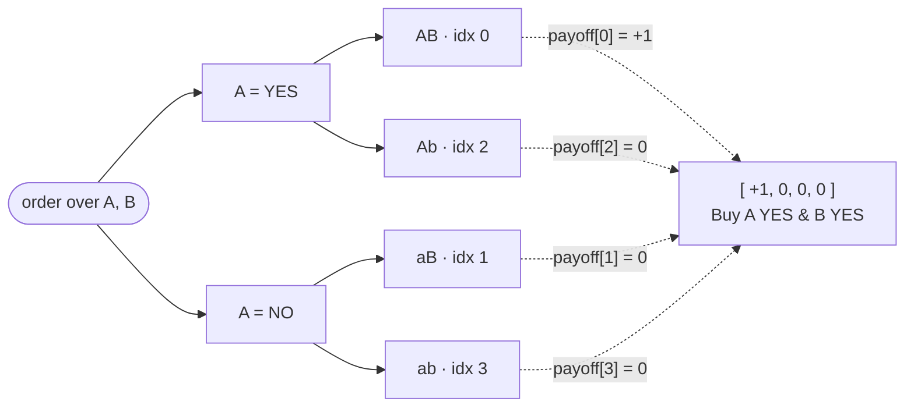

Every order in Sybil is represented as a payoff vector over atomic world states. This is the central abstraction that unifies all order types — simple limit orders, spreads, bundles, butterflies, and arbitrary conditionals — into a single representation that the solver can handle uniformly.

For an order spanning N markets, there are 2^N possible world states (each market resolves YES or NO independently). The payoff vector assigns a value to each state: +1 means the order is long in that state, -1 means short, 0 means no exposure. State indexing uses mixed-radix encoding: for markets A and B, the four states are indexed as `o_A + 2*o_B`, giving states [AB, aB, Ab, ab] where uppercase means YES (outcome digit `0` = YES, `1` = NO). A simple "Buy YES on market A" has payoff [+1, 0, +1, 0] — it pays out in any state where A is YES (states AB and Ab), regardless of B.

N markets branch into 2^N leaf states (above, N=2 → 4 states); the payoff vector is just one signed number per leaf — `+1` long, `-1` short, `0` flat. Mixed-radix indexing (`idx = o_A + 2·o_B`, with YES=0, NO=1) maps each leaf to its array slot: AB=0, aB=1, Ab=2, ab=3. "Buy A YES & B YES" pays only in state AB, so its lone `+1` sits at index 0.

This representation is powerful because the solver never needs to know what "type" an order is. A spread "Buy A YES, Sell B YES" becomes payoff [0, -1, +1, 0]. A bundle "Buy A YES and B YES" becomes [+1, 0, 0, 0]. The solver just sees vectors and limit prices, and the [[The LP Core|LP]] handles them all identically through per-state position balance constraints. The practical limit is 5 markets (32 states) per order, which keeps the arrays stack-allocated and covers all realistic trading strategies.

**Worked example.** Consider two markets: A ("Will it rain?") and B ("Will it snow?"). The four world states, in index order `[AB, aB, Ab, ab]`, are AB (rain and snow), aB (no rain, snow), Ab (rain, no snow), ab (neither). A trader who thinks rain-without-snow is likely submits a spread: Buy A YES, Sell B YES. This becomes payoff `[0, -1, +1, 0]` — the `+1` at index 2 (state `Ab`) means they profit when A=YES and B=NO, and the `-1` at index 1 (state `aB`) is their short-B exposure. A plain "Buy A YES" is `[+1, 0, +1, 0]` — profit whenever it rains (states AB and Ab), regardless of snow. The solver handles both identically: just vectors and limit prices, with [[Nanos and Integer Arithmetic|nanos]] values alongside the payoff entries.

## Key Properties
- `payoffs: [i8; MAX_STATES]` — positive = long, negative = short, zero = no exposure
- Mixed-radix state indexing: `index = o0 + 2*o1 + 4*o2 + ...`
- Max 5 markets, 32 states per order (stack-allocated)
- Marginal decomposition extracts per-market contributions for the [[The LP Core|LP formulation]]
- Enables unified solver handling — no special cases for different [[Order Types]]

## Where This Lives
> `crates/matching-engine/src/order.rs` — `Order` struct with `payoffs` array and `market_ids`
> `crates/matching-engine/src/order_builder.rs` — factory functions for common payoff patterns
> `crates/matching-engine/src/state.rs` — state indexing and `StateSpace`

## See Also
- [[Order Types]] — user-facing order specs that get converted to payoff vectors
- [[The LP Core]] — how payoff vectors enter the optimization problem
- [[Binary Markets and Market Groups]] — the market structure payoff vectors operate over
