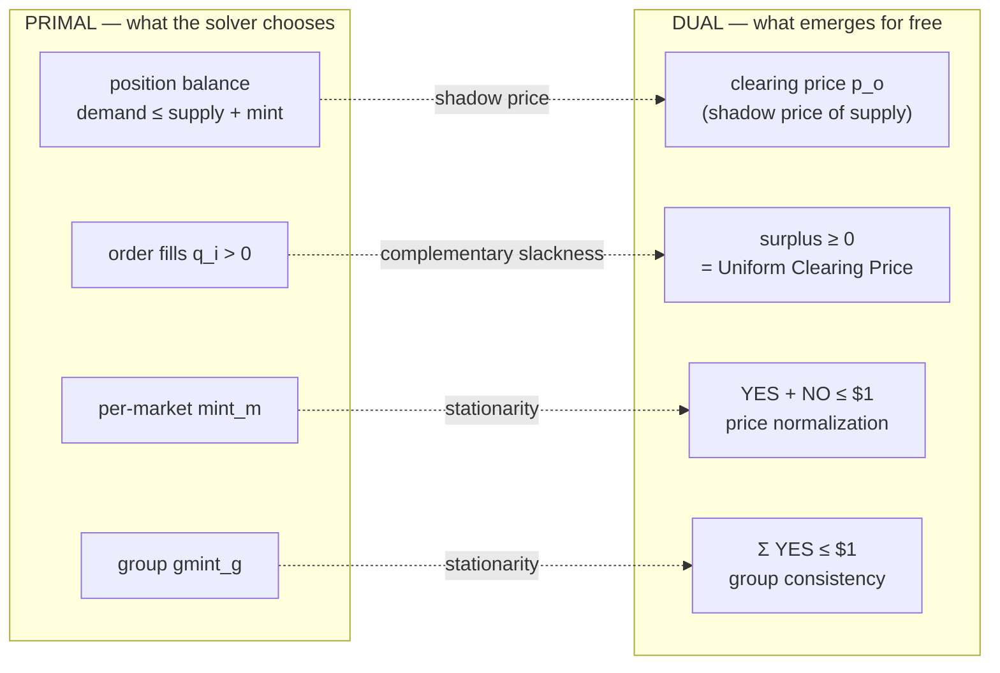

The allocation objective determines a face of economically valid prices, but it
need not determine one point. Every "market cannot sell what it doesn't have"
constraint has a shadow price: the marginal welfare of one extra unit of
supply. On a non-degenerate book that price is unique. On a degenerate book,
such as a seller at 20 crossing a buyer at 70 with no marginal order, the same
fills can be supported by an interval. A numerical LP basis may return either
endpoint, but basis choice is not protocol economics.

Formally: every LP has a dual, and the dual variable of a constraint is the marginal value of relaxing it by one unit. For the position balance constraint on market m, outcome o — "total demand cannot exceed total supply plus minting" — that marginal value is exactly the clearing price for the outcome. Conjure one more unit of supply and welfare rises by the clearing price. That is the textbook definition of a competitive market price.

LP duality hands you three economic properties, each an edge in the diagram
above. First, the Uniform Clearing Price (UCP): a filled order must have
non-negative surplus. Second, minting stationarity gives outcome-price
normalization. Third, group minting gives the categorical price simplex. KKT
conditions for unfilled executable quantity add the opposite support bounds.

After integer fill landing, Sybil reconstructs those conditions with integer
arithmetic. Filled orders use their literal limits. Residual MM quantity uses
the one exact rational pacing factor shared across that MM's markets, so
budget-blocked quotes do not create fictitious pressure. The remaining
box-simplex face is canonicalized by maximum Shannon entropy: equalize
unclamped outcome probabilities, with indivisible one-nano remainders assigned
by market id. This is the zero-temperature limit of the paper's unique
positive-temperature price, not a midpoint convention.

Floating duals remain useful for optimization and certificates, but never
cross the protocol boundary. `sybil-verifier` recomputes the same canonical
integer point from orders, fills, MM constraints, and market groups.

## Key Properties
- Dual variables characterize the competitive equilibrium-price face
- Complementary slackness = Uniform Clearing Price (UCP)
- [[Minting]] stationarity = `YES + NO <= $1` per market
- Group minting stationarity = `sum(YES) <= $1` per [[Binary Markets and Market Groups|group]]
- Maximum entropy selects exactly one integer point on a non-unique face
- Canonical prices are independent of solver backend and floating dual basis

## Where This Lives
> `crates/matching-engine/src/canonical_price.rs` — pure integer face reconstruction and selection
> `crates/matching-solver/src/lp_solver.rs` — shared landed-fill finalization
> `crates/sybil-verifier/src/match_verifier.rs` — exact canonical-price enforcement
> `docs/adr/0020-canonical-maximum-entropy-clearing-prices.md` — invariant and alternatives

## See Also
- [[The LP Core]] — the primal LP whose dual gives prices
- [[Welfare Maximization]] — total welfare is independent of prices (depends only on fills)
- [[Minting]] — price normalization through minting stationarity
