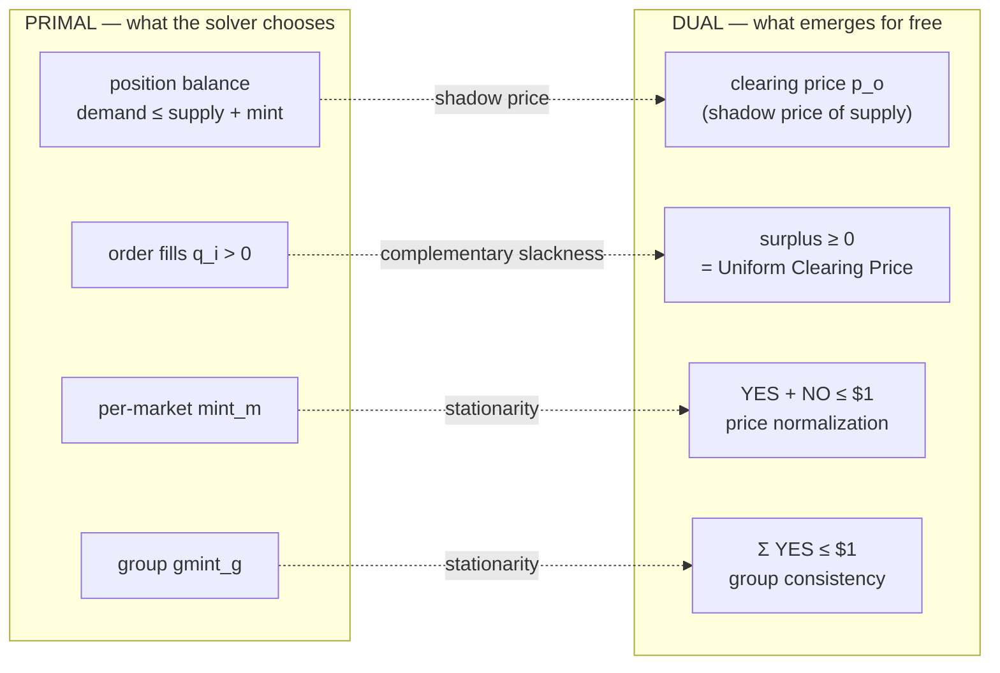

The idea in plain words: nobody in Sybil ever *chooses* a price. You hand the solver a pile of orders and ask one question — "which fills create the most welfare?" — and the prices fall out the side of the answer for free. Every "market cannot sell what it doesn't have" constraint has a shadow price attached: how much more welfare you'd get from one extra unit of supply. That shadow price *is* the clearing price. Price discovery isn't a separate step; it's the receipt the optimizer prints.

Formally: every LP has a dual, and the dual variable of a constraint is the marginal value of relaxing it by one unit. For the position balance constraint on market m, outcome o — "total demand cannot exceed total supply plus minting" — that marginal value is exactly the clearing price for the outcome. Conjure one more unit of supply and welfare rises by the clearing price. That is the textbook definition of a competitive market price.

LP duality hands you three economic properties, each an edge in the diagram above. First, the Uniform Clearing Price (UCP): complementary slackness says a filled order (`q_i > 0`) must have non-negative surplus — buyers fill only at or above the clearing price, sellers only at or below. Second, price normalization: stationarity on the per-market minting variable gives `YES_price + NO_price <= $1`, with equality when [[Minting]] is active (almost always). Third, group consistency: stationarity on group minting gives `sum(YES_prices) <= $1` across a [[Binary Markets and Market Groups|group]], with equality when group minting is active. All three are enforced automatically — no post-hoc price adjustment code exists, because none is needed.

## Key Properties
- Clearing price = dual variable of position balance constraint
- Complementary slackness = Uniform Clearing Price (UCP)
- [[Minting]] stationarity = `YES + NO <= $1` per market
- Group minting stationarity = `sum(YES) <= $1` per [[Binary Markets and Market Groups|group]]
- All economic constraints emerge from LP duality — zero enforcement code needed

## Where This Lives
> `crates/matching-solver/src/lp_solver.rs` — dual variable extraction after solve
> `design/problem-statement.md` — dual conditions table (Section 7)

## See Also
- [[The LP Core]] — the primal LP whose dual gives prices
- [[Welfare Maximization]] — total welfare is independent of prices (depends only on fills)
- [[Minting]] — price normalization through minting stationarity
