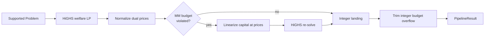

# LP solver

> [!summary] In one paragraph
> `LpSolver` is the low-latency risk-neutral baseline. It asks HiGHS for the welfare-maximizing supported allocation, reads clearing prices from balance-constraint duals, linearizes MM capital usage at those prices, and re-solves with budget rows. The default permits one budget-aware re-solve. The floating solution is rounded, trimmed for integer MM compliance, and judged by `sybil-verifier`. [[Retained Cash Solver]] is the production default when shared MM capital is present.

The LP has fill, per-market mint, and group-mint variables with outcome-balance constraints. Duals yield uniform YES/NO prices. MM capital is bilinear in unknown price and fill quantity, so each SLP row fixes the price coefficient from the preceding solve.

## Properties and limits

- No entropy objective or entropy tie-breaker exists in the implementation.
- The capped SLP iteration has no general convergence certificate; diagnostics
  distinguish a solved fixed point from an iteration cap.
- Orders belonging to a zero-capital MM are disabled before price discovery.
  Otherwise endpoint prices can make their linearized capital appear free,
  after which trimming removes the MM fills but cannot recover retail crossing
  volume that those prices suppressed.
- The supported execution path is single-market binary; unsupported shapes are filtered/rejected before value execution.
- HiGHS output is an untrusted floating candidate. Final fills, prices, welfare, and MM checks are integer.
- HiGHS runs with one thread, parallel mode off, and random seed zero so
  degenerate landing bases do not vary with host core count.
- `matching-engine` owns floor/ceil money helpers; `sybil-verifier` owns trusted correctness and net-of-minting welfare.

## Where this lives

> `crates/matching-solver/src/lp_solver.rs` — LP construction, budget linearization, dual extraction, and landing

## See also

- [[Solver Landscape]]
- [[The LP Core]]
- [[MM Budget Constraint]]
- [[LP Duality and Clearing Prices]]
