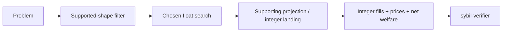

# Solver landscape

> [!summary] In one paragraph
> Solver implementations share one interface and integer trust boundary. The supported matching core is a fast LP; shared MM capital introduces endogenous price×quantity coupling. `ProductionSolver` is a named facade over the monolithic fully corrective [[Pacing Bundle Solver|pacing bundle]], which is the security baseline when one admitted MM constraint connects the whole book. The independent [[Retained Cash Solver|`RetainedCashSolver`]] generalized Frank--Wolfe path remains a certified reference and injectable alternative. [[Exact Component Solver|Exact economic-connectivity routing]] remains an opt-in accelerator and benchmark instrument, not part of the default. [[Direct Price-Pacing Dual Solver|`DirectDualConicSolver`]] is an independent price-side certificate/reference whose continuous fill recovery is not robust enough for production integer landing.

| Solver | Feature | MM-budget approach | Role |
|---|---|---|---|
| `ProductionSolver` | `retained-cash` | Monolithic fully corrective pacing bundle | Production default and security baseline |
| [[Retained Cash Solver|`RetainedCashSolver`]] | `retained-cash` | Generalized Frank--Wolfe on affine-to-log MM utility | Certified reference / alternative |
| [[Pacing Bundle Solver|`PacingBundleSolver`]] | `retained-cash` | Fully corrective primal atoms from the convex pacing dual | Production core |
| [[LP Solver|`LpSolver`]] | `lp` | Solve, linearize budgets at discovered prices, re-solve once by default | Low-latency baseline |
| [[Conic Solver|`ConicSolver`]] | `conic` | Clarabel exponential-cone formulation, then projection LP | Interior-point reference |
| [[Direct Price-Pacing Dual Solver|`DirectDualConicSolver`]] | `conic` | Price/pacing hinge dual; fill quantities from hinge-row multipliers | Certificate and marginal-face research reference |
| [[MILP Solver|`MilpSolver`]] | `milp` | SCIP MIQCQP or McCormick mode with timeout | Exact/reference route when optimal |
| [[Decomposed Solver|`DecomposedSolver<S>`]] | `lp` | Component solves with proportional-response MM budget coordination | Scaling experiment |
| [[Exact Component Solver|`ExactComponentSolver<S>`]] | `retained-cash` | Exact split on groups, spanning/conditional orders, and shared MM budgets | Opt-in accelerator / topology benchmark |

The removed IterLP damped fixed point and forced-step EG implementation did not
have the claimed convergence semantics. Their public types and CLI variants
have been removed; historical protocol v1 remains reproducible at its frozen
source revision. `ConicSolver` in QuasiFisher mode is an independent
exponential-cone formulation of the same objective. Its backend failures remain
failures rather than being replaced by another solver.

Shared machinery includes the HiGHS LP oracle, an optional structure-aware
fixed-pacing price sweep, lexicographic nearest-face allocation projection,
integer rounding, and canonical maximum-entropy price selection from landed
fills. The structural oracle exploits
one-hot single-market orders to recover a primal optimum analytically from
price subgradients; it does not handle budget rows or replace HiGHS landing.
Retained-cash projections preserve the certified target within the primary
supporting face, re-solve price-dependent budget rows, and finalize only at a
budget-consistent fixed point; the LP-SLP baseline still has a capped trimming
path and is measured as such. Every backend discards its floating price choice
at the integer boundary; `matching-engine` selects and `sybil-verifier`
recomputes the same canonical point. MM sells are paced through the paper's sell-to-complementary-buy
reduction, including its exact linear complete-set correction.
`PipelineResult::diagnostics` reports algorithm termination separately from
integer validity: convergence, a configured iteration cap, backend failure,
and projection failure are not interchangeable. `matching-sim` compares
results; `sybil-verifier` decides validity.

The production sequencer enables only `retained-cash`, which contains the named
monolithic pacing-bundle facade, the opt-in exact-component implementation,
RC-FW, and private HiGHS machinery. The `lp` feature adds the public
risk-neutral LP baseline and approximate `DecomposedSolver`; `conic` includes
that research surface because its reference implementation reuses LP
projection utilities. This boundary keeps production coupled to the solver it
invokes without exposing unrelated experimental policies at its call sites.

## Important boundaries

- The payoff-vector domain model is more expressive than current production clearing. Unsupported multi-market/custom shapes are rejected at every boundary.
- Solver libraries may use `f64`; protocol state never trusts those raw values.
- A MILP timeout incumbent is not a proven global optimum.
- Research solvers do not silently return an LP result after numerical failure.
  Explicit delegation exists only where the mathematical objective reduces to
  LP (for example no active log-utility MMs or Conic Linear mode).
- Benchmark rankings belong in the complete preregistered artifacts under
  `benchmarks/solver/results/`, not timeless architecture claims or a selected
  `just compare` run.

## Where this lives

> `crates/matching-solver/src/solver.rs` — shared interface and supported-shape filtering  
> `crates/matching-solver/src/` — implementations  
> `crates/matching-sim/` — comparison harness
> `benchmarks/solver/` — preregistered empirical protocol and retained results

## See also

- [[The LP Core]]
- [[MM Budget Constraint]]
- [[Exact Component Solver]]
- [[Direct Price-Pacing Dual Solver]]
- [[Four-Layer Verification]]
