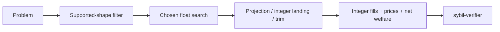

# Solver landscape

> [!summary] In one paragraph
> Seven solver types implement the same search interface. The supported matching core is a fast LP; MM capital introduces price×quantity coupling. [[Retained Cash Solver|`RetainedCashSolver`]] is the production default and directly optimizes the paper's convex retained-cash objective with a certified generalized Frank--Wolfe gap. Every solver lands integers and relies on the same external verifier and welfare definition.

| Solver | Feature | MM-budget approach | Role |
|---|---|---|---|
| [[Retained Cash Solver|`RetainedCashSolver`]] | `lp` | Generalized Frank--Wolfe on affine-to-log MM utility | Production default |
| [[LP Solver|`LpSolver`]] | `lp` | Solve, linearize budgets at discovered prices, re-solve once by default | Low-latency baseline |
| `IterLpSolver` | `lp` | Explicit alias to `RetainedCashSolver` | Compatibility only |
| [[EG Solver|`EgSolver`]] | `lp` | Explicit alias to `RetainedCashSolver` | Compatibility only |
| [[Conic Solver|`ConicSolver`]] | `conic` | Clarabel exponential-cone formulation, then projection LP | Interior-point reference |
| [[MILP Solver|`MilpSolver`]] | `milp` | SCIP MIQCQP or McCormick mode with timeout | Exact/reference route when optimal |
| [[Decomposed Solver|`DecomposedSolver<S>`]] | `lp` | Component solves with proportional-response MM budget coordination | Scaling experiment |

The removed IterLP damped fixed point and the old forced-step EG implementation
did not have the claimed convergence semantics. Their public names now preserve
source compatibility while routing explicitly to `RetainedCashSolver`; their
diagnostics retain the actual `retained-cash-fw` algorithm name. `ConicSolver`
in QuasiFisher mode is an independent exponential-cone formulation of the same
objective. Its backend failures remain failures rather than being replaced by
another solver.

Shared machinery includes the HiGHS LP oracle, price normalization from duals, projection LPs, integer rounding, and MM-overflow trimming. MM sells are paced through the paper's sell-to-complementary-buy reduction, including its exact linear complete-set correction. `PipelineResult::diagnostics` reports algorithm termination separately from integer validity: convergence, a configured iteration cap, backend failure, and projection failure are not interchangeable. `matching-sim` compares results; `sybil-verifier` decides validity.

## Important boundaries

- The payoff-vector domain model is more expressive than current production clearing. Unsupported multi-market/custom shapes are rejected at every boundary.
- Solver libraries may use `f64`; protocol state never trusts those raw values.
- A MILP timeout incumbent is not a proven global optimum.
- Research solvers do not silently return an LP result after numerical failure.
  Explicit delegation exists only where the mathematical objective reduces to
  LP (for example no active log-utility MMs or Conic Linear mode).
- Benchmark rankings belong in the complete preregistered artifacts under
  `benchmarks/solver/results/`, not timeless architecture claims or a selected
  `just compare` run.

## Where this lives

> `crates/matching-solver/src/solver.rs` — shared interface and supported-shape filtering  
> `crates/matching-solver/src/` — implementations  
> `crates/matching-sim/` — comparison harness
> `benchmarks/solver/` — preregistered empirical protocol and retained results

## See also

- [[The LP Core]]
- [[MM Budget Constraint]]
- [[Four-Layer Verification]]
