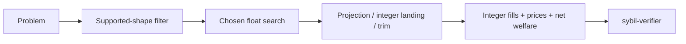

# Solver landscape

> [!summary] In one paragraph
> Six solvers implement the same search interface. The supported matching core is a fast LP; MM capital introduces price×quantity coupling. `LpSolver` is the production default. The others explore tighter-budget fixed points, Fisher/conic objectives, exact SCIP solving, or per-group coordination. Every solver lands integers and relies on the same external verifier and welfare definition.

| Solver | Feature | MM-budget approach | Role |
|---|---|---|---|
| [[LP Solver|`LpSolver`]] | `lp` | Solve, linearize budgets at discovered prices, re-solve once by default | Production default |
| `IterLpSolver` | `lp` | Damped fixed point on EG/KKT multipliers, then projection LP | Tight-budget experiment |
| [[EG Solver|`EgSolver`]] | `lp` | Frank–Wolfe on Eisenberg–Gale utility, then projection LP | Fisher-market reference |
| [[Conic Solver|`ConicSolver`]] | `conic` | Clarabel exponential-cone formulation, then projection LP | Interior-point reference |
| [[MILP Solver|`MilpSolver`]] | `milp` | SCIP MIQCQP or McCormick mode with timeout | Exact/reference route when optimal |
| [[Decomposed Solver|`DecomposedSolver<S>`]] | `lp` | Component solves with proportional-response MM budget coordination | Scaling experiment |

`IterLpSolver` does not directly optimize the logarithmic Fisher objective. It
iterates a damped multiplier fixed point, stops after a configured cap, and has
no general convergence guarantee. `ConicSolver` in QuasiFisher mode is the
single-convex-program implementation corresponding most directly to the
paper's retained-cash formulation; it is not currently the production default.

Shared machinery includes the HiGHS LP oracle, price normalization from duals, projection LPs, integer rounding, and MM-overflow trimming. `PipelineResult::diagnostics` reports algorithm termination separately from integer validity: convergence, a configured iteration cap, backend failure, and projection failure are not interchangeable. `matching-sim` compares results; `sybil-verifier` decides validity.

## Important boundaries

- The payoff-vector domain model is more expressive than current production clearing. Unsupported multi-market/custom shapes are rejected at every boundary.
- Solver libraries may use `f64`; protocol state never trusts those raw values.
- A MILP timeout incumbent is not a proven global optimum.
- Research solvers do not silently return an LP result after numerical failure.
  Explicit delegation exists only where the mathematical objective reduces to
  LP (for example no active log-utility MMs or Conic Linear mode).
- Benchmark rankings belong in the complete preregistered artifacts under
  `benchmarks/solver/results/`, not timeless architecture claims or a selected
  `just compare` run.

## Where this lives

> `crates/matching-solver/src/solver.rs` — shared interface and supported-shape filtering  
> `crates/matching-solver/src/` — implementations  
> `crates/matching-sim/` — comparison harness
> `benchmarks/solver/` — preregistered empirical protocol and retained results

## See also

- [[The LP Core]]
- [[MM Budget Constraint]]
- [[Four-Layer Verification]]
