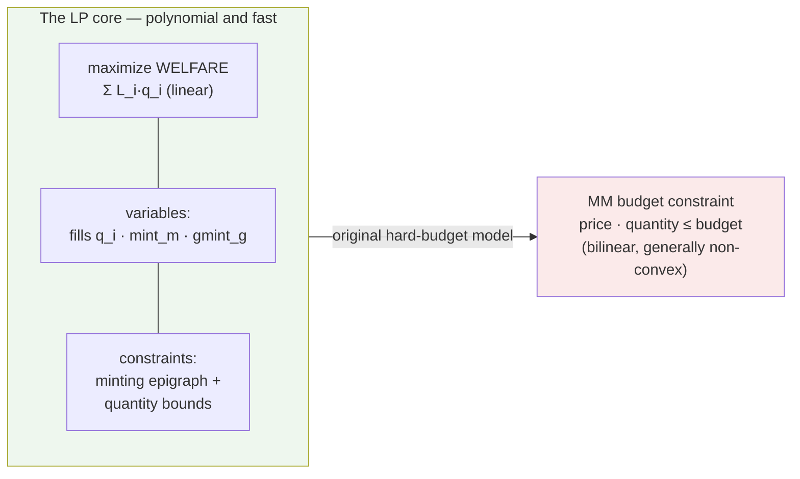

Without market maker budget constraints, the welfare-maximizing matching problem is a plain Linear Program. This is the structural insight that makes Sybil tractable: the core problem is trivially solvable, and all computational difficulty comes from a small number of [[MM Budget Constraint|bilinear side constraints]].

The LP has three kinds of decision variables: fill quantities `q_i` in
fixed-point share-units (bounded by `[0, max_fill]`), signed per-market epigraph
levels `mint_m`, and nonnegative group creation `gmint_g`. The objective is
[[Welfare Maximization|total welfare]]: signed limit-value of fills minus signed
complete-set cost. Each outcome's net demand is constrained *above* by its
minting epigraph. For an independent binary market this implements
`C_0(D) = max(D_yes, D_no)`; equality balance would incorrectly require the two
demands to match before minting and can give the wrong objective.

The original hard-budget model adds the difficult arrow on the right. Sybil's
production model instead absorbs shared capital into retained-cash utility,
which restores a concave program and makes the budget self-enforcing. Entries
in the [[Solver Landscape]] either solve that convex surrogate, approximate the
bilinear model, or act as references.

The problem size scales linearly in orders, markets, and groups. HiGHS (used
by [[LP Solver]]) solves the general core efficiently. Retained-cash research
solvers can alternatively exploit the supported one-hot, one-market order
shape: each independent market becomes a sorted one-dimensional price hinge
curve, while categorical groups merge those curves under one price-simplex
capacity. Complementary-slackness intervals recover a matching primal point.
This structural price sweep is exact only for the zero-RHS matching oracle;
budget rows, supporting-face projection, and integer landing remain general
HiGHS problems. Balance-constraint duals become [[LP Duality and Clearing
Prices|clearing prices]] and minting stationarity produces price coherence;
the verifier still checks the landed integer result.

## Key Properties
- Variables: `q_i` (fills), free signed `mint_m` (per-market creation/burning), nonnegative `gmint_g` (group creation) — all continuous, bounded
- Constraints: per-outcome minting epigraph inequalities + quantity bounds
- O(N + M + G) size — trivially solvable by simplex or interior-point methods
- Clearing prices = [[LP Duality and Clearing Prices|dual variables]] of balance constraints
- The [[MM Budget Constraint]] is the only thing that makes this hard

## Where This Lives
> `crates/matching-solver/src/lp_solver.rs` — LP construction and solving via HiGHS
> `design/problem-statement.md` — formal boxed LP formulation (Section 7)

## See Also
- [[MM Budget Constraint]] — the bilinear coupling that makes the full problem NP-hard
- [[LP Duality and Clearing Prices]] — how prices emerge from the LP dual
- [[Welfare Maximization]] — the linear objective function
- [[Minting]] — minting variables in the LP
