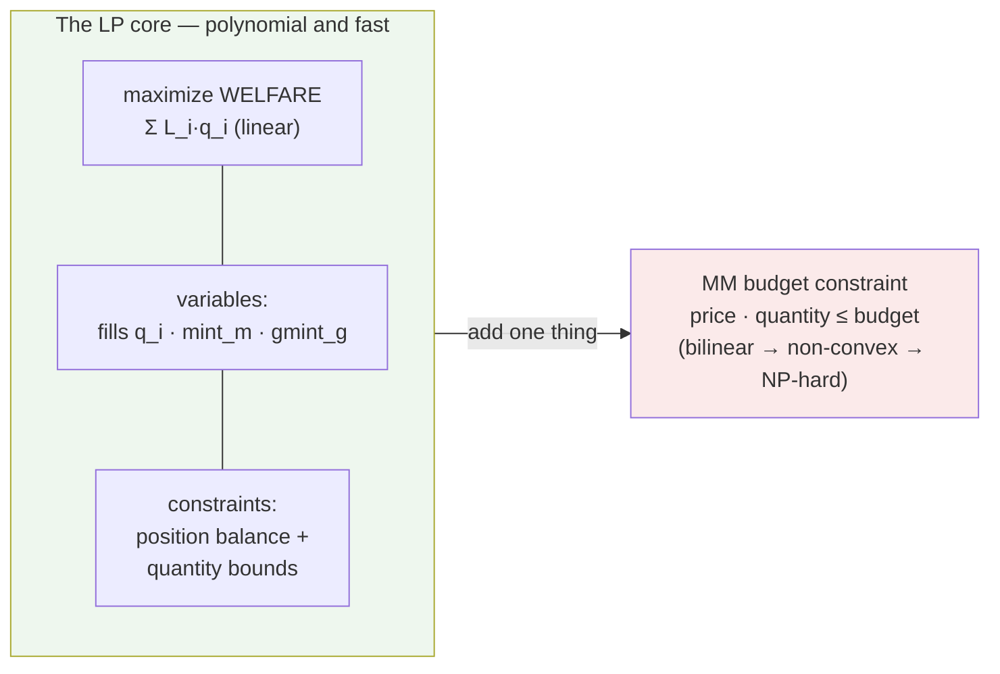

Without market maker budget constraints, the welfare-maximizing matching problem is a plain Linear Program. This is the structural insight that makes Sybil tractable: the core problem is trivially solvable, and all computational difficulty comes from a small number of [[MM Budget Constraint|bilinear side constraints]].

The LP has three kinds of decision variables: fill quantities `q_i` in fixed-point share-units (how much of each order to fill, bounded by `[0, max_fill]`), signed per-market minting `mint_m`, and nonnegative group creation `gmint_g`. The objective is [[Welfare Maximization|total welfare]]: signed limit-value of fills minus signed complete-set cost. The constraints are equality balance for each market and outcome plus quantity and variable bounds. That's it — a textbook LP.

The whole difficulty gradient lives in that one arrow: everything on the left is a textbook LP, and the single [[MM Budget Constraint|bilinear budget constraint]] on the right is what turns the problem NP-hard. Every entry in the [[Solver Landscape]] is a different strategy for coping with that one arrow.

The problem size scales linearly in orders, markets, and groups. HiGHS (used by [[LP Solver]]) solves the core efficiently. Balance-constraint duals become [[LP Duality and Clearing Prices|clearing prices]] and minting stationarity produces price coherence; the verifier still checks the landed integer result.

## Key Properties
- Variables: `q_i` (fills), free signed `mint_m` (per-market creation/burning), nonnegative `gmint_g` (group creation) — all continuous, bounded
- Constraints: position balance per market per outcome + quantity bounds
- O(N + M + G) size — trivially solvable by simplex or interior-point methods
- Clearing prices = [[LP Duality and Clearing Prices|dual variables]] of balance constraints
- The [[MM Budget Constraint]] is the only thing that makes this hard

## Where This Lives
> `crates/matching-solver/src/lp_solver.rs` — LP construction and solving via HiGHS
> `design/problem-statement.md` — formal boxed LP formulation (Section 7)

## See Also
- [[MM Budget Constraint]] — the bilinear coupling that makes the full problem NP-hard
- [[LP Duality and Clearing Prices]] — how prices emerge from the LP dual
- [[Welfare Maximization]] — the linear objective function
- [[Minting]] — minting variables in the LP
