# Block lifecycle

> [!summary] In one paragraph
> On each configurable interval, the sequencer clones its state, applies queued system/key/bridge events, revalidates the resting book, atomically admits deferred supported submissions, solves and settles the batch, builds a block and witness, and persists the candidate. Only after qMDB/root checks and the redb fence commit does it replace live state and publish.

```mermaid
flowchart LR
    EVENTS["1. System · key · bridge events"] --> BOOK["2. Expire/revalidate book"]
    BOOK --> ADMIT["3. Admit deferred supported submissions"]
    ADMIT --> PROBLEM["4. Build supported Problem"]
    PROBLEM --> SOLVE["5. Solve + integer landing"]
    SOLVE --> SETTLE["6. Settle + update book"]
    SETTLE --> SEAL["7. Roots · block · witness v10"]
    SEAL --> PERSIST["8. Persist + fence"]
    PERSIST --> COMMIT["9. Swap live state + publish"]
```

Simple non-MM orders are normally already reserved in the resting book. MM-constrained and supported multi-order submissions drain from the durable deferred queue. Unsupported order shapes never enter the solver. MM quotes are one-shot; eligible non-MM remainders rest according to time-in-force and TTL.

Settlement applies shared integer primitives, derives MINT adjustments, updates committed last clearing prices, processes deposit/quarantine and withdrawal lifecycle effects, and preserves unresolved market-group structure. Witness assembly captures account state, key operations/universe, bridge/deposit dispositions, pre/post sidecars, fills, prices, constraints, and canonical events.

Two artifacts leave the kernel:

- `SealedBlock`: canonical block plus explicitly non-validity derived views for REST/WebSocket.
- `BlockWitness` v10: transition-complete private material for native verification, proving, DA, and recovery, including ordinary order/cancel authorization and trading nonces.

After the fence and live-state swap, `SealedBlock` publication updates the
shared read-only recent-block ring before broadcasting the live event. Replay
and REST block serving read that ring without entering the single-writer actor;
the persistent canonical archive remains the fallback beyond the ring.

## Invariants

1. The actor serializes exchange mutation; the synchronous kernel remains deterministic.
2. `prepare_block` mutates a clone, so a persistence failure cannot leak candidate state.
3. Durable acknowledgement/WAL rules preserve every successful between-block command.
4. qMDB roots match the header before the redb fence commits the slot.
5. Publication happens after commit.
6. Derived analytics never determine roots or witness validity.

## Integrity halt

A hard invariant or full-verifier failure discards the prepared transition and
puts the actor into fail-stop mode. The mailbox boundary then rejects every
canonical mutation before validation, replay-nonce advancement, WAL append, or
live-state mutation. This includes ordinary/IOC/signed orders, cancellation,
identity and account commands, market/oracle commands, and bridge inputs.

Read queries remain available for incident diagnosis. `GET /v1/health` returns
`503` with `status = "integrity_halted"` while retaining the last committed
height and genesis hash, and mutation endpoints return the stable
`SEQUENCER_INTEGRITY_HALTED` code. Pausing remains available as an incident
control; resume cannot override the stronger halt. Recovery is an operator
restart from the last committed fence after the underlying solver/state fault
is understood.

## Where this lives

> `crates/matching-sequencer/src/sequencer.rs` — prepare/produce/commit kernel  
> `crates/matching-sequencer/src/actor.rs` — timer, persistence ordering, and publication

## See also

- [[Order Admission]]
- [[Pending Orders and TTL]]
- [[Settlement]]
- [[Persistence]]
- [[Block Witness]]
- [[Block Data Boundaries]]
- [[Crate Dependency Map]]
