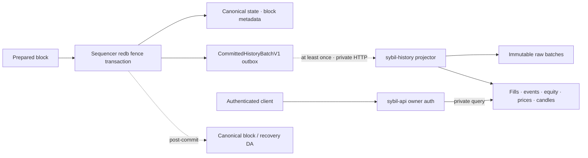

# Historical data serving

> [!summary] In one paragraph
> Live exchange state, canonical recovery data, and product history are three
> different products. A fenced sequencer commit appends one immutable private
> history batch to a transactional outbox. `sybil-history` consumes those
> batches at least once, atomically advances a contiguous checkpoint, and owns
> historical indexes, candles, pagination, and query load. History never feeds
> matching, settlement, roots, proofs, or escape reconstruction.

## Data path

The outbox row is committed or rolled back with the canonical fence, so a
failed candidate block cannot leak derived facts. Delivery is outside both the
sequencer actor and the commit path. The publisher deletes a row only after the
history checkpoint covers its height. A service outage therefore makes history
lag and grows the durable backlog; it does not stop trading or block production.

The sequencer does not also maintain durable or in-memory query history for
fills, events, equity, prices, or candles. It keeps only current aggregates and
the uncommitted fact buffers copied into the next fenced outbox row. Those
former projections and cache fallbacks were removed after this boundary landed;
keeping them would restore duplicate ownership and ambiguous retention policy.

`CommittedHistoryBatchV1` is genesis-bound and contains the block/state hashes,
commit timestamp, account-attributed fill/event/equity facts, public committed
price facts, and a canonical payload hash. It contains stable domain facts, not
sequencer redb keys. The batch is private because account attribution is not on
the public tape described by [[Block Data Boundaries]]. It is derived product
data, not [[Data Availability|recovery DA]].

## Projector rules

`sybil-history` has one write actor. Applying a batch stores the raw batch,
updates every projection and configured candle resolution, and advances the
checkpoint in one redb transaction. Exact redelivery is a verified no-op.
Unsupported schema versions, invalid fact order/heights, gaps, genesis changes,
parent mismatches, and same-height/different-payload replays fail closed.

Queries bypass the write actor and run as blocking reads in the history process.
This is the critical isolation property: arbitrarily busy historical clients
cannot fill the sequencer mailbox or execute range scans in the sequencer
database. Cursor and account/time indexes bound pages and support opening
equity anchors and windowed leaderboard baselines without scanning from
genesis. A semaphore remains owned by the blocking worker, so timed-out clients
cannot leave unbounded orphaned scans. Candle resolutions are part of the
persisted projection configuration and a changed set fails startup rather than
claiming false completeness.

## Ownership

| Concern | Owner |
|---|---|
| Current balances, positions, orders, counters | sequencer/qMDB + fenced redb |
| One committed batch and unacknowledged delivery backlog | sequencer redb outbox |
| Raw product-history facts and query projections | `sybil-history` |
| Browser/session/passkey and account ownership checks | `sybil-api` |
| Exact blocks, witnesses, proof material, reconstruction/escape data | canonical block/DA pipeline |

The API uses a dedicated `SYBIL_HISTORY_TOKEN`; it does not reuse the operator
service token. Internal ingestion/query routes are not browser routes. Public
account-history handlers authenticate the owner before sending an
account-scoped internal query. Active read-key ownership is snapshotted into
the API at startup and maintained after key create/revoke acknowledgements, so
this authorization check is O(1) and does not enqueue a sequencer RPC.

## Read contracts

- Fills and events are stable cursor pages with existing account-ownership
  authorization.
- Equity includes the last sample before a requested boundary as an opening
  anchor and bounds/downsamples large responses explicitly.
- Leaderboard bases are refreshed into an API read model once per committed
  block. Windowed rankings combine that model with history-service opening
  anchors; all-time rankings need no historical scan and neither path performs
  per-request sequencer work. A windowed request with no publishable bases is
  also immediately and legitimately empty; it does not require history.
- Price points and sparse OHLCV candles page by stable height/time cursors.
- Responses expose `indexed_through_height` and
  `history_complete_from_height`. The private `ProjectionStatus` also pairs
  the contiguous checkpoint height with its commit timestamp. A windowed
  leaderboard is complete only when the projector began at genesis or no
  later than the opening cutoff **and** that checkpoint timestamp has reached
  the cutoff. Only after both global facts hold may a missing per-account
  baseline mean that the account was created after the cutoff. An
  unavailable/unconfigured backend is a typed `HISTORY_UNAVAILABLE` response;
  either an insufficient floor or a lagging checkpoint returns
  `HISTORY_INCOMPLETE`. Neither condition is represented as an empty successful
  history or silently substituted with all-time PnL.

The first indexed batch may be above height one when a new projector is
bootstrapped from an existing sequencer. That floor is disclosed as incomplete
history. A new genesis is a distinct history domain and invalidates old cursors.

## Retention and storage evolution

The initial service deliberately uses a separate redb file and retains raw
batches and projections without the sequencer's former 30/31-day and global-row
caps. This is appropriate for the current devnet, not a claim that one local
redb file is the permanent archive.

Before network-lifetime preservation is promised, raw committed batches need an
immutable off-host archive plus restore/reprojection drills. The stable batch
contract permits a later PostgreSQL serving projection, object storage archive,
coarser equity rollups, or analytical store without changing the sequencer.
Policy for deletion/export of private account history remains a product/legal
decision.

Canonical block/DA retention is separate. Deleting product history does not
invalidate a root; retaining product history does not make positions
reconstructable or supply an escape witness.

## Operations and failure behavior

- Monitor exact outbox rows/logical payload bytes, oldest/newest height, oldest
  age, delivery failures/duration, root-filesystem capacity, history checkpoint,
  and lag to the sequencer head. Payload bytes are transactionally maintained
  and deliberately exclude redb page/fragmentation overhead.
- Back up the history volume independently from canonical sequencer state.
- A prolonged service outage can exhaust sequencer disk through the unbounded
  outbox. Devnet alerts and discloses; a production halt/drop policy requires a
  separate explicit decision in
  [GitHub #90](https://github.com/MetaB0y/sybil/issues/90). Silent dropping is
  forbidden.
- The current Compose topology puts both processes on one host. It isolates
  CPU/mailbox/database work, not host failure or disk contention.
- Outbox catch-up delivers and acknowledges bounded prefixes; one local redb
  commit removes the whole delivered prefix to limit contention with future
  block fences.
- `sybil-history-load` drives authenticated historical reads through the public
  API while measuring sequencer health against both a pre-load baseline and an
  absolute p95 ceiling. Run it off-host before capacity claims; see the
  [historical-read isolation runbook](../../runbooks/history-read-load.md).

## Invariants and checks

1. History rows never affect state roots, matching, settlement, or verification.
2. No history network call occurs in the fenced commit or sequencer actor.
3. Outbox acknowledgement follows verified durable application.
4. Apply is contiguous, genesis-bound, idempotent, and atomic.
5. Historical list/range APIs bound allocation and expose lag/completeness.
6. Load tests saturate authenticated history reads while checking live
   health/admission/block latency independently.

## Implementation map

| Concern | Location |
|---|---|
| Shared batch/query contract | `crates/sybil-history-types` |
| Atomic outbox append/ack | `matching-sequencer/src/store/commit.rs`, `history_outbox.rs` |
| Delivery and private client | `sybil-api/src/history.rs` |
| Projector/store/private HTTP | `crates/sybil-history` |
| Public history handlers | `sybil-api/src/routes/accounts.rs`, `markets.rs`, `leaderboard.rs` |
| Black-box isolation load test | `crates/sybil-loadtest`, `just history-load` |

## See also

- [[Persistence]]
- [[Block Data Boundaries]]
- [[REST API]]
- [[Data Availability]]
- [ADR-0018](../../adr/0018-extract-private-history-service.md)
