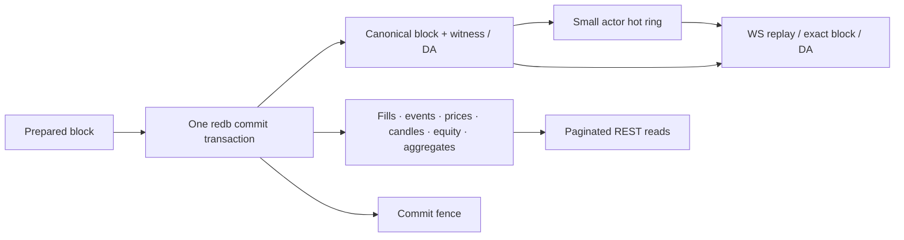

# Historical data serving

> [!summary] In one paragraph
> Live state, recovery state, and query history are different products. The
> actor keeps small hot caches; redb stores committed blocks, DA, prices,
> candles, account/fill/equity history, and aggregate read models. Historical
> rows are written only with a committed block and never feed validity. Reads
> are bounded and expose retention gaps explicitly—but several append tables
> still need production byte/age budgets.

## Data path

History is visible only after the same transaction that commits the block and
fence succeeds. Failed candidate blocks do not leak derived rows. Pruning is a
separate bounded transaction and may lag; APIs advertise only committed
retention floors.

## Stored families

| Family | Role | Validity status |
|---|---|---|
| Full sealed blocks | Exact-height reads and WebSocket replay | Canonical block data |
| Canonical witnesses / DA artifacts | Audit, proving, recovery | Commitment-bound private payload |
| Fill and account events | Portfolio/activity history | Derived index |
| Raw committed prices | Short-range charts/backtests | Derived from sealed blocks |
| OHLCV candles | Long-window charts | Derived rollup |
| Equity and aggregate trackers | Product analytics | Derived read model |
| Arena decision SQLite | Bot reasoning/cost/equity | Separate non-exchange database |

Derived rows can be rebuilt from retained canonical blocks where sufficient
inputs remain, but the implementation does not currently promise a universal
rebuild command for every table.

## Read contracts

- `GET /v1/blocks/{height}` checks the hot ring then durable full blocks.
- `GET /v1/blocks?before_height=&limit=` pages newest-first with bounded limits.
- WebSocket `from_block` replays durable blocks and emits a typed
  `retention_gap` when the requested height is no longer retained.
- Raw market prices page by time/height and return `retention_min_height`.
- Candles return committed sparse buckets; empty buckets are omitted.
- Account fills use opaque stable cursors; account events/equity are bounded
  query surfaces over durable tables.

SSE remains a live convenience stream without replay guarantees. A missing row
inside retention, a height below retention, and an in-memory deployment with no
durable history are distinct API outcomes; see [[REST API]].

## Retention

Block/DA, raw-price, and candle retention are configured independently. `0`
currently means unbounded retention for the corresponding family. Pruning must:

1. delete only rows older than the committed policy floor;
2. update metadata in the same transaction;
3. preserve rows required by the live head/fence and recovery invariants;
4. make API gap semantics agree with the committed floor.

Account events, fills, and equity are append tables without complete production
byte/age budgets today. Combined with permissionless churn, this is an open
availability issue documented in the [resource audit](https://github.com/MetaB0y/sybil/blob/main/design/dos-audit-2026-07-11.md).

Retention is not DA availability. Deleting the only canonical payload can make
an accepted validium root unrecoverable even if product history remains.

## When to split a history service

Keep history inside the sequencer process while commit coupling and query load
remain manageable. Split only when measurements show read/retention work
competing with block production. A split service must consume a committed,
replayable boundary; it must not invent a second source of exchange truth.

## Invariants and checks

- No history/analytics row changes state roots, matching, or settlement.
- All list/range APIs have bounded allocation and stable pagination.
- Restart tests cover cold reads beyond hot-cache eviction.
- Retention tests cover exact floors, typed gaps, and restart persistence.
- Candle/price tests use sealed marks only; no private open-batch data leaks.
- `frontend/DATA_MAP.md` changes with any page-visible endpoint or provenance.

## Implementation map

| Concern | Owner |
|---|---|
| Commit and history tables | `matching-sequencer/src/store/` |
| Retention job/metadata | `store/retention.rs` |
| Fill/event/equity/aggregate deltas | sequencer analytics/aggregate modules |
| REST pagination/gap mapping | `sybil-api/src/routes/` |
| Realtime replay/gaps | API WebSocket plus sequencer block queries |

## See also

- [[Persistence]]
- [[Block Data Boundaries]]
- [[WebSocket Block Stream]]
- [[Fill History Persistence]]
- [[Data Availability]]
