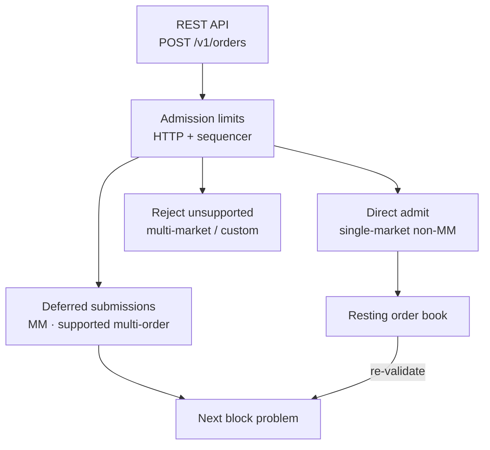

# Order admission

> [!summary] In one paragraph
> Admission has two durable paths for supported single-market orders. Simple non-MM orders are validated, capital-reserved, and inserted into the resting book immediately. MM-constrained or multi-order submissions are deferred to the next block so they can be validated atomically. Unsupported multi-market/custom payoff shapes are rejected, not deferred. Layered limits protect the actor before work becomes mailbox pressure.

Simple single-market, non-MM orders are admitted directly into the [[Pending Orders and TTL|resting order book]] at submission time, after validation and capital reservation. That makes them visible immediately and eligible for the next [[Block Lifecycle|block]] without waiting in an unvalidated queue.

Supported submissions that cannot be safely admitted one order at a time still
use the deferred path: MM-constrained orders and multi-order bundles of
supported single-market orders. They are durably appended as `DeferredBundle`
rows in the global acknowledged-write WAL and drained into the next block. This
preserves flash-liquidity, atomicity, group self-trade-prevention semantics, and
exact ordering against nonce/key/bridge actions. Multi-market/custom payoff
execution is rejected at API, admission, solver, and verifier boundaries.

Admission has lightweight backpressure before either path mutates state:

- HTTP order-write endpoints have a global and per-client token bucket before JSON parsing and P256 signature work.
- The sequencer actor has a global token bucket, bounding coordinated many-account submission floods.
- Each account has its own token bucket, bounding runaway agents without affecting normal users.
- Non-MM orders are capped per account across resting orders plus staged non-MM bundles.
- Every non-MM order that may become durable resting state must have positive
  price and quantity and meet the configured minimum notional. The default is
  1,000,000 nanodollars ($0.001), exactly one minimum quantity unit at a $1
  limit. One-shot MM quotes do not create resting state and retain the existing
  shape rules.
- Deferred bundles have both total and per-account caps.
- A per-submission order-count cap prevents request amplification.
- [[Actor Mailbox Monitoring]] exposes sequencer mailbox pressure after those admission checks, so coordinated floods that still enqueue faster than the actor drains become visible before latency or memory are the first symptoms.

## Key Properties
- Simple single-market non-MM orders are validated, reserved, and visible immediately
- Deferred buffer is for MM-constrained and supported multi-order submissions
- Unsupported multi-market/custom shapes are rejected before value execution
- Deferred submissions are persisted before the API returns success
- An integrity-halted actor rejects all order and cancel forms at the mailbox
  boundary, before rate/signature work, nonce advancement, reservation, or WAL
  append
- MM quotes are one-shot — never carried over to the next batch
- Admission backpressure is generous by default and only affects abnormal load
- Durable resting-order growth is backed by positive order notional
- Orders arrive from [[REST API]] endpoints `POST /v1/orders` and `POST /v1/orders/signed`

## Where This Lives
> `crates/matching-sequencer/src/actor.rs` — admission limits and deferred-buffer routing
> `crates/matching-sequencer/src/sequencer.rs` — direct admit vs deferred submission decision
> `crates/matching-sequencer/src/store/wal.rs` — global `DirectAdmit` / `DeferredBundle` durability

## See Also
- [[Block Lifecycle]] — deferred submissions are merged at block production
- [[Actor Mailbox Monitoring]] — queue-depth metrics and alerts for actor backpressure
- [[Pending Orders and TTL]] — unfilled orders that stay in the resting book
- [[REST API]] — how orders enter the sequencer
