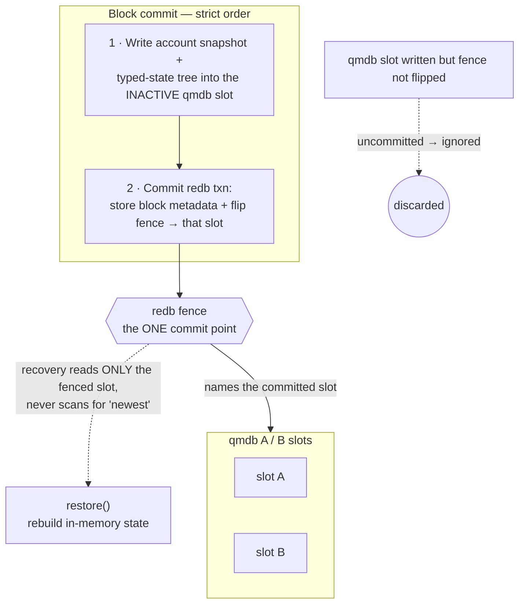

# Persistence

Sybil persists exchange state to survive crashes without losing accounts, markets, or positions.

**The idea in plain words:** two databases, but only *one* of them decides what is real. `qmdb` holds the big authenticated state; `redb` holds a single **commit fence** that names which `qmdb` snapshot is committed. Everything hinges on flipping that fence last — a crash before the flip leaves the old state authoritative, a crash after leaves the new one. No cross-database transaction, no journal, no ambiguity about "latest."

## Philosophy

**Block-boundary snapshots, not event sourcing.** Each block is the transactional unit. After a block is prepared and accepted for commit, we persist the committed state and resume from that point on restart. Anything in-flight at crash time (mempool contents, current solve, transient actor state) is discarded and rebuilt by normal client behavior.

This follows [[Block Lifecycle]]: the block is the natural checkpoint. We do not replay a long event log at startup and we do not attempt to preserve partial progress inside a block.

## Storage Split: redb + qmdb

Sybil currently uses two storage engines with distinct authority boundaries:

- **qmdb** stores fenced account snapshots and fenced typed-state trees.
- **redb** stores block metadata, market data, counters, and the authoritative commit fence that says which qmdb snapshot is committed.

This is intentionally not "one transaction across two databases". There is no journal and no cross-db transaction. Instead, redb is the only commit point:

1. Write the next account snapshot and typed state tree into the inactive qmdb
   slot.
2. Commit the redb transaction that stores the new block metadata and flips the authoritative fence to that slot.
3. Recover strictly from the fence recorded in redb.

Anything written to qmdb without a corresponding redb fence flip is treated as uncommitted and ignored.

### Why This Split Makes Sense Today

- **qmdb fit**: accounts are the large authenticated keyspace and the part most likely to evolve toward proof-oriented storage.
- **redb fit**: metadata, counters, block headers, and fence coordination remain simple inside one ACID write transaction.
- **Simple crash model**: one authoritative fence, one authoritative slot, no ambiguity about "latest".
- **Honest semantics**: we do not pretend to have cross-db atomicity that the system does not actually provide.

**Serialization**: structured values are stored with `rmp-serde` MessagePack. That keeps values self-describing and tolerant of additive schema changes via `#[serde(default)]`.

### Commitment Direction

This split is the current runtime persistence model. [[State Root Schema]]
commits typed leaves for accounts, bridge state, markets, market groups,
active resting orders, and aggregate reservations through native qMDB.
Runtime persistence mirrors that shape with a dedicated typed-state qMDB per
fenced slot. The root of the committed typed-state slot is exactly the block
header `state_root`, so inclusion and exclusion proofs verify directly against
the header commitment.

The account qMDB remains a recovery snapshot store. It stores MessagePack
account rows plus slot-local metadata; it does not define the public state
root. redb remains the authority for which account/state slot is committed.

## Tier 1: Core State

Authoritative state needed to resume the exchange after a crash:

| Engine | Namespace / Table | Role |
|--------|--------------------|------|
| `qmdb` | slot-prefixed account snapshot keys | `Account` rows plus slot-local `height` and `next_account_id` |
| `qmdb` | unprefixed typed-state keys in fenced A/B qMDBs | canonical account, bridge, market, market-group, order, and reservation leaves committed by `state_root` |
| `redb` | `markets` | market definitions |
| `redb` | `market_meta` | market metadata |
| `redb` | `market_statuses` | market status driven by oracle/system logic |
| `redb` | `market_groups` | market groups |
| `redb` | `resolution_templates` | installed resolution templates referenced by market metadata |
| `redb` | `block_headers` | canonical block header by height |
| `redb` | `pubkey_registry` | compressed pubkey to account id |
| `redb` | `clearing_prices` | last clearing price vector per market |
| `redb` | `market_volumes` | cumulative traded volume per market |
| `redb` | `counters` | next IDs, store layout version, and the authoritative account-state fence |

The account snapshot and typed-state tree both use logical qmdb slots `A` and
`B`. Only one slot is committed at a time; redb records which one.

## Tier 2: Order State

Persisted today:

- **Order book**: resting orders and their reservations in `resting_orders`
- **Deferred submissions**: MM / bundle / multi-market submissions in `pending_bundles`
- **Admit log**: direct-admitted single-market orders accepted after the last committed block in `admit_log`

Still not persisted:

- **MM runtime state**: inventory, short-term price history, and variance estimation state

The order state tables protect the API's 200 OK contract: anything acknowledged before a crash is either already in the committed order-book snapshot or replayed from an incremental log.

On restore, the sequencer rebuilds the resting book from the committed
snapshot plus the admit log before it drains deferred pending bundles. It must
advance `next_order_id` past every replayed resting-order id before assigning
fresh ids to pending-bundle orders. Otherwise a restart with both `admit_log`
and `pending_bundles` can reuse an order id in the first replay block and trip
the verifier's duplicate-order check.

Deferred pending bundles are not trusted as already validated after restore.
They are drained through normal block-time validation against the restored
resting-book reservations. If replayed state makes a bundle stale or
over-reserved, its orders become block rejections instead of accepted witness
orders.

## Acknowledged Control-Plane Mutations

The same 200 OK contract must apply to control-plane mutations, not only orders. Account creation, funding, pubkey registration, market creation, metadata updates, cancellation, and resolution are all user-visible state transitions. If one is acknowledged after the last committed block and the process restarts before the next block snapshot, it needs an incremental durability path.

This is implemented with a small redb write-ahead table for acknowledged control-plane commands:

1. Serialize the validated command with a monotonic sequence number.
2. Commit the command before mutating in-memory sequencer state or before returning success.
3. Replay unapplied commands after loading the last committed block snapshot.
4. Clear commands atomically when `save_block()` commits a block that includes their effects.

This mirrors `admit_log` and `pending_bundles`: the block snapshot stays the primary checkpoint, while the log protects acknowledged writes between checkpoints. Commands must be deterministic under replay. Market and feed IDs are reallocated from the committed `next_*` counters in the same WAL order; timestamp-bearing commands carry the acknowledged timestamp so sidecar history does not depend on restart time.

For public account onboarding, account allocation and its initial signing key
are one `CreateAccountWithInitialKey` control-plane command; bare service-tier
account creation and the deprecated service-tier first-key bootstrap remain
backward-compatible commands. Account creation and dev-mode funding stage
history facts at the same time as the pending system event. They become
historical only when the next block commits them into
`CommittedHistoryBatchV1`; current account state remains visible immediately
through live endpoints. This keeps remote history strictly committed and
prevents dual-source pagination.

Implemented today:

- Account creation
- Account funding
- Pubkey registration
- Market creation and metadata updates
- Market-group creation
- Market resolution / attested resolution
- Signed order cancellation
- Oracle feed registration
- Resolution template installation

Bridge deposits and withdrawals use dedicated WAL tables because they are
bridge-sidecar inputs rather than generic control-plane commands. Recovery
replays the admitted resting-order log into the order book, then replays the
control-plane WAL, then replays bridge deposit/withdrawal WALs. That order is an
invariant: bridge withdrawals validate against account balances and resting-book
reservations, so an acknowledged cancellation or funding command must be visible
before pending bridge withdrawals are replayed.

The separate WAL tables preserve state correctness but do not preserve exact
cross-subsystem system-event ordering. If event interleaving becomes
validity-sensitive, migrate these acknowledged-write paths into one globally
sequenced WAL rather than adding more pairwise replay rules.

Resolution templates are also persisted in the committed snapshot. A WAL alone
would protect template installation only until the next block; once
`save_block()` clears the control-plane log, templates must be snapshot state
like feeds and market metadata.

## Tier 3: Derived Views

The sequencer persists only the export boundary for product history:

- **History outbox**: one immutable `CommittedHistoryBatchV1` row per fenced
  block commit. It carries fill, account-event, equity, and committed-price
  facts plus genesis/block/state identity. A background publisher acknowledges
  and deletes rows only after the private history projector has durably applied
  their height.
- **History event sequence counter**: the next event id remains canonical
  sequencer metadata so restart never derives identity by scanning a query
  projection.

`sybil-history` persists immutable raw batches and its fill/event/equity,
price, candle, and timestamp/account projections in a separate redb. Those
tables are not part of sequencer recovery and are not validity inputs. See
[[Historical Data Serving]] and [[Fill History Persistence]].

Other sequencer-owned durable serving rows are:

- **Full block replay payloads**: `SealedBlock` rows in `blocks_full`, keyed by
  height, used as the exact-height fallback for `GET /v1/blocks/{height}` when
  the hot block ring has evicted the block or after restart.
- **DA serving artifacts**: canonical witness payloads in `da_artifacts` plus
  small publish-time metadata in `da_manifests`, keyed by height. The paired
  rows are written atomically after block commit and pruned together with the
  `blocks_full` retention floor. They are availability artifacts, not part of
  the redb commit fence.

Recent in-memory fill/price/event/equity caches may still support live
analytics computations, but no public historical endpoint depends on them and
startup does not hydrate them from legacy history tables. Aggregate tracker
snapshots needed for current product values (for example all-time fill counts
and cost basis) remain sequencer snapshots rather than historical scans.

Canonical full-block and DA retention remains a bounded post-commit maintenance
job. Product-history retention, backups, projections, and later archive/rollup
policy belong entirely to `sybil-history`. The two policies must not be
conflated: product history is not enough to reconstruct private state, and DA
is not an account-query store.

## Recovery Order

Startup recovery is intentionally fence-driven:

1. Open redb and validate `store_layout_version`.
2. Read the canonical block height and canonical account-state fence from redb.
3. Read only the fenced qmdb slot.
4. Reject the store as corrupt if the fenced qmdb slot's `height` or `next_account_id` does not match redb.
5. Restore the in-memory sequencer state from those committed structures.

Recovery never scans qmdb looking for "the newest" snapshot. The fence is the authority.

## Invariants

The current model relies on explicit invariants:

- `store_layout_version` must exist and match the binary's expected layout.
- If `height` exists, then `account_state_height` and `account_state_slot` must also exist.
- `height == account_state_height`.
- The account qmdb slot named by `account_state_slot` must contain matching
  `height` and `next_account_id`.
- The typed-state qmdb slot named by `account_state_slot` must contain leaf
  bytes equal to `sybil_verifier::commitments::state_schema::state_root_leaves`
  for the same account and sidecar snapshot.
- The typed-state qmdb slot root must equal the committed block header
  `state_root`.
- Recovery trusts redb's fence, not qmdb recency.

When any of these fail, startup should reject the store as unsupported or corrupt rather than guessing.

## Crash Cases

- **Crash before qmdb finishes writing the inactive slot**: redb fence is unchanged, so recovery uses the previous committed slot.
- **Crash after qmdb finishes but before redb commits**: the new qmdb snapshot exists but is ignored as uncommitted.
- **Crash after redb commits**: the new slot is authoritative and recovery uses it.

This is the whole reason the commit fence lives in redb.

## Preserved vs Lost

**Preserved on crash:**

- All account balances and positions
- All markets, groups, metadata, and statuses
- Installed resolution templates and data feeds
- Block headers
- Pubkey registry
- Counter state and next IDs
- Resting orders and reservations
- Direct-admit recovery log and deferred submissions admitted after the last committed block
- Control-plane recovery log for acknowledged account, market, resolution, cancellation, feed, and template mutations admitted after the last committed block
- Fill history
- Account event history, including pending acknowledged account creation and funding replayed before the next block

**Lost on crash:**

- In-memory price-history cache contents. Store-backed raw price rows already
  committed before the crash are preserved.
- SSE ring buffer contents
- Transient external feed state such as recently pushed reference prices

## Restart Stress Testing

Persistence needs failure-injection tests at acknowledgement boundaries, not only clean `save_block()` round trips:

- Acknowledge account creation, restart before the next block, and verify the account exists.
- Acknowledge funding, restart before the next block, and verify balance and deposit history.
- Acknowledge pubkey registration, restart before the next block, and verify signed orders can use it.
- Acknowledge market creation and metadata, restart before the next block, and verify both survive.
- Acknowledge cancellation, restart before the next block, and verify reservations are released exactly once.
- Acknowledge feed/template installation, restart before the next block, and verify attested resolution can still resolve through that template.
- Acknowledge market resolution, restart before the next block, and verify balances, status, group membership, and the next block's system event are consistent.
- Crash after qMDB slot write but before redb fence commit and verify recovery uses the previous fence.
- Crash after redb fence commit and verify recovery uses the new fence.
- Restart repeatedly while direct-admit orders and deferred bundles are queued and verify no accepted order disappears or double-reserves funds.

The broader fixture ladder and restart-harness conventions live in [[Testing Strategy]].

## How to Add New Persisted State

1. Decide which store is authoritative for the new state.
2. If it is metadata, counters, or coordination state, prefer redb.
3. If it is large authenticated per-key state, consider qmdb.
4. Add serialization in `save_block()` and deserialization in `load_state()`.
5. If the new state participates in crash recovery, document its invariants explicitly.
6. Wire it into `BlockSequencer::restore()` if needed.

Do not add state to both stores unless there is a clear authority boundary and recovery rule.

## Files

| File | Role |
|------|------|
| `crates/matching-sequencer/src/store.rs` | redb metadata store, layout checks, authoritative commit fence |
| `crates/matching-sequencer/src/account_storage.rs` | account snapshot boundary and fenced recovery contract |
| `crates/matching-sequencer/src/qmdb_accounts.rs` | qmdb-backed account snapshot implementation |
| `crates/sybil-api/src/main.rs` | opens store and restores or bootstraps state |
| `crates/sybil-api/src/config.rs` | `--data-dir` / `SYBIL_DATA_DIR` config |

## Related Notes

- [[Acknowledged-Write WAL Replay]] — table inventory, replay dependencies, and fixed ordering
- [[Block Lifecycle]] — the transactional unit we persist at
- [[Settlement]] — what mutates committed state
- [[State Root and Parent Hash]] — integrity verification of committed state
