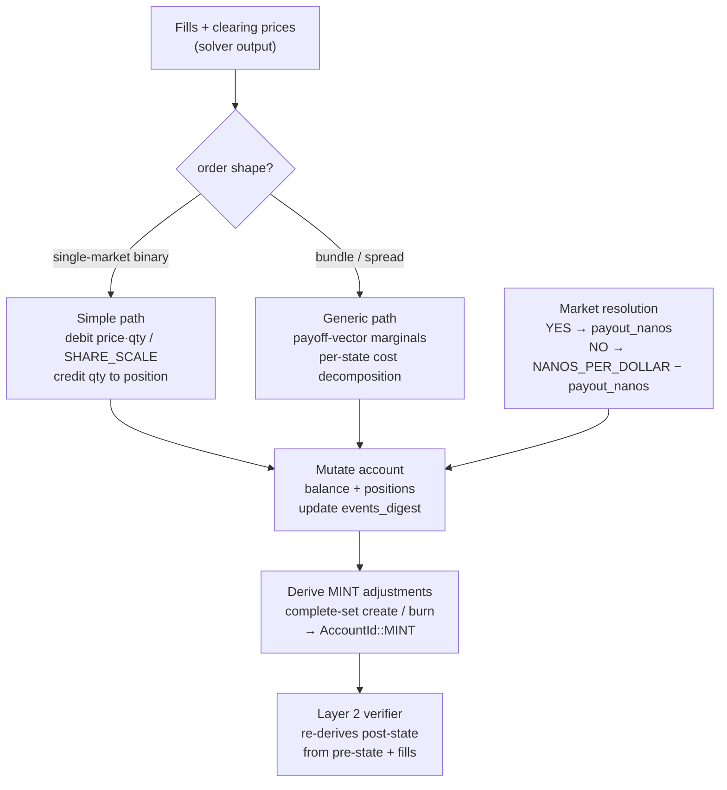

Settlement is the step in the [[Block Lifecycle]] where fills become real: balances are debited, positions are credited, and account state is updated. It runs after the solver returns fills and clearing prices but before the block is sealed. The system uses i128/u128 intermediates for all arithmetic to prevent overflow — a price times fixed-point quantity units can exceed u64 range, and settlement involves both debits (negative) and credits (positive).

There are two settlement paths. The **simple path** handles single-market binary orders: buying YES debits `price_nanos * qty_units / SHARE_SCALE` from the buyer's balance and credits `qty_units` to their YES position; selling YES does the reverse. The **generic path** handles bundles and spreads via [[Payoff Vectors|payoff vector]] marginals. For each market the order spans, the marginal payoff determines the position change, and the cost is computed from the per-state decomposition. Both paths use the same intermediate arithmetic and the same validation checks.

The sequencer now settles fills directly from the `Fill` records themselves: each fill carries its own `account_id`, so `settle_batch()` no longer needs a separate `order_account_map`. Settlement also updates each touched account's `events_digest`, the running BLAKE3 accumulator included in the state root.

Complete-set creation and burning go through the reserved MINT account. After
real fills settle, the sequencer computes market-level YES/NO position totals,
derives the minimal MINT adjustments needed to restore solvency, and applies
those adjustments to `AccountId::MINT`. The verifier repeats the same derivation
from the witness. Synthetic orders/fills are not part of canonical block output:
they would not correspond to a submitted order, an account signature, or an
event-root leaf.

Market resolution is also handled through settlement. When a market resolves via the [[Market Resolution|oracle]] (see [[Market Resolution]]), YES shares pay out `yes_payout_nanos` per share and NO shares pay out `NANOS_PER_DOLLAR - yes_payout_nanos`. Fractional resolution is supported — a market can resolve 70/30 instead of binary 100/0 — which allows for nuanced outcomes. Resolution is irreversible: once settled, positions are converted to balance and the market is marked as resolved. Resolutions are also emitted as `system_events` in the next block so the witness explains why pre-state changed between blocks. The [[Four-Layer Verification|settlement verification layer]] independently re-derives the post-state from pre-state plus fills to confirm correctness.

## Key Properties
- i128/u128 intermediates for overflow-safe `price * qty / SHARE_SCALE` calculations
- Simple path: single-market binary orders (most common)
- Generic path: bundles/spreads via [[Payoff Vectors|payoff vector]] marginals
- `settle_batch()` uses `fill.account_id`, not a separate order→account lookup
- MINT account records protocol counterparty positions from complete-set creation/burning
- Canonical fills are real participant fills only; no synthetic minting fills
- Settlement updates `events_digest` for touched accounts
- Market resolution: YES → `payout_nanos`, NO → `NANOS_PER_DOLLAR - payout_nanos`
- Fractional resolution supported (e.g., 70%/30%)
- Resolution is irreversible

## Where This Lives
> `crates/matching-sequencer/src/settlement.rs` — fill settlement and market resolution logic

## See Also
- [[Block Lifecycle]] — settlement is step 6 of the pipeline
- [[Nanos and Integer Arithmetic]] — why i128 intermediates are needed
- [[Four-Layer Verification]] — Layer 2 independently verifies settlement
- [[Fill History Persistence]] — durable per-account records derived from settled fills
- [[Market Resolution]] — the oracle-triggered resolution process
- [[Market Resolution]] — the state machine that triggers resolution decisions
- [[Pending Orders and TTL]] — unfilled orders persist after settlement for future batches
