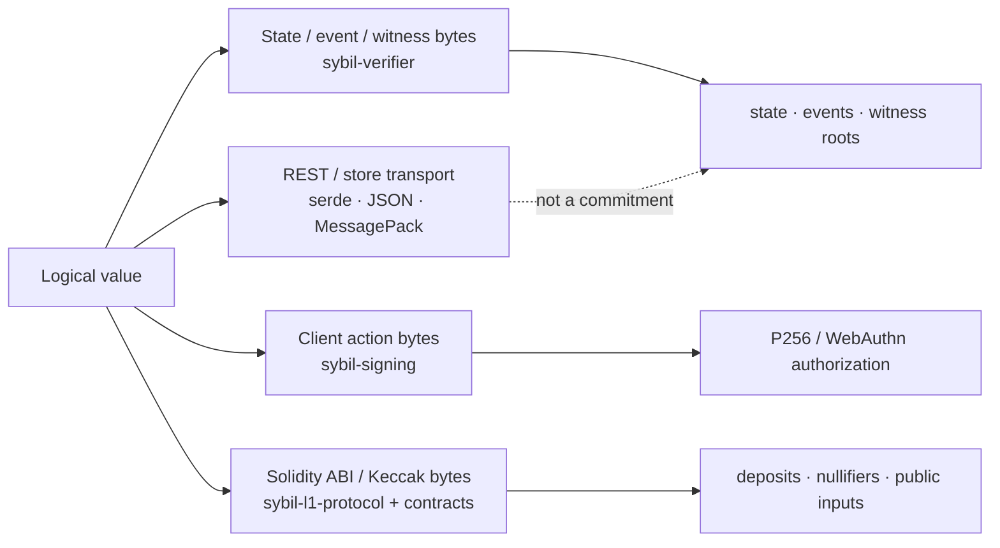

# Canonical serialization

> [!summary] In one paragraph
> Sybil does not have one universal codec. Verifier-owned state/event/witness
> bytes, client signing bytes, L1 ABI hashes, and transport JSON/MessagePack are
> separate domains with separate owners. A value becomes protocol truth only
> through the canonical encoder for its domain; serde output and convenient
> in-memory layout are never substitutes.

## Domain ownership

| Byte domain | Owner | Used for |
|---|---|---|
| Typed state leaves | `sybil-verifier/src/state_schema.rs` | `state_root`, qMDB proofs |
| Snapshot/sidecar values | `snapshot_schema.rs` | witness openings and exact replay |
| Per-block events | `event_schema.rs`, `event_commitment.rs` | `events_root` |
| Canonical witness | `witness_schema.rs` | `witness_root`, DA payload, import |
| Block header | `sybil-zk/src/header_hash_impl.rs` | parent-linked block hash |
| Ordinary client actions | `sybil-signing` | RawP256/WebAuthn canonical challenge |
| Key-operation authorization | verifier key-transition/auth modules | guest-proven state-bound intent |
| L1 leaves/public inputs/nullifiers | `sybil-l1-protocol`, `sybil-zk`, `sybil-escape-claim`, Solidity | contract verification |
| REST/persistence transport | `sybil-api-types`, serde/rmp | communication/storage only |

## Rules shared by canonical domains

1. **Integers only on validity paths.** Prices, quantities, balances, counts,
   and arithmetic outcomes use fixed-width integers.
2. **Explicit domains.** Hash inputs begin with a stable domain or otherwise
   live behind a versioned top-level schema. Similar logical values in
   different contexts must not collide.
3. **Deterministic collection order.** Maps, sets, accounts, markets, orders,
   keys, and events use their schema's declared sort/section order. Input order
   is never trusted.
4. **Explicit shape.** Variable sections carry bounded counts/lengths; sum
   types have pinned tags; decoders reject unknown tags, truncation, trailing
   bytes, and noncanonical order.
5. **Checked conversion.** Unit conversion and signed/unsigned boundaries fail
   closed on overflow or malformed high bytes.
6. **One encoder per commitment.** Native, guest, generator, and Solidity tests
   call or mirror the owner; they do not maintain a second “equivalent” layout
   by convention.

Rust commitment schemas generally use fixed-width little-endian integers.
Solidity ABI uses 32-byte big-endian words and Keccak domain hashes. Client
signing currently uses pinned Borsh layouts. These differences are deliberate;
never normalize them into one guessed codec.

## State, event, and witness boundaries

Typed state keys use stable namespace bytes plus fixed-width identifiers.
Values include every field needed to authenticate/continue that leaf family;
[[State Root Schema]] owns the inventory. qMDB hashes the canonical key/value
operations, not Rust struct memory or serialized API DTOs.

Per-block events are encoded in fixed section order and committed through the
keyless qMDB/MMR format. Account `events_digest` is a different running BLAKE3
accumulator and must not be substituted for `events_root`.

The canonical witness begins with `WITNESS_FORMAT_VERSION` and includes bounded,
ordered sections for headers, events, account phases/keys, state sidecars,
bridge data, fills, prices, constraints, and groups. MessagePack is only a
transport envelope for proof jobs/store rows. See [[Block Witness]].

## Client authorization bytes

`sybil-signing` owns ordinary order, cancel, profile, read-key, and bridge
withdrawal layouts. Genesis-bound actions include `genesis_hash`; nonce/state
binding follows [[P256 Authentication]]. WebAuthn signs a challenge derived
from the same canonical action bytes rather than a JSON reconstruction.

Key registration/revocation has a stronger verifier-owned state-bound path.
Do not infer that every struct in `sybil-signing` is automatically guest-proven.

## L1 bytes

Deposit leaves/tree nodes, withdrawal and escape nullifiers, and transition /
escape public-input hashes are mirrored between Rust and Solidity. ABI word
padding, address width, integer width, domain string, and field order are
load-bearing. `SybilGoldenVectors.t.sol` consumes the generator-owned root
golden JSON to prevent hand-copied twins.

## Safe change procedure

For any canonical byte change:

1. identify the domain owner and every native/guest/Solidity consumer;
2. decide whether the change is additive, version-breaking, or requires fresh
   genesis/migration;
3. update one owner, its decoder bounds, negative tests, and shared vectors;
4. run `just golden-write`, review the diff, then `just golden-check`;
5. rebuild/fingerprint affected guests and update [protocol pins](../../protocol-pins.md);
6. repin adapters and follow the fresh-genesis runbook when validity changed.

Never update golden output merely to make a failing test green. Explain which
logical byte change caused every vector difference.

## See also

- [[State Root Schema]]
- [[Block Witness]]
- [[Proof Architecture]]
- [[P256 Authentication]]
- [[L1 Settlement and Vault]]
