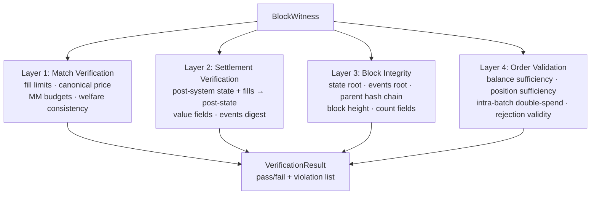

The verifier validates every aspect of a block across four independent layers, each checking a different class of invariant. The input is a [[Block Witness]] — a self-contained audit trail — and the output is a `VerificationResult` with a pass/fail verdict and a list of specific violations. A fifth pass, **sidecar transition verification**, checks derivable non-account facts (reservations, resting orders, withdrawals, deposit cursor, market status/groups). A system-transition replay checks account-value effects from `pre_state` to `post_system_state`. A key-transition pass welds the full post key universe to `keys_digest`, reverse-folds witnessed key ops to authenticated pre-state digests, and forward-replays them with global pubkey uniqueness, last-key lockout, and in-guest RawP256/WebAuthn signature verification. These passes are merged into `verify_full` alongside the four core layers. Every failure mode is a variant of the `ViolationKind` enum — the single source of truth for what can go wrong; consult `crates/sybil-verifier/src/violations.rs` for the current enumeration rather than a hardcoded count here.

**Layer 1: Match Verification** checks that the solver's output is economically
valid. Per-fill checks confirm existence, quantity bounds, and limit validity.
System-wide checks enforce UCP, outcome complementarity, market-group
constraints, [[MM Budget Constraint|MM budgets]], and welfare consistency. The
verifier also reconstructs the landed retained-cash price face and requires
the exact [[LP Duality and Clearing Prices|canonical maximum-entropy price]];
another dual-optimal endpoint is invalid. The same integer recomputation is
compiled into the OpenVM guest. Fresh equality is required for every market
with a nonzero fill. An unfilled market may only carry its previous committed
price unchanged.

**Layer 2: Settlement Verification** re-derives the post-state from the post-system state and fills. It independently runs [[Settlement]] arithmetic with checked integers, folds fill and MINT `events_digest` entries, carries `total_deposited` unchanged, and compares those fields plus every account's balance and positions against the witness's reported post-state. Any mismatch is a violation.

**Layer 3: Block Integrity** verifies the [[State Root and Parent Hash|cryptographic commitments]]. Native verification recomputes typed qMDB roots. The guest verifies complete qMDB membership/keyspace proofs for post-state and, on every non-genesis block, pre-state against the previous public root. It also reconstructs the keyless qMDB events root, parent hash chaining, consecutive heights, and count fields.

**Layer 4: Order Validation** checks pre-state feasibility. Buy orders must have sufficient balance in the pre-state. Sell orders must have sufficient positions. Intra-batch double-spend detection catches cases where multiple fills against the same account would overdraw. It also validates rejections: no false rejections (valid orders incorrectly rejected) and no incorrect rejection reasons.

## Key Properties
- 4 independent layers: Match → Settlement → Block Integrity → Order Validation, plus a sidecar-transition pass
- Every failure is a `ViolationKind` variant (see `crates/sybil-verifier/src/violations.rs`) — no hardcoded total lives in prose
- Input: [[Block Witness]] (self-contained audit trail)
- Diagnostics never relax validity rules
- The same verification logic compiles into the [[ZK Integration Path|OpenVM guest]]

## Where This Lives
> `crates/sybil-verifier/src/match_verifier.rs` — Layer 1
> `crates/sybil-verifier/src/settlement.rs` — Layer 2
> `crates/sybil-verifier/src/block.rs` — Layer 3 header checks
> `crates/sybil-verifier/src/event_commitment.rs` — Layer 3 events-root commitment
> `crates/sybil-verifier/src/orders.rs` — Layer 4
> `crates/sybil-verifier/src/sidecar.rs` — sidecar transition pass
> `crates/sybil-verifier/src/system.rs` — pre-to-post-system value/event replay
> `crates/sybil-verifier/src/key_transition.rs` — key-universe digest replay
> `crates/sybil-verifier/src/violations.rs` — `ViolationKind`, the canonical list of failure modes

## See Also
- [[Block Witness]] — the input to verification
- [[Block Lifecycle]] — verification runs after block production
- [[MM Budget Constraint]] — budget compliance checked in Layer 1
- [[ZK Integration Path]] — these checks become the ZK circuit
