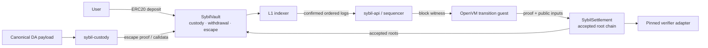

# L1 settlement and vault

> [!summary] In one paragraph
> Ethereum does not run Sybil's market. `SybilSettlement` accepts a consecutive
> chain of validity-proven state roots; `SybilVault` holds one collateral token
> and moves it through deposits, delayed normal withdrawals, or conservative
> escape claims. Solidity contracts, Rust hash twins, the escape guest, and the
> custody CLI exist. Real verifier deployment, a dedicated normal-withdrawal
> proof producer, production DA, and hostile-successor governance remain
> incomplete.

## Boundary at a glance



L1 never solves auctions, resolves markets, replays orders, or interprets raw
qMDB proofs. Those rules execute in [[ZK Integration Path|the guest]] over a
[[Block Witness]] and typed [[State Root Schema|state]].

## Non-negotiable design choices

- `SybilSettlement` accepts proofs and roots; it never holds collateral.
- `SybilVault` is the only token custodian.
- Every accepted transition binds its parent, block/events/witness roots, DA
  commitment, and L1 deposit checkpoint.
- Normal withdrawal claims come from committed withdrawal leaves, not a stale
  account balance.
- Escape pays a conservative cash floor at the settlement head frozen when
  escape mode activates. It does
  not unwind orders or promise future market-resolution proceeds.
- A generic OpenVM proof is insufficient: adapters pin the intended executable
  and VM commitments from [current protocol pins](../../protocol-pins.md).
- `UnsafeAcceptAllVerifierAdapter` is Anvil-only and never evidence of
  production validity.

## `SybilSettlement`

The settlement contract stores the accepted root chain and liveness reference.
A `RootRecord` carries height, new/previous state roots, block/events/witness
roots, DA commitment, deposit root/count, acceptance time, and verifier version.

`submitStateRoot` requires:

1. the supplied previous height/root to match the accepted head;
2. a forward height and a new, nonzero state root;
3. deposit count/root to match `SybilVault.depositRootByCount`;
4. the pinned adapter to accept the exact transition public-input hash.

The OpenVM adapter decodes the proof envelope, checks the pinned executable/VM
commitments, requires the guest's 32-byte reveal to equal Sybil's public-input
hash, and calls the generated verifier. Root submission pauses immediately;
adapter/vault/admin changes use the timelock described below.

## `SybilVault`

The vault currently supports one USDC-like token with six decimals. Internal
accounting is nanodollars:

```text
amount_nanos = amount_token_units * 1_000
```

### Deposits

1. `deposit` transfers tokens and appends a domain-separated leaf to a
   depth-32 incremental Merkle tree.
2. `DepositReceived` exposes the sequential id and cumulative root.
3. The public indexer chooses the lowest finalized height reported by every
   configured provider, requires unanimous block hashes, fetches vault logs by
   exact block hash, and reconciles `depositRootByCount` at the deposit log's
   same canonical block hash before using the service route.
4. The sequencer credits a known account or quarantines an unresolved key.
5. The transition guest reconstructs the same deposit prefix and requires the
   credited/quarantined events and committed cursor/root to agree.

Leaf/node domains, zero hashes, and conversion rules are shared by
`sybil-l1-protocol` and Solidity golden tests. Host calldata, event, and return
types come from the unconditional Alloy bindings in `sybil-l1-abi`, with
existing byte-level goldens guarding the Rust/Solidity boundary. RPC/finality
policy remains an explicit operational trust boundary; provider disagreement,
invalid hash binding, finality regression, root mismatch, or cursor identity
mismatch is fatal and durably latched in the indexer.

#### Same-deposit-ID substitution argument

The cumulative root binds every deposit leaf field: chain, vault, id, token,
sender, raw Sybil account key, and amount. For a malicious RPC or service to
replace the next leaf while preserving its id, it must choose one of two
checkpoints:

1. **Retain the canonical `depositRootByCount(id)`.** The sequencer folds the
   substituted leaf onto its committed pre-frontier and obtains a different
   root, so it rejects before credit or quarantine.
2. **Supply the substituted leaf's recomputed root.** The indexer's pinned
   `depositRootByCount(id)` call rejects it before service submission. Even if
   a dishonest RPC lies about both the log and call, the transition guest binds
   that different root into its public inputs and `SybilSettlement` rejects it
   against the vault's real mapping before accepting the state root.

The argument relies on Keccak collision resistance and the settlement/vault
binding. Public operation now uses `unanimous-finalized`: at least two
operator-asserted independently operated providers with distinct URLs, the
standardized
`finalized` tag, EIP-234 block-hash log filters, and EIP-1898
`requireCanonical=true` calls. Every provider must return identical
security-relevant content. One unavailable provider stalls ingestion; a
conflicting provider latches a fatal incident; no endpoint is silently dropped.

This is not an embedded Ethereum light client or a receipt/storage Merkle-proof
verifier. Its ratified trust assumption is that at least one configured
provider is honest and independent. It detects a fully self-consistent fork
fabricated by one provider because that view conflicts with the honest source;
it cannot detect all configured providers colluding on the same fabricated
view. Provider ownership, credentials, TLS, and configuration control therefore
remain part of the production security boundary. Deposit ingress remains
service-authenticated. Deterministic tests cover inconsistent headers, omitted
logs, inconsistent contract state, invalid hash binding, and a self-consistent
fabricated fork.

### Confirmed-prefix checkpoint and deep reorgs

The indexer requires a deployment-bound cursor file. Cursor schema v3 stores
`next_from`, the canonical number/hash of `next_from - 1`, the last
authenticated source-tip number/hash, the trust mode, and the sorted non-secret
provider identities. Changing chain, vault, trust mode, or provider set for an
acknowledged cursor is refused. Before reading or
submitting another range, the indexer requires every provider to reproduce the
checkpoint header. The descendant header commits the processed prefix. Each
log query is pinned to an agreed header hash, each deposit state call is pinned
to the deposit's own header hash, and the range-tip hash must remain stable
across ingestion.

A mismatch stops before further L1 input and persists `integrity_incident` in
the cursor. The process retains only scrapeable metrics and unhealthy health
endpoints; restarts refuse the latch. Critical alerts cover fatal kind, unready
state, consecutive RPC failures, and authenticated-prefix lag. This detects deep rewrites
of deposits already credited and withdrawal events already applied; it does not
invent an inverse transition. Operators must freeze the API and both contracts,
preserve the store/cursor, and follow the
[L1 reorg runbook](../../runbooks/l1-reorg-recovery.md). Complete validium-state
rollback/reconstruction is not implemented, so this remains a blocker before
real funds.

Local Anvil may explicitly select `unsafe-single-dev` and use zero
confirmations; that mode logs a `DEV-ONLY` warning and makes no public-finality
claim. Public/devnet deployments use `unanimous-finalized` with at least two
independently operated provider identities. Confirmation-count settings are
ignored in that mode.

### Normal withdrawals

Normal withdrawal is sequencer-cooperative:

1. An authenticated API request debits available cash and creates a typed
   `withdrawal/{id}` leaf with recipient, token, amounts, expiry, and nullifier.
2. A proof against an accepted root authorizes `requestWithdrawal`.
3. The vault consumes the root-independent nullifier and queues the transfer.
4. Anyone may finalize after `withdrawalDelay`.
5. Before escape activation, cancellation before `executableAt`, or confirmed
   L1 expiry, refunds the exact debited nanos once; finalization retires the
   leaf without refund.

The contract queue, sequencer leaf lifecycle, refund/finalization replay rules,
and verifier sidecar transition are implemented. A dedicated production-grade
user proof generator/guest for the normal withdrawal public inputs is not yet
the same complete path that exists for escape claims. API signatures alone do
not authorize vault release.

### Emergency escape

After at least one nonzero state root has been accepted, anyone may call
`activateEscapeMode` once:

```text
block.timestamp > livenessReference + escapeTimeout
```

The liveness reference is the latest accepted root time. Activation stores that
root and height permanently for escape claims; later settlement roots cannot
change them. A pre-first-root activation is rejected because there is no
mark-to-market state to prove. Deposits and new normal withdrawal requests are
rejected after activation. Already queued withdrawals cannot be cancelled and
may finalize even while the vault is paused, because their amounts were already
debited from the frozen account state. Escape uses a separately pinned verifier.
The guest proves:

- ownership through the account's committed active P256/WebAuthn key set;
- inclusion of the account and every referenced market leaf;
- inclusion or authenticated exclusion of `acct_resv/{account_id}`;
- cash plus positions valued at committed last-clearing prices, less cash
  reservations, floored at zero and converted to token units;
- deployment/account/root-bound nullifier and exact recipient/amount.

The vault recomputes the nullifier, consumes it, verifies the proof, and pays
immediately. Escape intentionally bypasses both pause and the normal withdrawal
delay so an emergency administrator cannot trap a valid claimant.

`sybil-custody snapshot`, `reconstruct`, and `escape-claim` retain openings,
authenticate a full DA payload, run real OpenVM prove/verify, wrap adapter bytes,
and optionally submit calldata. An own-leaf snapshot supports one user's claim;
full exchange continuation still needs the complete canonical DA payload. See
[[Operator Replacement]].

Returning every historical deposit is rejected: trading transfers value, so
raw deposit refunds would let losing accounts drain winners' collateral.

## Authority

Both contracts inherit `SybilAccessControl` and have one administrator—not the
granular roles in early design drafts.

| Action | Authority / delay |
|---|---|
| Pause/unpause either contract | Admin, immediate |
| Cancel a queued vault withdrawal before execution and escape activation | Admin, immediate |
| Activate escape after timeout | Anyone |
| Rotate normal/escape verifier, vault, delays, or admin | Exact proposal → `adminActionDelay` → execute |
| Cancel a pending proposal | Admin before execution |

Escape activation and valid escape claims remain permissionless. Live key
custody belongs in a private operator inventory; see the
[administrator runbook](../../runbooks/admin-keys.md).

The Foundry money-path suite pins exact rejection selectors, terminal/replay
states, ERC-20 `false` rollback and retry, escape freeze behavior, and
timelocked authorization. `just contracts-coverage` generates filtered LCOV
for the production adapter, settlement, vault, and shared access control,
enforcing per-contract floors plus a 95% aggregate branch floor. Tests, mocks,
deployment scripts, and the unsafe development adapter cannot inflate that
gate; the current inventory and exclusions live in
`contracts/COVERAGE.md`.

## Typed state and Rust ownership

The proof path relies on committed account, reservation, market/group,
withdrawal, deposit cursor/root, quarantine, observed-L1-height, and allocation
counter leaves. Display metadata and derived histories are not withdrawal
authority.

| Concern | Source of truth |
|---|---|
| Solidity ABI/state machine | `contracts/src/SybilSettlement.sol`, `SybilVault.sol`, `SybilTypes.sol` |
| Authority/timelock | `contracts/src/access/SybilAccessControl.sol` |
| L1 domains/tree/neutral event parsing | `crates/sybil-l1-protocol` |
| Host contract calls/events | `crates/sybil-l1-abi` |
| Confirmed log ingestion | `crates/sybil-l1-indexer` |
| Bridge WAL/state transition | `crates/matching-sequencer/src/bridge.rs` and bridge operations |
| Native transition checks | `crates/sybil-verifier` |
| Transition/DA public inputs | `crates/sybil-zk`, `crates/sybil-prover` |
| Escape statement and user tooling | `crates/sybil-escape-claim`, `crates/sybil-custody` |
| Rust/Solidity parity | `golden/golden-vectors.json`, `SybilGoldenVectors.t.sol` |

## Still incomplete for production

- Deploy and independently verify real pinned OpenVM adapters; mock/unsafe
  acceptance must be impossible.
- Complete the normal-withdrawal user proof path and drill it end to end.
- Operate provider-backed retention/decryption and emergency disclosure for DA.
- Ratify hostile-successor authority; witness import alone does not appoint a
  replacement operator.
- Decide whether escape mode is permanent for a deployment or has an explicit,
  safe resumption mechanism.
- Implement and drill complete state recovery after a canonical L1 checkpoint
  or provider-integrity mismatch. The finalized provider policy and critical
  monitoring fail closed, but detection alone is not a real-funds recovery
  mechanism.

## See also

- [[Threat Model]]
- [[State Root Schema]]
- [[ZK Integration Path]]
- [[Data Availability]]
- [[Operator Replacement]]
- [[P256 Authentication]]
