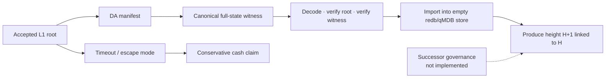

# Operator replacement and disaster recovery

> [!summary] In one paragraph
> Rebuilding the exchange from a retained canonical witness is implemented and
> tested: a fresh store can import one full-state witness, verify its root, and
> continue producing child blocks. Replacing a lost machine under the same
> operator is therefore real. Replacing a malicious or permanently absent
> operator is not trustless yet because production witness availability,
> emergency disclosure, and successor appointment remain governance/operations
> decisions.

## Two different promises

| Scenario | Current status | Missing piece |
|---|---|---|
| **Disaster recovery:** same operator loses disk/host/region | Implemented and drillable when a retained payload exists | Off-host retention and regular drills |
| **Hostile/absent operator replacement:** another party continues without cooperation | Data/import mechanics exist | Production DA/disclosure plus authority to appoint/recognize a successor |
| **Cash escape:** users claim a conservative cash floor on L1 | Guest, vault, and anyone-can-prove CLI implemented | Real verifier deployment, independently retained inputs, operational drill |

Validity proves that a supplied transition is correct. It does not force an
operator to publish the private witness, keep producing blocks, or hand control
to a successor.



## What one payload restores

The canonical witness contains the complete post-block state needed to
continue: accounts and committed key digests, markets and last clearing prices,
groups/lifecycle, resting orders and reservations, bridge frontier/quarantine,
withdrawals/claims, counters, and the authenticated header. Derived analytics
and history are not validity state and may be rebuilt or lost.

The import path is `Store::import_witness_genesis` in
`crates/matching-sequencer/src/store/import.rs`, exposed by `sybil-api
--import-witness`. It refuses a non-empty store, decodes canonical bytes,
recomputes the post-state root, verifies the optional expected root, restores
the committed head, and is covered by a child-block continuation drill.

Witness v12 imports the committed `last_trading_nonce` for every account, so
previously accepted order/cancel signatures remain spent after recovery. The
broader operational `last_nonce` is not validity state and is conservatively
seeded from `last_trading_nonce`; this prevents trading replay while allowing
non-trading operational nonce space to resume. The preserved `genesis_hash`
keeps captured signatures in their original chain domain. For a witness that
does not carry the genesis header as its previous header, the operator must
supply the known genesis hash explicitly; `/v1/health` exposes it on the source
chain.

## Recovery drill

Choose a retained height whose manifest/root you have independently matched to
the intended accepted chain:

```bash
H=12345
SRC=https://172-104-31-54.nip.io
SERVICE_TOKEN='replace-with-service-token'

curl -fsS "$SRC/v1/da/$H/manifest" -o "da-$H.json"
curl -fsS -H "Authorization: Bearer $SERVICE_TOKEN" \
  "$SRC/v1/da/$H/payload" -o "witness-$H.bin"
curl -fsS "$SRC/v1/health" -o source-health.json

EXPECT_STATE_ROOT=$(jq -r '.state_root' "da-$H.json")
GENESIS_HASH=$(jq -r '.genesis_hash' source-health.json)

SYBIL_DATA_DIR=/var/lib/sybil-recovered \
  sybil-api --import-witness \
  --payload "witness-$H.bin" \
  --expect-state-root "$EXPECT_STATE_ROOT" \
  --genesis-hash "$GENESIS_HASH"
```

Then start the recovered service against that data directory, keep external
writes disabled, and verify:

1. head height/state root equal the manifest;
2. representative accounts, markets, groups, orders, reservations, bridge, and
   withdrawal state match the source;
3. block H+1 can be produced and verified against H;
4. new deposits after H can be replayed from the L1 log;
5. post-H off-chain intents are re-submitted rather than guessed.

The routine store backup drill is separate: it restores redb/qMDB bytes. This
drill proves recovery from the canonical DA artifact alone.

## User-side custody and cash escape

The `sybil-custody` binary provides three user-operated paths:

- `snapshot` saves the account/reservation openings and matching DA manifest,
  optionally authenticating the accepted `RootRecord` from L1;
- `reconstruct` authenticates and decodes a complete canonical witness from a
  saved file or the DA API and reports the conservative withdrawable amount;
- `escape-claim` assembles the Form-L guest input, runs OpenVM EVM prove and
  verify, wraps the adapter proof, prints vault calldata, and can submit it.

The P256 scalar authorizes the escape statement; it is not the Ethereum
transaction key. Default tests use an explicit unsafe fixture-proof path for
Anvil, while real proving is gated and must be exercised operationally. An
own-leaf snapshot is sufficient input for the user's escape claim, but not for
full operator replacement: exchange continuation still needs the complete DA
payload.

## Availability and disclosure boundary

Current per-height API/storage support provides a typed manifest and canonical
payload, with hashes bound through `payload_root`, `witness_root`, and
`da_commitment`. The checked-in file provider is proof-pipeline scaffolding; it
does not guarantee that an independent provider retained the payload.

Plaintext full-state publication is incompatible with the private-validium
goal. Before real users, the project must ratify and operate an encrypted
retention/disclosure scheme that survives operator loss. The cryptographic
envelope is provider-neutral, but no particular external DA provider, key
escrow arrangement, retention SLO, or emergency release authority is currently
the production standard.

## Remaining hostile-replacement gap

Even with the bytes available, L1 does not yet define who becomes the successor
operator or how that authority is recognized when the existing administrator
is the failed party. Do not describe witness import as trustless operator
replacement until both are true:

1. an independent party can obtain/decrypt a recent accepted payload under a
   public, tested policy; and
2. a ratified governance/contract mechanism can authorize continuation without
   cooperation from the old operator.

Cash escape reduces the consequence of this gap but does not provide exchange
continuity or unwind positions.

## Operational checklist

- Retain canonical payloads off-host and monitor their age/coverage.
- Run both byte-backup restore and witness-import continuation drills.
- Record genesis hash, accepted root/height, main/escape verifier pins, and
  contract addresses outside the failed host.
- Never mix artifacts across genesis domains.
- State clearly whether a deployment uses mock/unsafe or real verifier adapters.
- Preserve L1 logs so deposits after the recovery root can be reconciled.

## See also

- [[Data Availability]]
- [[Block Witness]]
- [[L1 Settlement and Vault]]
- [[Threat Model]]
- [Store backup and restore](../../runbooks/store-backup-restore.md)
- [Fresh-genesis redeploy](../../runbooks/fresh-genesis-redeploy.md)
