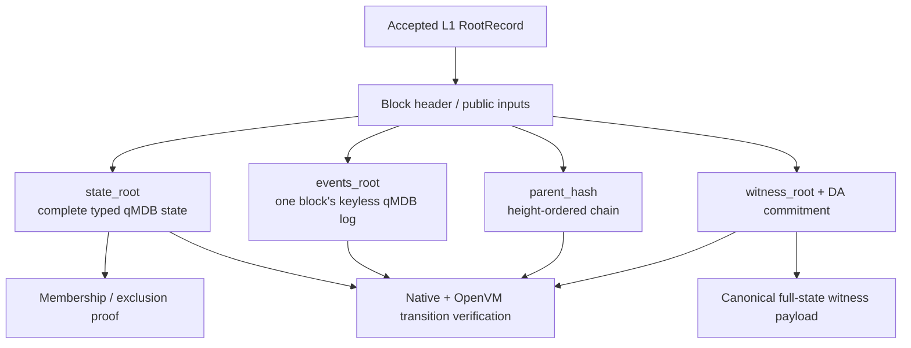

# Proof architecture

> [!summary] In one paragraph
> A trusted Sybil root authenticates complete typed state, the events of one
> block, and the parent-linked block history. The epoch guest proves that every
> transition in a contiguous range produced those commitments; qMDB membership or
> exclusion proofs open individual state leaves. These primitives support
> auditing, withdrawals, escape, and future selective claims, but they do not
> make every historical or privacy-preserving query available automatically.

## The trust chain

A root is useful only after its transition proof and exact public inputs are
accepted by the intended pinned verifier. A hash returned by the operator is
not independently trustworthy.

## Authenticated structures

### Typed state

`state_root` is the native ordered qMDB root over the complete keyspace needed
to continue the exchange:

- accounts, balances, positions, deposited totals, and key/event digests;
- aggregate reservations and active resting orders;
- markets, last clearing prices, lifecycle, and market groups;
- deposit cursor/frontier/quarantine and observed L1 height;
- active withdrawals/claims and allocation counters.

Keys and values use verifier-owned canonical bytes from [[State Root Schema]].
The transition verifier authenticates both pre/post openings and requires the
post-state sidecar to equal the exact replayed keyspace—not merely the keys the
operator chose to show.

The latest-state API serves inclusion or exclusion proofs at
`GET /v1/proofs/state/{leaf_key_hex}`. It requires persistent qMDB storage and
returns the committed height/root plus Commonware 2026.5 proof parts. Clients
must know the canonical key/value schema and verify the proof themselves.

### Per-block events

`events_root` is a fresh keyless qMDB/MMR commitment over canonical event bytes
in fixed section order: system events, accepted orders, rejected orders, then
fills. Native and guest implementations share the Commonware 2026.5 operation
format and backward peak-bagging rule.

It authenticates occurrence and complete per-block ranges. It is not a global
query index. Account-local `events_digest` is a separate running BLAKE3
accumulator useful for detecting whether account activity changed between two
trusted states.

### Block and witness chain

`parent_hash` plus consecutive heights prevents insertion, removal, or
reordering relative to a trusted head. Transition public inputs additionally
bind `witness_root`, `da_commitment`, and the L1 deposit checkpoint.

The canonical witness is intentionally a full snapshot. It lets the verifier
check exact keyspace transitions and lets a fresh operator reconstruct the
exchange from one retained payload. It is not scheduled to become a
touched-leaves-only witness unless the recovery/trust model is redesigned.

## What the transition proof establishes

For every streamed private `StateTransitionGuestInput`, the guest re-derives:

1. header, parent/height, count, and block hash bindings;
2. canonical events, witness, state, and DA commitments;
3. order/fill limits, uniform prices, groups, MM budgets, and welfare;
4. integer settlement, minting, balances, positions, and reservations;
5. market, bridge, withdrawal, quarantine, key-operation, and ordinary
   signed-action transitions;
6. deposit prefix/checkpoint agreement and the per-block public-input hash.

It then requires exact header/root/genesis chaining, folds the verified block
hashes and DA commitments in order, and reveals one epoch public-input hash for
the claimed start/end range.

Witness v11 retains ordinary order/cancel RawP256/WebAuthn envelopes and the
account leaf commits `last_trading_nonce`. Shared native/guest verification
replays both against the actor-ordered active key set; see
[[P256 Authentication]] and [[Threat Model]].

## Composing other claims

Authenticated leaves can be inputs to another proof—for example, proving an
account balance at a root or computing the conservative escape amount from
account/reservation/market openings. The claim-specific circuit must still
define and verify its computation, root trust, range completeness, and privacy
properties.

Current concrete compositions are:

- state-transition verification and L1 root acceptance;
- latest typed-state membership/exclusion;
- full-payload authentication and witness import;
- Form-L escape authorization/valuation through `sybil-escape-claim` and
  `sybil-custody`.

Not currently provided as general services:

- arbitrary historical state proofs by height;
- public per-event/account range-proof APIs;
- generic PnL, Sharpe, provenance, or non-participation proof circuits.

## Retention and availability

The fenced A/B live qMDB slots are not a historical proof archive. Transition
proving remains possible because each witnessed commit captures a portable
pre/post qMDB proof job transactionally before rotation. Arbitrary historical
claims still require retained journals/snapshots or reconstruction from
canonical DA.
The API stores blocks and DA payloads according to configured retention, but a
production provider/decryption/disclosure policy is still required. See
[[Historical Data Serving]], [[Data Availability]], and [[Operator Replacement]].

## Implementation map

| Concern | Owner |
|---|---|
| Typed state/event canonical bytes | `crates/sybil-verifier` |
| qMDB native roots and persistent slots | `matching-sequencer` store/qMDB modules |
| Guest qMDB, transition, DA, public inputs | `crates/sybil-zk` |
| Portable jobs/envelopes | `crates/sybil-proof-protocol` |
| Job capture | `matching-sequencer` store/outbox |
| Authenticated outbox transport | `sybil-api` service routes, `sybil-prover` source client |
| Durable epoch assembly, leases, STARK verification, artifacts | `crates/sybil-prover` daemon |
| Escape-specific claim | `crates/sybil-escape-claim`, `crates/sybil-custody` |
| L1 accepted roots and adapters | `contracts/src/` |
| Current hashes/commitments | [Generated protocol pins](../../protocol-pins.md) |

## See also

- [[Block Witness]]
- [[State Root Schema]]
- [[Four-Layer Verification]]
- [[ZK Integration Path]]
- [[L1 Settlement and Vault]]
- [Prover daemon runbook](../../runbooks/prover-daemon.md)
