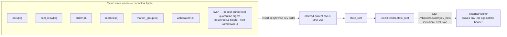

# State Root Schema

Normative spec for `BlockHeader.state_root`: what it commits to, how typed
state bytes are produced, and how proofs are expected to work.

**The idea in plain words:** `state_root` is a single hash over *all* active trading state — every account, reservation, resting order, market, group, and withdrawal — encoded as canonical byte leaves and folded into one ordered qMDB root. Because the header commits to that root, anyone can prove a fact about any single leaf ("account 42 has balance B", "order 99 is absent") against the header alone, without trusting the operator or replaying the block.

[[State Root and Parent Hash]] is the concept introduction. This note is the
byte-level commitment contract.

## Commitment

`state_root` is the native current-qmdb root over sorted typed state leaves.
The root uses commonware's ordered current qMDB with SHA-256 and variable-size
`Vec<u8>` keys and values. The authenticated-storage boundary is pinned to
Commonware `2026.5.0`: MMR peaks use Commonware's backward-bagging policy,
and roots with an inactive prefix commit the inactive-peak count. Sybil uses
the explicit `Sequential` merkleization strategy so native recomputation,
sequencer persistence, and proof generation all share one deterministic
configuration.

Implementation:

- `crates/sybil-verifier/src/block.rs::compute_state_root_with_sidecar`
- `crates/sybil-verifier/src/state_schema.rs::state_root_leaves`
- `sybil_verifier::commitments::state_schema` as the public schema namespace
- `crates/sybil-verifier/src/block.rs::state_root_from_leaves`
- `crates/matching-sequencer/src/block.rs::compute_complete_state_root`

For verifier-side recomputation, the typed leaves are inserted into a fresh
empty qMDB in bytewise key order and the resulting qMDB root is the
`state_root`. Runtime persistence stores the same leaves in a dedicated
typed-state qMDB whose active keyspace exactly matches the header root.

## Key Families

| Key family | Commits to |
|---|---|
| `acct/{account_id}` | `id`, `balance`, `total_deposited`, non-zero `positions`, `events_digest`, `keys_digest` |
| `acct_resv/{account_id}` | aggregate reserved cash and positions from active resting orders |
| `market/{market_id}` | binary market definition, lifecycle status/resolution, metadata digest, resolution template, and last clearing prices |
| `market_group/{group_id}` | mutually exclusive market group name and member markets |
| `order/{order_id}` | active resting order, owner, effective expiry, remaining quantity, and reservation metadata |
| `sys/deposit_cursor` | highest consumed L1 deposit cursor |
| `sys/deposit_root` | deposit log root used by the bridge sidecar |
| `sys/quarantine_digest` | SHA-256 digest of the sorted raw-key quarantine ledger opening |
| `sys/observed_l1_height` | confirmed L1 height used by bridge expiry transitions |
| `sys/next_withdrawal_id` | next withdrawal id counter |
| `withdrawal/{withdrawal_id}` | normal L1 withdrawal claim, recipient, token, amount, expiry, and nullifier |

The committed surface covers the exchange's active trading state: accounts,
bridge withdrawals, markets, groups, resting orders, and reservations. This is
what lets a verifier check order presence/absence, market tradeability, and
withdrawal claims from the header commitment rather than trusting witness-only
context.



## Leaf Encoding

Keys are byte strings. Collections are canonicalized before leaf construction:

- accounts by `account_id`
- withdrawals by `withdrawal_id`
- markets by `market_id`
- market groups by `group_id`
- resting orders by `order_id`
- reservations by `account_id`

Values are canonical Sybil bytes under explicit type domains defined in
[[Canonical Serialization]]. Runtime storage may keep ergonomic MessagePack
copies elsewhere, but authenticated state values must be canonical leaf bytes.

The qMDB root commits to the key/value pairs themselves. There is no separate
sorted-leaf digest layer.

Market leaf values append their price state last, after the resolution
template: `price_count:u64le || price:u64le * price_count`. An empty vector
means the market has never cleared; otherwise the count equals
`num_outcomes`, with each price bounded by `NANOS_PER_DOLLAR`.

## OpenVM State Proof

The OpenVM guest does not rebuild the qMDB database. Instead, the private input
includes commonware ordered-current-qMDB key/value proofs for every typed leaf
derived from `BlockWitness.post_state` and `BlockWitness.state_sidecar`.

For each derived leaf, the guest verifies:

- the qMDB key/value proof against public `new_state_root`
- the proven qMDB `next_key` equals the next derived key in bytewise sorted
  order, wrapping from the last key back to the first

This proves exact post-state keyspace, not just membership of a subset. If the
committed qMDB contains a hidden extra active key, at least one adjacent
`next_key` pointer will target that hidden key and the guest rejects the
transition.

The proof bytes are produced from commonware qMDB outside the guest. With its
`sequencer-store` feature, `crates/sybil-prover` reads the committed block
witness and retained qMDB proof material from sequencer storage, checks the
native proof against the committed root, and emits a serializable
`StateTransitionProofJob`. The default prover path then validates that portable
job and converts it into the guest input shape. Inside OpenVM,
`crates/sybil-zk` verifies the needed SHA-256 MMR/grafted-root proof shape
directly, avoiding commonware storage as a guest dependency while keeping the
proof format pinned to commonware's ordered-current-qMDB semantics.

The portable 2026.5 range-proof subset carries `leaves`, `inactive_peaks`, the
MMR proof digests, the optional partial-bitmap-chunk digest, and `ops_root`.
The guest mirrors backward peak bagging and the inactive-prefix root encoding.
Commonware's MMR family has no pending-chunk contribution. Native/guest tests
include a state that crosses a complete bitmap-chunk boundary so drift in
proof layout, grafting, or peak bagging fails closed.

## Sequencer Storage

Current storage has two qMDB roles:

- The block header root is computed from the typed leaves through native qMDB.
- `crates/matching-sequencer/src/qmdb_accounts.rs` persists account snapshots
  under a fenced account-qMDB slot for crash recovery.
- `crates/matching-sequencer/src/qmdb_state.rs` persists the typed state
  leaves in fenced A/B qMDBs whose unprefixed keyspace is exactly the
  `state_root` keyspace.

The account qMDB slot currently stores:

- legacy account rows: `slot_prefix || 'a' || account_id_be_u64`
- metadata rows: slot height and `next_account_id`

`QmdbState` exposes the committed typed-state root plus typed-leaf inclusion
and exclusion proofs. Those proofs verify directly against
`BlockHeader.state_root` for the fenced slot recorded by redb. During witnessed
block commit, the sequencer converts the required pre/post proofs into a
`sybil-proof-protocol` job and stores it in the same redb fence transaction.
`sybil-prover` consumes the portable job and owns epoch assembly/proving.

## Proof API

qMDB exposes current-value and exclusion proofs natively. The Sybil API wraps
the committed typed-state qMDB proof for off-chain verifiers and ZK provers:

```
GET /v1/proofs/state/{leaf_key_hex}
  -> {
      "block_height": 42,
      "state_root": "...",
      "leaf_key_hex": "...",
      "proof_kind": "inclusion" | "exclusion",
      "proof_format": "commonware-qmdb-current-ordered-sha256-mmr-2026.5",
      "verified": true,
      "leaf_value_hex": "...",
      "inclusion_proof": { ... },
      "exclusion_proof": { ... }
    }
```

The endpoint currently serves the latest committed block only. The path key is
hex-encoded because canonical keys are byte strings (`acct/` followed by an
8-byte big-endian id, `order/` followed by an 8-byte id, and so on).

Verifier logic checks the qMDB proof with SHA-256, the supplied key/value (or
exclusion key), and the header `state_root`. The API also verifies the proof
server-side before returning it, but external verifiers must treat that boolean
as diagnostic only and verify independently. For bridge withdrawals, the L1
contract should verify a ZK proof over the relevant qMDB
membership/exclusion checks rather than reimplementing qMDB proof verification
directly in Solidity.

Normal bridge withdrawals should prove a committed
`withdrawal/{withdrawal_id}` leaf. Emergency cash exits should expose
withdrawable cash, not just raw balance, which is why reservations or
equivalent open-exposure data are committed state. See
[[L1 Settlement and Vault]] for the contract boundary.

## Retention and Historical Proofs

The current proof API intentionally serves only the latest committed state.
Historical proofs are useful once an external verifier needs to prove a claim
against a specific previously accepted root:

- a withdrawal leaf existed under root `R_N`, even if the latest state has
  since consumed, expired, or replaced it
- a prover is checking a transition from old root `R_N` to new root `R_N+1`
- an auditor needs account, order, or market state exactly as of block `N`

This is deferred because the current sequencer storage uses fenced A/B qMDB
slots. That gives a clean latest committed root, but it is not a real
retained-height proof store. Commonware qMDB is append-only and has historical
operation proofs in the retained journal window, but Sybil still needs a
designed height-to-root/operation-boundary index and a current-state
membership/exclusion proof API for a past block height.

Acceptable implementation shapes:

- retain typed-state qMDB history plus per-block metadata, then expose
  `GET /v1/proofs/state/{leaf_key_hex}?height=N`
- archive full typed leaf snapshots for a bounded window and rebuild qMDB on
  demand, only if simplicity matters more than duplication
- keep latest-only proofs until L1 root acceptance, withdrawal claim windows,
  or transition proofs require historical roots

A future "prune to last N blocks" policy is therefore a storage and
data-availability question, not a commitment-scheme question.

## Recovery Boundary

The state root is a commitment, not a data availability mechanism. If the
operator disappears and users cannot obtain the state data, neither a qMDB
root nor a ZK proof system can reconstruct it.

The preferred recovery shape is DA-backed operator replacement: fetch
published state snapshots/deltas, verify the reconstructed typed state against
the latest accepted `state_root`, and start a replacement sequencer.
Individual cash-only force exits are a conservative fallback because
unresolved prediction-market positions cannot be cleanly unwound on L1
without moving market resolution and settlement logic onto L1.

Out of scope here:

- DA provider and publication cadence: SYB-76.
- Escape reconstruction tooling: SYB-80.
- Operator replacement and encrypted emergency disclosure: SYB-116.
- L1 vault/settlement contracts: [[L1 Settlement and Vault]] and SYB-31/SYB-32.

## Alternatives Considered

**Account-only qMDB root.** Rejected as incomplete. It cannot prove active
resting orders, reservations, market lifecycle state, market-group membership,
or that an expired order is absent after a block.

**Sparse Merkle tree.** Rejected for now because it duplicates storage and
proof APIs while qMDB already gives the sequencer an authenticated ordered
key-value store.

**Separate commitment tree alongside qMDB.** Rejected unless direct Solidity
membership proofs become more important than keeping one authenticated state
store.

## Where This Lives

> `crates/sybil-verifier/src/block.rs` - typed leaf construction and native qMDB root recomputation
> `crates/matching-sequencer/src/block.rs` - writes `state_root` into the block header
> `crates/matching-sequencer/src/canonical_state.rs` - canonical account ordering used by account leaves
> `crates/matching-sequencer/src/qmdb_accounts.rs` - fenced account recovery snapshots
> `crates/matching-sequencer/src/qmdb_state.rs` - fenced typed-state qMDB and proofs
> `crates/matching-sequencer/src/account_storage.rs` - account snapshot and typed-leaf persistence boundary

## See Also

- [[State Root and Parent Hash]]
- [[Canonical Serialization]]
- [[Block Witness]]
- [[Proof Architecture]]
- [[ZK Integration Path]]
- [[L1 Settlement and Vault]]
- [[Persistence]]
