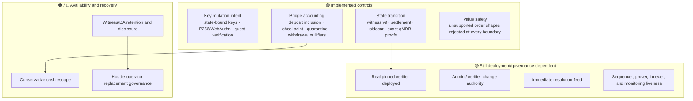

# Threat model

> [!summary] In one paragraph
> Sybil minimizes trust in transition correctness, but authorization is split. Witness v9 and the OpenVM guest check state transitions plus key-operation P256/WebAuthn authorization. Ordinary order/cancel signatures and cross-block replay nonces are enforced at admission and are not yet re-proved by the guest. Production security also depends on deploying the real verifier, keeping witness data available, governing privileged keys, maintaining liveness, and using an honest immediate-resolution feed.

This note distinguishes **implemented cryptographic controls** from **controls that only exist when the production deployment actually enables them**.

**Legend:** 🟢 cryptographically checked in the current implementation · 🟡 deployment/governance trust · 🟠 recovery/escape mitigation · 🔴 open design gap.

## Assets

- Collateral held by `SybilVault`.
- Account balances, reservations, positions, keys, and replay state.
- Correct market lifecycle and resolution payouts.
- Availability of blocks and witness data needed to audit or continue the chain.
- Liveness of sequencing, proving, L1 indexing, and withdrawals.

## Malicious or compromised operator

| Attack | Status | Control / residual trust |
|---|---|---|
| Forge a key registration/revocation | 🟢 | Witness v9 binds `genesis_hash`, the active key universe, state digests, key operation, and RawP256/WebAuthn envelope; the guest re-verifies authorization. |
| Forge an ordinary order/cancellation at admission | 🟡 | API/sequencer verify the active key, genesis-bound signature, and monotonic nonce before durable admission. The guest verifies the resulting order/state transition but not the ordinary signature envelope or prior cross-block nonce. |
| Insert an unsupported multi-market/custom value path | 🟢 | Unsupported shapes are rejected at API, admission, solver, and verification boundaries. The expressive payoff-vector type is not treated as execution support. |
| Forge balances, positions, reservations, or market/bridge sidecar | 🟢 / 🟡 | Native and guest transition checks cover the witness and exact post-state keyspace. This becomes a production guarantee only when the real pinned verifier—not `UnsafeAcceptAllVerifierAdapter` or a mock prover—is deployed. |
| Credit an unbacked or misdirected deposit | 🟢 | Guest-verified deposit inclusion, vault checkpoint binding, ordered cursor, and witnessed credit-or-quarantine disposition. |
| Replay or equivocate transitions | 🟢 / 🟡 | Consecutive height/parent binding and L1 root rules cover transitions. Genesis-domain separation limits captured ordinary signatures to one chain, while cross-block nonce enforcement remains admission-layer trust. |
| Withhold witness data | 🟠 / 🔴 | Per-height DA manifest/payload endpoints and recovery import exist. Continued positions require retained payloads; hostile-operator replacement still needs provider policy and governance. See [[Data Availability]] and [[Operator Replacement]]. |

## Malicious user or client

| Attack | Status | Control |
|---|---|---|
| Replay an ordinary signed write | 🟡 | Strictly increasing admission nonce plus action/genesis domain separation; nonce durability is tested but not guest-proven ([ADR-0007](../../adr/0007-canonical-bytes-domain-separation.md)). |
| Register/revoke a key for another account | 🟢 | State-bound signed key operations, service-tier checks, committed `keys_digest`, and guest replay. |
| Overspend through concurrent/resting orders | 🟢 | Direct-admission reservations, atomic deferred admission, Layer 4 accumulation, and deterministic settlement. |
| Double-withdraw or reuse an escape claim | 🟢 | Typed withdrawal/claim leaves, root binding, freshness rules, and nullifiers. |
| Exhaust parsing, signatures, actor queues, or solver work | 🟡 | HTTP and actor token buckets, account/global caps, supported-shape gates, mailbox metrics, and deployment limits reduce the surface; capacity remains operational. |

## Oracle and market resolution

Core resolution is `ResolutionPolicy::Immediate`: one registered feed signs a payout and the sequencer settles it irreversibly. Signature, feed identity, market id, payout range, and already-resolved state are checked. **Outcome truth remains 🟡 trusted**—the core has no quorum/bond/challenge adjudication path. External LLM/review processes can improve the signer’s decision process but do not change this trust boundary. See [[Market Resolution]].

## L1, escape, and replacement

- Normal withdrawal safety depends on an accepted root, typed proof, nullifier, and queue/finalization rules.
- Escape-claim contract and guest paths provide a conservative cash floor; they do not unwind positions or manufacture unavailable state.
- Disaster recovery from a retained canonical witness is implemented and drillable.
- Trustless replacement of a hostile/absent operator is still 🔴 until production DA retention/disclosure and a successor-appointment governance mechanism are ratified.
- Admin/verifier changes and pause powers remain 🟡 governance/key-management risks even when transition proofs are sound.

## Production trust checklist

1. Deploy and pin the real Sybil OpenVM verifier; ensure no unsafe adapter or mock prover can accept production roots.
2. Run persistent storage, backups, restore drills, L1 confirmation depth, synthetic monitoring, and alerting from [[Deployment Profiles]].
3. Publish and retain the canonical witness payload before treating a root as recoverable.
4. Protect admin, feed, service, and verifier-change keys with the chosen multisig/timelock policy.
5. Test normal withdrawal, escape claim, and witness-import recovery against the deployed artifacts.
6. State the oracle trust model plainly: signed does not mean objectively true.

## See also

- [[P256 Authentication]]
- [[Block Witness]]
- [[Four-Layer Verification]]
- [[Data Availability]]
- [[L1 Settlement and Vault]]
- [[Operator Replacement]]
- [Consolidated invariants](../../SPEC.md#11-consolidated-invariants)
