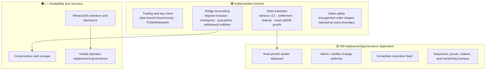

# Threat model

> [!summary] In one paragraph
> Sybil minimizes trust in transition correctness. Witness v12 and shared
> native/guest verification check state transitions, key mutations, ordinary
> RawP256/WebAuthn order/cancel intent, and committed cross-block trading
> nonces. The deployed guest commitment still requires the coordinated epoch
> repin. The current permissionless API also has critical resource-bound gaps,
> so production security requires closing those—not merely deploying the real
> verifier and keeping DA available.

This note distinguishes **implemented cryptographic controls** from **controls that only exist when the production deployment actually enables them**.

**Legend:** 🟢 cryptographically checked in the current implementation · 🟡 deployment/governance trust · 🟠 recovery/escape mitigation · 🔴 open design gap.

## Assets

- Collateral held by `SybilVault`.
- Account balances, reservations, positions, keys, and replay state.
- Correct market lifecycle and resolution payouts.
- Availability of blocks and witness data needed to audit or continue the chain.
- Liveness of sequencing, proving, L1 indexing, and withdrawals.

## Malicious or compromised operator

| Attack | Status | Control / residual trust |
|---|---|---|
| Forge a key registration/revocation | 🟢 | Witness v12 binds `genesis_hash`, the active key universe, state digests, key operation, and RawP256/WebAuthn envelope; shared native/guest verification replays authorization. |
| Forge an ordinary order/cancellation | 🟢 | Witness v12 retains the exact action envelope in actor order. Verification checks the active scheme-matching key, genesis/action binding, RawP256/WebAuthn policy and signature, committed trading nonce, and corresponding order/cancel effect. |
| Insert an unsupported multi-market/custom value path | 🟢 | Unsupported shapes are rejected at API, admission, solver, and verification boundaries. The expressive payoff-vector type is not treated as execution support. |
| Forge balances, positions, reservations, or market/bridge sidecar | 🟢 / 🟡 | Native and guest transition checks cover the witness and exact post-state keyspace. This becomes a production guarantee only when the real pinned verifier—not `UnsafeAcceptAllVerifierAdapter` or a mock prover—is deployed. |
| Credit an unbacked or misdirected deposit | 🟢 | Guest-verified deposit inclusion, vault checkpoint binding, ordered cursor, and witnessed credit-or-quarantine disposition. |
| Replay or equivocate transitions | 🟢 | Consecutive height/parent binding and L1 root rules cover transitions. Genesis-domain separation limits signatures to one chain, while `last_trading_nonce` in authenticated account leaves rejects same- or cross-block ordinary-action replay. |
| Withhold witness data | 🟠 / 🔴 | Per-height DA manifest/payload endpoints and recovery import exist. Continued positions require retained payloads; hostile-operator replacement still needs provider policy and governance. See [[Data Availability]] and [[Operator Replacement]]. |

## Malicious user or client

| Attack | Status | Control |
|---|---|---|
| Replay an ordinary signed write | 🟢 | Strictly increasing committed `last_trading_nonce`, exact action/genesis domain separation, and actor-order active-key replay ([ADR-0007](../../adr/0007-canonical-bytes-domain-separation.md)). |
| Register/revoke a key for another account | 🟢 | State-bound signed key operations, service-tier checks, committed `keys_digest`, and guest replay. |
| Overspend through concurrent/resting orders | 🟢 | Direct-admission reservations, atomic deferred admission, Layer 4 accumulation, and deterministic settlement. |
| Double-withdraw or reuse an escape claim | 🟢 | Typed withdrawal/claim leaves, root binding, freshness rules, and nullifiers. |
| Exhaust parsing, signatures, actor queues, solver work, or persistent state | 🟠 / 🔴 | Public onboarding has route/client flow limits plus a durable lifetime account cap; read-key records, resting-order admission, and DA reads are also bounded. Product-history outbox growth during a prolonged projector outage remains an open stock/liveness attack; exact backlog and host-disk alerts are devnet detection, not the missing overflow policy. |

## Resource exhaustion and free state

The current public surface does **not** satisfy the assumption that persistent
state is bounded by deposited capital. The highest-priority gaps are:

- the product-history outbox can grow without a byte/row budget while its
  projector is unavailable (policy tracked in
  [GitHub #90](https://github.com/MetaB0y/sybil/issues/90));
- some durable histories still require explicit retention economics.

Anonymous account creation no longer accepts caller-selected funding: it uses a
fixed server grant, a durable lifetime account-id ceiling, and a dedicated rate
budget. IDs are not reclaimed. Service-authenticated creation is a trusted
operator bypass, not a permissionless resource path.

These are availability and persistence-safety defects even when every state
transition is cryptographically valid. The detailed evidence and remediation
order are in the [2026-07-11 resource audit](https://github.com/MetaB0y/sybil/blob/main/design/dos-audit-2026-07-11.md).

## Oracle and market resolution

Core resolution is `ResolutionPolicy::Immediate`: one registered feed signs a payout and the sequencer settles it irreversibly. Signature, feed identity, market id, payout range, and already-resolved state are checked. **Outcome truth remains 🟡 trusted**—the core has no quorum/bond/challenge adjudication path. External LLM/review processes can improve the signer’s decision process but do not change this trust boundary. See [[Market Resolution]].

## L1, escape, and replacement

- Normal withdrawal safety depends on an accepted root, typed proof, nullifier, and queue/finalization rules.
- Escape-claim contract and guest paths provide a conservative cash floor; they do not unwind positions or manufacture unavailable state.
- Disaster recovery from a retained canonical witness is implemented and drillable.
- Trustless replacement of a hostile/absent operator is still 🔴 until production DA retention/disclosure and a successor-appointment governance mechanism are ratified.
- Admin/verifier changes and pause powers remain 🟡 governance/key-management risks even when transition proofs are sound.

## Production trust checklist

1. Close or explicitly gate the critical public resource-growth paths in the current audit.
2. Deploy and pin the real Sybil OpenVM verifier; ensure no unsafe adapter or mock prover can accept production roots.
3. Run persistent storage, backups, restore drills, L1 confirmation depth, synthetic monitoring, and alerting from [[Deployment Profiles]].
4. Publish and retain the canonical witness payload before treating a root as recoverable.
5. Protect admin, feed, service, and verifier-change keys with the chosen multisig/timelock policy.
6. Test normal withdrawal, escape claim, and witness-import recovery against the deployed artifacts.
7. State the oracle trust model plainly: signed does not mean objectively true.

## See also

- [[P256 Authentication]]
- [[Block Witness]]
- [[Four-Layer Verification]]
- [[Data Availability]]
- [[L1 Settlement and Vault]]
- [[Operator Replacement]]
- [Consolidated invariants](../../SPEC.md#11-consolidated-invariants)
