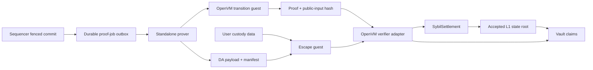

# ZK Integration Path

Sybil is a Validium: execution data stays off-chain, while Ethereum accepts a
new exchange state root only after an OpenVM proof attests to a contiguous
epoch of transitions.
The guest reuses the same integer-only verification rules as native execution;
Solidity sees a compact public-input hash rather than orders, fills, or account
balances.

The integration is no longer merely a plan. The main transition guest, escape
guest, portable proof jobs, local prover worker, Solidity adapter, settlement
contract, vault, and distrustful custody tooling all exist. The remaining work
is primarily production operation: a real continuously proving service,
production DA, deployed verifier governance, and the dedicated normal-withdrawal
proof generator.

## Trust Chain

The epoch public input binds the start/end heights and state roots, ordered
folds of every block public-input hash and DA commitment, and the final deposit
checkpoint. A valid proof therefore means the transition rules ran against
every contiguous block in the claimed range. See [[Proof Architecture]] for
the authenticated-data model and [[L1 Settlement and Vault]] for the contract
boundary.

## Implemented Components

| Component | Responsibility |
|---|---|
| `sybil-verifier` | Native match, settlement, block-integrity, and order checks |
| `sybil-zk` | Guest-safe per-block verification plus streamed epoch chaining/folds/public inputs |
| `sybil-proof-protocol` | Portable jobs, epoch IDs, proof kinds/envelopes, transport digests |
| `sybil-prover` | Guest inputs, mock/backend boundary, DA artifacts, worker/API, and L1 calldata |
| `zk/openvm-guest` | OpenVM 2.0 main transition program |
| `sybil-escape-claim` | Small, independent Form-L escape statement |
| `zk/openvm-escape-guest` | OpenVM escape program |
| `sybil-custody` | User-side retention, reconstruction, proving, and submission |
| `OpenVmVerifierAdapter.sol` | Binds an OpenVM proof to Sybil's public-input hash |
| `SybilSettlement.sol` / `SybilVault.sol` | Accept roots and release collateral |

`zk/openvm-tools` is deliberately outside the main Cargo workspace. It uses
the OpenVM-pinned serializer to turn prepared MessagePack inputs into the exact
word stream consumed by the guest, without pulling the proving dependency graph
into ordinary server builds.

## What the Transition Guest Proves

OpenVM stdin begins with a bounded `EpochTransitionHeader`, followed by one
independently encoded `StateTransitionGuestInput` per block. The guest reads,
verifies, folds, and drops each block before reading the next. For every block
it:

1. derives the canonical typed state leaves and verifies them against the
   public `new_state_root`;
2. checks the qMDB `next_key` ring, so hidden extra leaves cannot be omitted;
3. recomputes the event root and witness root from [[Canonical Serialization]];
4. reconstructs the L1 deposit checkpoint and checks credited or quarantined
   deposits, automatic claims, and the quarantine ledger;
5. runs the native validity layers, including key/action authorization; and
6. requires identical genesis, exact previous-header equality, consecutive
   heights, and state-root chaining against the prior streamed block.

After the declared count, it matches the claimed endpoints and final deposit
checkpoint, recomputes the ordered block/DA folds, and reveals
`keccak256(abi.encode("sybil/openvm/epoch-transition/v1", ...))`. The
single-block transition hash remains an internal fold item and diagnostic API,
not the deployed guest's final reveal.

The guest contains small SHA-256/MMR verifiers for the pinned Commonware qMDB
proof formats. It does not link Commonware's native storage or cryptography
stack. The state schema, event schema, witness format, golden vectors, public
input hashes, and guest commitments are tracked in the generated
[protocol pins](../../protocol-pins.md).

## Proof-Job and DA Boundary

`StateTransitionProofJob` is the portable, versioned handoff between sequencer
storage and a prover. A witnessed block captures its post-state proof and, when
present, prior-state proof before qMDB A/B rotation. The serialized bytes cross
the same redb fence as the committed block and remain in an ordered outbox.
Exact-byte digests make ingest acknowledgements idempotent and conflict-safe.
The default `sybil-prover` path has no sequencer dependency; direct store access
remains debug-only behind the `sequencer-store` feature.

The current compatibility worker uses a file inbox and per-block artifact directories.
It validates a job, prepares guest input, writes the DA payload and manifest,
records the public-input hash, and exposes artifact status over HTTP. This is a
service boundary, not yet the redb-backed production scheduler: prepared jobs
start with `proof_status: "not_started"`. The streamed epoch guest, native
fold, OpenVM serializer, typed envelopes, and transactional source outbox are
implemented. Durable scheduling, authenticated pull/ack, and the continuously
running OpenVM STARK subprocess backend remain the next stage. See
[ADR-0019](../../adr/0019-epoch-stark-prover-service.md).

`da_commitment` binds the canonical witness payload, height, state root,
witness root, payload length, and provider-reference hash. The file provider is
development scaffolding. A production provider may replace it without changing
the commitment envelope once its reference encoding and recovery guarantees are
specified. L1 stores the proven commitment; it cannot itself test availability.

## Escape Proof

The escape guest is intentionally separate from the full transition guest. It
authenticates one account, its reservation leaf or exclusion proof, every
positioned market, and the active P-256 keys; verifies RawP256 or WebAuthn user
authorization; values positions at committed last-clearing prices; and reveals
the escape-claim public-input hash used by the vault.

Keeping this statement small makes the operator-disappearance path auditable
and independently pinnable. It still depends on users obtaining authenticated
data; [[Data Availability]] and [[Operator Replacement]] describe that recovery
boundary.

## Guest Commitments

Each guest has three records with distinct authority:

1. **Deployed adapter constructor values** are authoritative for what L1
   accepts.
2. **Committed `release/*.commit.json`** files are the reviewable expected
   commitments for the source tree.
3. **`guest.commitment.lock.json`** fingerprints the guest and its complete
   path-dependency closure, and copies the expected commitments for drift
   detection.

Authority is therefore: deployed adapter > release record > fingerprint lock.
`just zk-rebuild-check` rebuilds both guests and rejects commitment drift;
`scripts/zk-guest-fingerprint.sh --check` detects source changes that were not
repinned.

An intentional guest change requires one coordinated migration:

1. update golden vectors and guest logic together;
2. rebuild both affected guests with `just openvm-commit-all`;
3. review and commit the release records;
4. refresh the source fingerprint and generated protocol pins;
5. deploy or repoint the adapter to the new commitments; and
6. decide explicitly whether compatibility is possible or a fresh genesis is
   required.

Never infer the deployed commitment from documentation alone; query the
adapter. Never silently regenerate pins during an ordinary test.

## Current Limits

- Real OpenVM execution and proof drills exist, but the normal local worker
  prepares per-block artifacts rather than continuously assembling, scheduling,
  and publishing epoch proofs.
- The file-backed DA path does not provide the availability, encryption, or
  recovery guarantees required for production.
- Escape proving/submission is implemented; the dedicated proof generator for
  normal withdrawal-leaf claims is not complete.
- Adapter upgrades, proof latency, prover capacity, and emergency governance
  need production runbooks and deployed monitoring.
- `UnsafeAcceptAllVerifierAdapter` is Anvil-only plumbing and must never be used
  on a public network.

## Verification and Ownership

Use `just zk-smoke` for the normal guest integration path,
`just zk-smoke true` when a real app proof is required, and
`just zk-rebuild-check` for a commitment-sensitive change. Run
`cargo test -p sybil-prover --all-features` for host orchestration and
`just contracts-test` for the L1 boundary.

Implementation ownership lives in:

- `crates/sybil-verifier/`, `crates/sybil-zk/`, and `crates/sybil-prover/`
- `crates/sybil-escape-claim/` and `crates/sybil-custody/`
- `zk/openvm-guest/`, `zk/openvm-escape-guest/`, and `zk/openvm-tools/`
- `contracts/src/OpenVmVerifierAdapter.sol`, `SybilSettlement.sol`, and
  `SybilVault.sol`

## See Also

- [[Four-Layer Verification]] — native checks reused by the guest
- [[State Root and Parent Hash]] — the accepted-root chain
- [[Canonical Serialization]] — consensus bytes and hash domains
- [[Nanos and Integer Arithmetic]] — deterministic arithmetic
