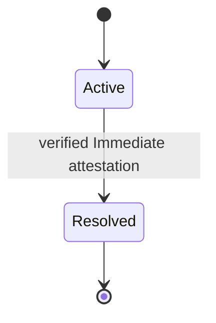

# Market resolution

> [!summary] In one paragraph
> External processes decide what happened; the trusted core accepts only a typed P256-signed attestation from the feed named by the market's resolution template. The implemented core policy is immediate: one valid attestation moves an active market irreversibly to resolved, pays YES at `payout_nanos`, pays NO at `$1 - payout`, and records the transition in the next witness.

## Trust boundary

```mermaid
flowchart LR
    SOURCE["Polymarket · API · LLM/review · operator"] --> SIGNER["Untrusted resolver process"]
    SIGNER -->|"P256 attestation<br/>market · payout · nonce"| API["Resolution endpoint"]
    API --> CHECK["Feed · signature · market binding · payout · status"]
    CHECK --> POLICY["Immediate policy"]
    POLICY --> EVENT["Sequencer system event"]
    EVENT --> PAY["Irreversible position payout"]
    PAY --> WIT["Witness + state root"]
```

The external signer may fetch arbitrary networks or use human/LLM review. None of that logic enters consensus. The core sees only the signed result and the installed feed/template policy.

## Implemented lifecycle

`Proposed`, `Challenged`, and `Voided` remain reserved type variants; the core policy does not enter them. The Polymarket auto-resolver may hold a signed proposal in its own durable review/challenge queue before submitting it, but final settlement still uses the immediate attestation path.

## Payout and groups

- YES receives `payout_nanos` per share; NO receives `NANOS_PER_DOLLAR - payout_nanos`.
- Fractional payout is supported.
- Positions are converted to balance and zeroed; resolved markets cannot trade or resolve again.
- Resolving a member removes only that member from a mutually exclusive group. Two or more unresolved members retain the group; a singleton dissolves.

## Invariants

1. The signer is the feed required by the market template.
2. The signed market id equals the market being resolved.
3. Payout lies in `[0, NANOS_PER_DOLLAR]`.
4. Resolution is irreversible and witness-visible.
5. External I/O and subjective decision logic remain outside the oracle/sequencer core.
6. A valid signature authenticates the source; it does not prove objective truth. The immediate feed remains a trust assumption.

## Where this lives

> `crates/sybil-oracle/src/policy.rs` — immediate policy  
> `crates/sybil-oracle/src/attestation.rs` — signed resolution payload  
> `crates/matching-sequencer/src/market_lifecycle.rs` — templates, feeds, status  
> `crates/matching-sequencer/src/settlement.rs` — payout and group update  
> `crates/sybil-polymarket/src/autoresolve.rs` — optional resolver-side LLM/review workflow

## See also

- [[P256 Authentication]]
- [[Settlement]]
- [[Binary Markets and Market Groups]]
- [[Threat Model]]

