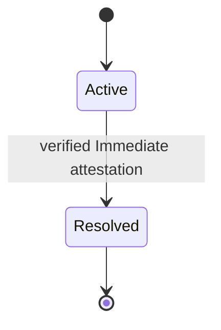

# Market resolution

> [!summary] In one paragraph
> External processes decide what happened; the trusted core accepts either an explicit trusted-admin decision or a typed P256-signed attestation from the feed named by the market's resolution template. The implemented core policy is immediate: one authorized result moves an active market irreversibly to resolved, pays YES at `payout_nanos`, pays NO at `$1 - payout`, and records the transition in the next witness.

## Trust boundary

```mermaid
flowchart LR
    SOURCE["Polymarket · API · LLM/review · operator"] --> SIGNER["Untrusted resolver process"]
    SIGNER -->|"P256 attestation<br/>market · payout · nonce"| API["Resolution endpoint"]
    API --> CHECK["Feed · signature · market binding · payout · status"]
    CHECK --> POLICY["Immediate policy"]
    POLICY --> EVENT["Sequencer system event"]
    EVENT --> PAY["Irreversible position payout"]
    PAY --> WIT["Witness + state root"]
```

The external signer may fetch arbitrary networks or use human review. None of that logic enters validity. The core sees only the signed result and the installed feed/template policy. Native markets currently use explicit operator resolution; the former dormant LLM resolver was removed rather than carrying an unexercised policy surface in production packages.

In the production Compose profile, the admin feed's signing scalar is generated
once at `/data/admin-feed.key` inside the persistent `sybil-data` volume and
reloaded on restart. This keeps the installed `admin_immediate` feed identity
stable across process/container replacement. Deleting that volume deliberately
rotates the admin identity together with the chain state; production preflight
rejects an unset key path.

## Implemented lifecycle

These are the only canonical states. Proposal, challenge, dispute, abstention,
and void semantics remain product/governance design questions until their
authority, economics, timeouts, and executable transitions are specified.

## Payout and groups

- YES receives `payout_nanos` per share; NO receives `NANOS_PER_DOLLAR - payout_nanos`.
- Fractional payout is supported.
- Positions are converted to balance and zeroed; resolved markets cannot trade or resolve again.
- Resolving a member removes only that member from a mutually exclusive group. Two or more unresolved members retain the group; a singleton dissolves.

## Invariants

1. An attested signer is the feed required by the market template; the unsigned path is restricted to trusted admin control.
2. A signed market id equals the market being resolved.
3. Payout lies in `[0, NANOS_PER_DOLLAR]`.
4. Resolution is irreversible and witness-visible.
5. External I/O and subjective decision logic remain outside the oracle/sequencer core.
6. A valid signature authenticates the source; it does not prove objective truth. The immediate feed remains a trust assumption.

## Where this lives

> `crates/sybil-oracle/src/policy.rs` — immediate policy  
> `crates/sybil-oracle/src/attestation.rs` — signed resolution payload  
> `crates/matching-sequencer/src/market_lifecycle.rs` — templates, feeds, status  
> `crates/matching-sequencer/src/settlement.rs` — payout and group update  
> `crates/sybil-polymarket/src/resolution.rs` — source-bound Polymarket resolution workflow

## See also

- [[P256 Authentication]]
- [[Settlement]]
- [[Binary Markets and Market Groups]]
- [[Threat Model]]
