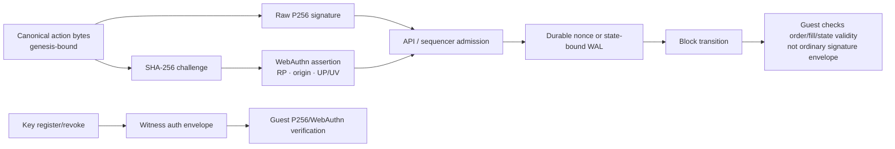

# P256 and WebAuthn authentication

> [!summary] In one paragraph
> Accounts have a committed set of P256 signing keys. Raw agent keys sign
> canonical action bytes directly; passkeys sign a WebAuthn assertion whose
> challenge is the hash of those same bytes. Key registration/revocation is
> state-bound, carried in witness v9, and re-verified by the OpenVM guest.
> Ordinary orders/cancels are checked at API/sequencer admission with durable
> replay nonces, but their signature envelopes and nonce state are not currently
> re-proved by the guest—an important distinction in the trust model.

## Key and action model



`KeyRecord` commits auth scheme, compressed SEC1 P256 public key, and a reserved
capability mask through the account's `keys_digest`. All capability bits are
authoritative today; scoped delegation is not active.

## Bootstrap and key mutation

- Account creation can atomically install its initial key.
- `POST /v1/accounts/{id}/keys` is service-gated and can bootstrap only an
  account with zero keys.
- Additional keys use `POST /v1/accounts/{id}/keys/register`; revocation uses
  `/v1/accounts/{id}/keys/revoke`.
- Each mutation binds the current `keys_digest` and `events_digest` from
  `/v1/accounts/{id}/keyop-state` and is authorized by an active key.
- The witness carries the key operation plus RawP256/WebAuthn envelope. Native
  and guest verification replay the active-key set, canonical bytes, signature,
  WebAuthn RP/origin/challenge, and required user presence/verification.
- The last active key cannot be revoked.

This is the strongest authorization path: the key universe and mutation intent
are validity-checked, not merely accepted by the server.

## Ordinary signed actions

Public signed endpoints include orders and cancellations. Their canonical bytes
bind the action, account nonce, and chain `genesis_hash`. The sequencer looks up
the active key, verifies RawP256/WebAuthn at admission, requires a strictly
increasing per-account nonce, and durably records the nonce advance before the
action becomes live. Gaps are allowed.

The block witness contains the accepted order/cancellation effects, so the guest
checks funding, positions, expiry, limits, settlement, and state transition. It
does **not** currently contain/re-verify the ordinary signature envelope or the
prior cross-block nonce. Replay protection for these actions therefore still
trusts the admission/WAL layer, bounded to one genesis domain. Do not claim that
all trader intent is proven until this gap is closed or ordinary intent becomes
otherwise validity-bound.

Unsigned `POST /v1/orders` is a service route: in production it requires the
service token; dev mode skips that service bearer for local workflows. It is not
a public production trading path.

Signed bridge withdrawal creation is also service-gated scaffolding. The final
L1 release remains proof/root/nullifier controlled; an API signature alone does
not move vault funds.

## WebAuthn details

For a passkey assertion:

```text
challenge = base64url(SHA-256(canonical_action_bytes))
signature covers authenticatorData || SHA-256(clientDataJSON)
```

The API checks credential/public-key association, `webauthn.get`, challenge,
origin, RP ID hash, user presence, user verification, signature shape, and
configured envelope limits. RP ID is the browser app hostname; origin includes
scheme and hostname. Misconfiguring either locks out passkey actions.

Account reads use a separate read-scoped bearer. Passkey login creates such a
bearer after an assertion; read keys cannot trade, withdraw, or mutate signing
keys. An account retains at most 64 read-key records over its lifetime,
including revoked tombstones, and labels are limited to 128 UTF-8 bytes. The
sequencer also serializes the candidate recovery account before accepting a new
read key and keeps it under a conservative 256 KiB budget, well below qMDB's
1 MiB value-codec ceiling.

## Recovery

Register and test a second passkey while an existing key is still usable. There
is no server-side reset or seed phrase. See [Passkey recovery](../../passkey-recovery.md).

## Implementation map

| Concern | Owner |
|---|---|
| Canonical ordinary signing bytes | `crates/sybil-signing` |
| API WebAuthn verification | `crates/sybil-api/src/webauthn.rs`, account/order routes |
| Admission, nonce WAL, raw signatures | `crates/matching-sequencer/src/crypto.rs`, actor/store |
| Key digest/transition/auth | `crates/sybil-verifier/src/account_keys.rs`, `key_transition.rs`, `key_op_auth.rs` |
| Guest verification | `crates/sybil-zk` and OpenVM guest |

## See also

- [[REST API]]
- [[Block Witness]]
- [[Threat Model]]
- [ADR-0007](../../adr/0007-canonical-bytes-domain-separation.md)
- [ADR-0008](../../adr/0008-in-guest-p256-openvm-ecc.md)
- [ADR-0014](../../adr/0014-webauthn-first-auth.md)
